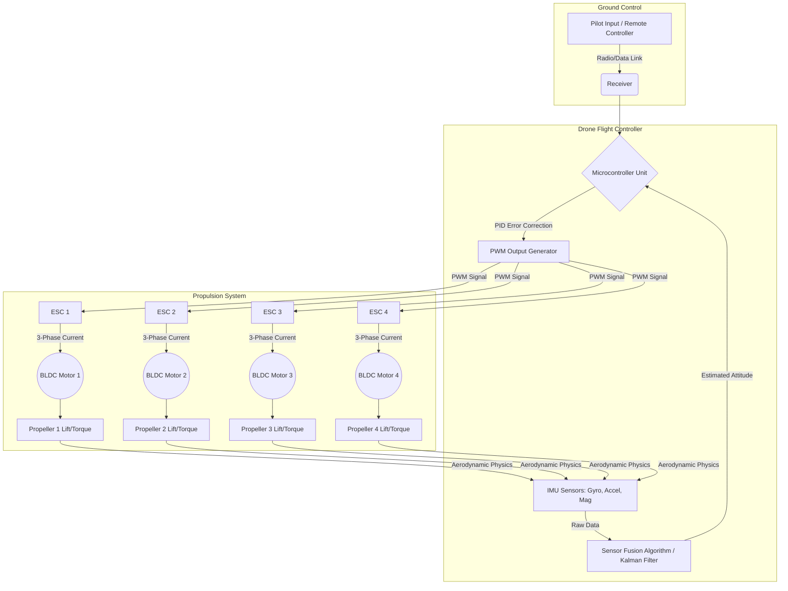

# 1.0 Module Overview

> [!abstract] Learning Objectives
> An introduction to drone technology, history, classifications, and the broader UAV ecosystem.

# Module 1: Drone Curriculum Overview – Systems, History, and Architectures

## 1. Fundamental Definition and First Principles of Flight

An Unmanned Aerial Vehicle (UAV) or Unmanned Aircraft System (UAS)—colloquially known as a drone—is an aircraft that operates without a human pilot or crew onboard . It utilizes aerodynamic forces to provide vehicle lift, can be flown remotely or autonomously, and moves within the 3D space inhabited by humans . 

From a first principles perspective, the flight of a rotary-wing drone (such as a quadcopter) is governed by Newton's Third Law of Motion . Flight is achieved by a motor spinning a propeller, which pushes air molecules downward; the resulting equal and opposite reaction pulls the aircraft upward . The aerodynamic thrust ($F_T$) and drag torque ($Q$) generated by the propellers are defined by blade element theory:
*   **Thrust Force:** $F_T = C_t \rho D^4 \omega^2$ 
*   **Drag Torque:** $Q = C_p D^5 \omega^2 / 2\pi$ 
*(Where $\rho$ is air density, $D$ is propeller diameter, $\omega$ is rotational speed, and $C_t$ and $C_p$ are thrust and power coefficients, respectively )*

A quadcopter maintains a stable hover when the vertical thrust equals the force of gravity ($\sum T_i = mg$) and the reaction pairs of the motors completely cancel each other out . By utilizing counter-rotating pairs (two clockwise, two counter-clockwise), the net torque on the vertical Z-axis remains zero . 

Directional translation involves manipulating these forces:
*   **Pitch and Roll:** Induced by unbalancing the lift between the front/rear or left/right motor pairs. This angular acceleration tilts the drone, decomposing the vertical thrust vector into a vertical component (to maintain altitude) and a horizontal component (for forward, backward, or lateral translation) [10-12].
*   **Yaw:** Achieved by symmetrically unbalancing the rotational speeds of the diagonally opposed motor pairs. This preserves total vertical lift but disrupts the torque equilibrium, causing the drone to rotate around its vertical axis to conserve angular momentum [13-15].

## 2. Historical Evolution of Unmanned Systems

The development of unmanned aerial systems spans nearly two centuries, shifting from crude military tools to highly sophisticated autonomous networks:
*   **1849 - The First Unmanned Strike:** Austrian forces launched approximately 200 incendiary balloons from the ship SMS *Vulcano* to bombard Venice, marking the first offensive use of air power in naval aviation .
*   **1903 to WWI - Radio Control Origins:** Spanish engineer Leonardo Torres Quevedo introduced the *Telekino*, a radio-based control system . This was followed in 1916 by A.M. Low's "Aerial Target" and the development of the Kettering Bug and Dayton-Wright pilotless aerial torpedo [19-21].
*   **WWII to the Cold War:** The Radioplane Company, started by Reginald Denny, produced target drones, while Nazi Germany developed the jet-powered V-1 flying bomb . During the Vietnam War, the U.S. Air Force heavily utilized highly classified drones (like the Ryan Firebee) to prevent the loss of pilots over hostile territory .
*   **Late 20th Century - The Tactical Shift:** During the 1973 Yom Kippur War and subsequent conflicts, Israel utilized UAVs like the IAI Scout and Tadiran Mastiff as radar decoys and for real-time surveillance, successfully neutralizing opposing air defenses .
*   **Modern Era - Massification:** The recent explosion in multirotor drones is largely due to the miniaturization of Microelectromechanical Systems (MEMS), which yielded compact, solid-state gyroscopes, accelerometers, and magnetometers required to actively stabilize inherently unstable rotary structures .

## 3. Typology and Classification of UAVs

Drones are classified by their physical aerodynamics, size, and operational endurance [30-32]:

**By Aerodynamic Configuration:**
*   **Fixed-Wing:** Aircraft where the wings are fixed to the fuselage. They must fly forward continuously to push the wings through the air to generate lift . They are highly efficient for long-endurance and high-speed missions .
*   **Rotary-Wing (Multirotor):** Utilize multiple motorized propellers to generate lift and allow for Vertical Take-Off and Landing (VTOL) and precise hovering . Common multirotor chassis types include the X, H, and + configurations .
*   **Hybrid and Ornithopters:** Hybrids combine fixed-wing endurance with VTOL rotors . Ornithopters generate propulsion via flapping wings, imitating birds or insects, making them stealthy platforms suited for micro-UAV surveillance .

**By Size and Weight (DoD and General Metrics):**
*   **Nano/Micro (Group 1):** Weighing under 250 grams up to 9.1 kg (20 lbs), operating below 1,200 feet .
*   **Small/Medium (Group 2 & 3):** Weighing between 9.1 kg and 600 kg, commonly used for tactical military or advanced commercial applications .
*   **Large (Group 4 & 5):** Exceeding 600 kg (1,320 lbs) and capable of operating at altitudes over 18,000 feet at any speed (e.g., MALE and HALE drones) .

## 4. The Drone Ecosystem and Systems Architecture

A modern Unmanned Aircraft System (UAS) represents a complex ecosystem extending far beyond the aircraft itself, encompassing ground control stations, data links, and highly optimized internal cyber-physical systems .

**Hardware & Propulsion Systems:**
*   **Propellers:** The fundamental rotating wing. Pitch and diameter determine the thrust and load capacity, with thrust drag behaving quadratically ($K \cdot V^2$) based on RPM [43-45]. 
*   **Brushless DC (BLDC) Motors:** Functioning as synchronous machines, BLDCs rely on electronic switching rather than mechanical brushes. They are categorized as *Inrunners* (rotor inside the stator, high RPM) or *Outrunners* (drum rotor outside the stator, high torque) [46-49].
*   **Electronic Speed Controllers (ESCs):** The critical interface converting low-power PWM signals from the flight controller into high-power three-phase alternating signals for the BLDCs, utilizing high-frequency MOSFET switching arrays .

**Avionics & Control Systems:**
*   **Inertial Measurement Unit (IMU):** A 9-DOF or 10-DOF sensor cluster utilizing MEMS technology. It houses 3-axis accelerometers (measuring specific force), vibrating structure gyroscopes (measuring angular velocity via the Coriolis effect), magnetometers (Hall-effect compasses), and barometers for altitude [29, 52-54].
*   **Flight Controller (FC):** The processing core of the drone. Because physical sensors suffer from noise and integration drift, the FC executes sophisticated sensor fusion algorithms (e.g., Kalman filters or Direction Cosine Matrices) [55-57]. It compares the estimated aircraft attitude against the pilot's input target rate, calculating closed-loop PID error corrections to adjust the RPM of individual motors dynamically .

### Systems Architecture Diagram

---

## Lessons in this Module
- [[1.1 What is a Drone]]
- [[1.2 History and Evolution of UAVs]]
- [[1.3 Types and Configurations]]
- [[1.4 The Drone Ecosystem]]

## 📎 Supplementary PDF Resources
> - [[40 Sources/PDF Library/The Drone Blueprint.pdf]] — Comprehensive visual blueprint for the whole curriculum.

---
⬅️ **Back to Course:** [[Overview]]
