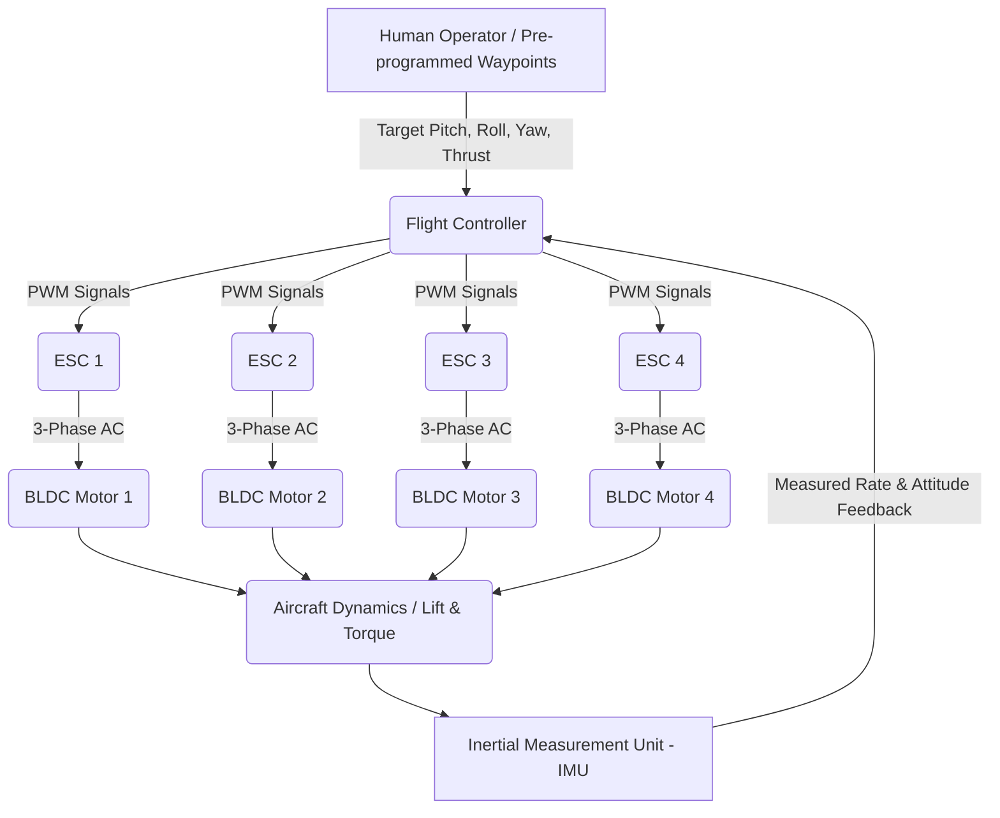

# 1.1 What is a Drone

> [!abstract] Learning Objectives
> Understand the fundamental definition, components, and operating principles of unmanned aerial vehicles.

### Definition of Unmanned Aerial Vehicles (UAVs)

An Unmanned Aerial Vehicle (UAV) is fundamentally defined as a powered aerial vehicle that does not carry a human pilot, crew, or passengers, and uses aerodynamic forces to provide vehicle lift . UAVs can be piloted remotely or operate with varying degrees of autonomy . In modern technical nomenclature, the aerial vehicle itself is often considered just one component of a broader Unmanned Aircraft System (UAS), which encompasses the drone, a ground-based control station, and the communication data links connecting them .

### Flight Mechanics from First Principles

To understand a multirotor drone from first principles, one must look at Newtonian mechanics, specifically Newton's Third Law of action and reaction . 

A fixed-wing aircraft flies forward to push air over statically mounted wings to generate lift . Conversely, a rotary-wing drone (such as a quadcopter) utilizes rotating wings—propellers driven by motors—to force air molecules downward. This downward push generates an equal and opposite upward pull (lift) on the drone . 

However, generating lift introduces a destabilizing physical phenomenon: reaction torque. When a motor applies torque to spin a propeller, an equal and opposite reaction torque is applied to the drone's chassis . Traditional helicopters mitigate this using a vertically mounted tail rotor . Multirotor drones solve this elegantly through symmetrical structural design and counter-rotation. A standard quadcopter uses two motors spinning clockwise and two spinning counterclockwise . If all motors rotate at equal aerodynamic speeds, the reaction torques perfectly cancel each other out, resulting in a net-zero yaw force and stable stationary hover .

Maneuvering relies on deliberately unbalancing these forces:
*   **Pitch (Forward/Backward):** Increasing the thrust of the rear rotors while decreasing the front rotors pitches the drone forward, changing the lift vector to possess a forward horizontal component, initiating forward translation .
*   **Roll (Lateral):** Increasing thrust on one side (e.g., the right pair of rotors) while decreasing the opposite side causes the drone to tilt and move laterally .
*   **Yaw (Rotation):** To rotate around the vertical axis, the flight controller increases the speed of the clockwise-spinning motors while equally decreasing the counterclockwise motors. This maintains overall vertical lift but induces a net reaction torque that rotates the chassis .

### High-Level Core Components

The architecture of a modern UAV represents a synthesis of aerodynamics, micro-electromechanical systems (MEMS), and power electronics.

1.  **Flight Controller (FC):** The primary microcontroller and the "brain" of the aircraft . It runs flight control algorithms (autopilot software) that compute the necessary actuator speeds by evaluating desired velocities against current sensor data .
2.  **Inertial Measurement Unit (IMU):** An electronic sensor suite measuring specific force, angular velocity, and magnetic fields . It typically incorporates a 3-axis accelerometer, a 3-axis gyroscope, and a magnetometer [22-24]. Because raw sensor data is prone to noise and drift, the FC processes IMU data through sensor fusion algorithms (e.g., Kalman filters) to accurately estimate the aircraft's spatial attitude .
3.  **Electronic Speed Controllers (ESCs):** Power electronic circuits that act as the interface between the low-power logic of the flight controller and the high-power motors . ESCs receive Pulse Width Modulation (PWM) signals from the FC and convert them into three-phase alternating currents via electronic switching to drive the motors precisely [27-29].
4.  **Brushless DC Motors (BLDC) and Propellers:** BLDC motors are utilized for their exceptionally high torque-to-weight ratio, longevity, and efficiency . The attached propellers are aerodynamically pitched to act as rotary wings .
5.  **Power System:** Usually driven by high-energy-density Lithium-Polymer (Li-Po) batteries . A Power Distribution Board (PDB) routes the high-current power from the battery directly to the ESCs, while Battery Elimination Circuits (BECs) or UBECs step down the voltage to safely power the 5V logic of the FC and radio receivers [35-38].

### Distinction from Traditional RC Aircraft

While both traditional Radio-Controlled (RC) aircraft and UAVs are controlled from the ground, the distinction lies in **autonomy and control loop architecture**. 

Traditional RC aircraft generally operate via an *open-loop* control system . The human operator moves a joystick, which sends a direct radio signal to a servomotor or throttle that physically moves a control surface. The pilot is entirely responsible for observing the aircraft's state and manually compensating for environmental disturbances like wind gusts. 

UAVs fundamentally differ by utilizing a *closed-loop*, "fly-by-wire" (fbw) control system . In a UAV, the human pilot's control inputs do not act directly on the motors or control surfaces. Instead, the pilot's inputs act as *target requests* sent to the flight controller's algorithms . The flight controller continuously reads high-frequency data from the IMU to calculate the difference between the pilot's requested attitude and the drone's actual physical state, automatically issuing rapid micro-adjustments to the ESCs to achieve the desired flight path .

This closed-loop architecture enables varying degrees of autonomy completely absent in traditional RC planes . Because the UAV can physically fly itself via self-leveling software, it can integrate exteroceptive sensors (like GPS, LiDAR, and obstacle avoidance cameras) to perform fully autonomous tasks . Features defining modern UAVs include GPS waypoint navigation, automatic return-to-home protocols upon signal loss, altitude hold, and autonomous obstacle avoidance [45-47].

---

---

## 📊 Slide Deck
> [!info] Presentation Available
> 📎 [[1.1 What is a Drone.pdf]]

## 📎 Supplementary PDF Resources
> - [[Autonomous Sky Blueprint.pdf]] — Introductory visual blueprint for autonomous drone systems.

### 🧭 Navigation
⬅️ **Previous:** [[1.0 Module Overview]]
⬆️ **Module:** [[1.0 Module Overview]]
➡️ **Next:** [[1.2 History and Evolution of UAVs]]

