# 1.2 History and Evolution of UAVs

> [!abstract] Learning Objectives
> Trace the evolution of drone technology from early military origins to modern commercial platforms.

# Historical Genesis of Unmanned Aerial Vehicles (UAVs)

The conceptualization of pilotless flying machines dates back to the early 1900s . Initially, the development of Unmanned Aerial Vehicles (UAVs) was strictly driven by military necessity, serving as reconnaissance and surveillance tools in high-risk environments . Manned systems were historically too large for covert intelligence gathering and posed severe risks regarding the loss of human life and expensive machinery during combat or ambush . By removing the onboard crew, military engineers established the foundation for autonomous and remotely piloted airframes that could operate safely from distant base stations via long-range antennas . 

# First Principles of UAV Flight Dynamics

The evolution from bulky military aircraft to agile, sophisticated multirotors was highly dependent on mastering the fundamental physics of motion across a three-dimensional spatial plane (the X, Y, and Z axes) . To sustain flight, a UAV must first overcome the Earth's gravitational pull, which accelerates objects downward at $9.8 \text{ m/sec}^2$ . 

Based on Newton’s third law of motion, achieving flight requires the drone to produce a reaction force—thrust—that is equal and opposite to the gravitational force acting upon its mass . In modern multirotors, thrust is generated by the rapid rotation of brushless DC (BLDC) motors coupled with aerodynamic propellers . The underlying first principles governing this mechanical lift dictate that the thrust force ($F$) produced by each rotor is proportional to the square of its angular velocity ($\omega$), expressed mathematically as $F = k_f \omega^2$, where $k_f$ is a proportionality constant . 

For a multicopter to maintain a stable hover in equilibrium, the net resultant forces acting upon its center of mass must equal zero . This hover condition is achieved when the total vertical thrust perfectly cancels out the vehicle's weight: $F_{Total} = F_1 + F_2 + F_3 + F_4 - mg = 0$ .

# Evolution of Multirotor Configurations

As technology advanced and electronic systems scaled down, the 2000s witnessed a dramatic surge in UAV evolution with the introduction of consumer and commercial drones . Engineers iterated through various structural configurations to optimize the thrust-to-weight ratio (TWR) and aerodynamic stability, leading to the diverse multirotor ecosystem used today:

*   **Bi-copters and Tri-copters:** Early exploratory models featuring two or three motors. These are largely obsolete in commercial use due to their limited payload capacity, unidirectional limitations, and poor aerodynamic control .
*   **Quadcopters:** The industry standard for stability and maneuverability. This configuration solves rotational instability by having two diagonal motors rotate clockwise and the other two anti-clockwise; this configuration effectively cancels out the anti-torque generated by the motors, yielding a net-zero yaw moment and extreme stability across the Z-axis [15-17].
*   **Hexacopters and Octocopters:** Evolving to meet the demand for heavy-lift operations, these 6-arm and 8-arm platforms produce substantially higher thrust and offer mechanical redundancy, albeit at the cost of being highly power-hungry vehicles .
*   **Hybrid VTOLs and Tilt-rotors:** Representing the pinnacle of modern UAV efficiency, these systems merge multirotor and fixed-wing principles. They utilize vertical takeoff and landing (VTOL) mechanics to hover, then transition their motors (or rely on a separate pusher motor) to achieve high-speed fixed-wing cruise efficiency, utilizing airfoils to generate lift and overcoming aerodynamic drag .

# The Modern Commercial and Industrial Era

Today, UAVs are deeply integrated into civilian and industrial sectors, guided by advanced flight stacks (such as ArduPilot and PX4) that fuse data from sophisticated Inertial Measurement Units (IMUs), barometers, and RTK GPS modules [21-23]. Because of their extremely small form factor, lower power consumption, and cost efficiency, commercial drones easily reach remote areas that ground vehicles cannot . 

Modern engineering has tailored drones to execute complex, autonomous tasks across a wide array of disciplines:
*   **Geospatial Surveying:** Utilizing LiDAR, RGB, and multispectral sensors to generate high-resolution Digital Elevation Models (DEMs) and orthomosaic maps [26-28].
*   **Precision Agriculture:** Deploying hyperspectral cameras to calculate vegetation indices and executing targeted pesticide distribution via Variable Rate Technology (VRT) spray systems [29-31].
*   **Aerial Deliveries:** Utilizing specialized payload release mechanisms (such as servo-based or electromagnetic latches) to transport heavy cargo to inaccessible areas [32-34].

### Evolutionary Architecture of UAVs

```mermaid
graph TD
    A[Early 1900s: Pilotless Military Concepts] --> B(Reconnaissance & Surveillance)
    B --> C{Miniaturization of Avionics}
    C --> D[Fixed-Wing UAVs]
    C --> E[Multirotor UAVs]
    
    E --> F[Bi/Tri-Copters<br>Low Payload, Limited Control]
    E --> G[Quadcopters<br>Balanced Anti-Torque, High Agility]
    E --> H[Hexa/Octocopters<br>Heavy Lift, High Redundancy]
    
    D --> I[Hybrid VTOL & Tilt-Rotors<br>Lift Efficiency + Vertical Hover]
    G --> I
    
    G --> J[2000s: The Consumer & Commercial Revolution]
    H --> J
    I --> J
    
    J --> K[Modern Autonomous Integration]
    K --> L(LiDAR & Photogrammetry)
    K --> M(Agricultural VRT Spraying)
    K --> N(Cargo & Last-Mile Delivery)
```

---

---

## 📊 Slide Deck
> [!info] Presentation Available
> 📎 [[1.2 History and Evolution of UAVs.pdf]]

## 📎 Supplementary PDF Resources
> - [[Unmanned Systems Evolution.pdf]] — Visual overview of unmanned-systems evolution.

### 🧭 Navigation
⬅️ **Previous:** [[1.1 What is a Drone]]
⬆️ **Module:** [[1.0 Module Overview]]
➡️ **Next:** [[1.3 Types and Configurations]]

