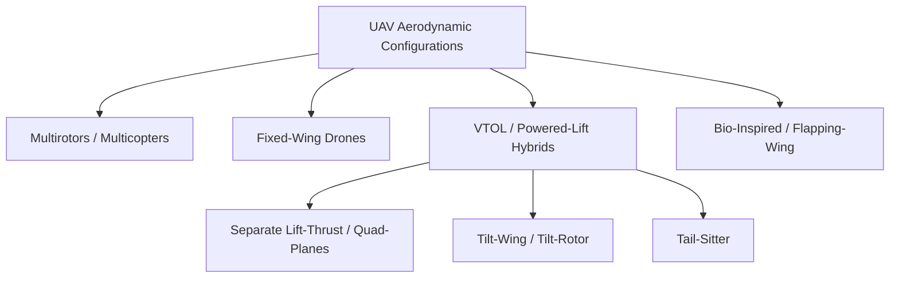

# 1.3 Types and Configurations

> [!abstract] Learning Objectives
> Classify drone architectures — multirotor, fixed-wing, VTOL hybrid, and bio-inspired designs.

# Aerodynamic Configurations and First Principles of Unmanned Aerial Vehicles

The design of Unmanned Aerial Vehicles (UAVs) is fundamentally governed by the methods used to counteract gravity (lift) and aerodynamic drag (thrust). Based on these physical first principles, drones are primarily categorized into multirotors, fixed-wing platforms, Vertical Take-Off and Landing (VTOL) hybrids, and flapping-wing bio-inspired models . 

## 1. Multirotors (Multicopters)
Multirotors operate on the direct Newtonian principle of momentum exchange, where lifting force is generated purely by accelerating a mass of air downward through active rotors . 

*   **Aerodynamic First Principles:** Because multicopters lack static aerodynamic lifting surfaces, the rotors must continuously provide both lift and thrust simultaneously by vectoring the rotor disk . The required thrust-to-weight ratio ($T/W$) is the primary sizing parameter; for a stable hover, $(T/W)_{hover} = 1$ . To achieve vertical acceleration during takeoff, the ratio must exceed unity, defined as $(T/W)_{takeoff} = 1 + a_{to}/g$, where $a_{to}$ is the takeoff acceleration . 
*   **Configuration Characteristics:** Standard configurations include quadcopters, hexacopters, and octocopters, sometimes featuring coaxial propellers on a single arm . 
*   **Aerodynamic Limitations:** The structural airframe (arms, central hub, and payloads) generates pure parasitic drag in forward flight . Because they do not rely on the aerodynamic efficiency of wings, they suffer from immense power consumption, sharply limiting their operational flight range and endurance . 

## 2. Fixed-Wing Drones
Fixed-wing drones rely on the Bernoulli principle and Newton's laws of motion applied to static airfoils, generating lift as the entire vehicle translates forward through the airmass . 

*   **Aerodynamic First Principles:** The core driver of fixed-wing efficiency is the ability to decouple lift generation from thrust generation . The fundamental sizing parameters are wing loading ($W/S$) and thrust-to-weight ratio ($T/W$) . To maximize cruise range—flying at the speed that yields the maximum lift-to-drag ($L/D$) ratio—the optimal wing loading is dictated by dynamic pressure ($q$), parasitic drag ($C_{D0}$), and the span efficiency factor ($e$), calculated as $(W/S)_{cruise} = q \sqrt{C_{D0}/K}$ .
*   **Configuration Characteristics:** A standard aerodynamic layout features a central fuselage, static lifting wings, and a stabilizing empennage (such as a tail-aft or V-tail configuration) . High-efficiency airfoils, such as the S1223, Eppler 66, or NACA 4412, are carefully selected to maximize the lift coefficient ($C_{L}$) and lift-to-drag ratio .
*   **Aerodynamic Limitations:** Since lift is proportional to the square of forward velocity, fixed-wing UAVs possess a strict stall speed boundary . They require a runway or catapult for launch and cannot hover, drastically limiting their use in confined or austere operational environments . 

## 3. VTOL (Powered-Lift) Hybrids
VTOL aircraft, or powered-lift vehicles, attempt to merge the aerodynamic efficiency of fixed-wing flight with the localized agility of multirotors . These platforms transition dynamically between vertical thrust-borne flight and horizontal lift-borne flight .

*   **Separate Lift-Thrust (Quad-Planes / FW-VTOL):** 
    *   *Configuration:* These use entirely distinct powertrains for hovering and cruising . Typically, four lifting rotors are mounted on horizontal booms attached to the main wings, while a separate tractor or pusher propeller drives forward flight . 
    *   *Aerodynamic Penalty:* While mechanically simple and highly stable during transition, this configuration suffers from inherent aerodynamic inefficiencies . During forward cruise flight, the stopped vertical rotors generate significant parasitic drag, adding a mass penalty and a drag coefficient penalty estimated via the rotor solidity ratio ($C_{Dpro} = 0.1 \sigma_{pro}$) [16-18].
*   **Tilt-Wing and Tilt-Rotor:**
    *   *Configuration:* The aircraft's propulsion units (and sometimes the entire wing structure) rotate 90 degrees between hover and cruise . 
    *   *Aerodynamic Dynamics:* The backward and forward transitions are highly non-linear and aerodynamically volatile . During transition, the wings are forced to fly at extreme angles of attack, pushing the airfoils toward or beyond flow separation and stall . However, the configuration leverages propeller slipstream effects—accelerated air from the rotors washes directly over the tilted wing, artificially increasing local dynamic pressure and suppressing stall behavior . 
*   **Tail-Sitters:**
    *   *Configuration:* The entire fuselage and wing structure rests vertically on the ground and pitches forward 90 degrees to transition into horizontal flight .
    *   *Aerodynamic Dynamics:* This approach eliminates the need for heavy tilting mechanisms or redundant stopped rotors . However, it requires complex control laws to manage massive aerodynamic disturbances during the pitch-over stall phase and makes the vehicle highly vulnerable to crosswinds and gusts during takeoff and landing . 

## 4. Bio-Inspired (Flapping-Wing) Drones
*Note: The provided sources contain very limited technical details on bio-inspired drones; the following is based strictly on the available excerpts.*

Bio-inspired flapping-wing micro air vehicles (FWMAVs) attempt to replicate the biological flight mechanics of birds or insects . 
*   **Aerodynamic Characteristics:** FWMAVs utilize oscillating wings to simultaneously vector both lift and thrust, granting them the ability to hover in place . 
*   **Aerodynamic Limitations:** Currently, the mechanical complexity and extreme high-power requirements of maintaining continuous flapping motion severely constrain their payload capacity, operational range, and overall flight endurance .

---

---

## 📊 Slide Deck
> [!info] Presentation Available
> 📎 [[1.3 Types and Configurations.pdf]]

## 📎 Supplementary PDF Resources
> - [[UAV Flight Architectures.pdf]] — Visual guide to UAV and VTOL flight architectures.

### 🧭 Navigation
⬅️ **Previous:** [[1.2 History and Evolution of UAVs]]
⬆️ **Module:** [[1.0 Module Overview]]
➡️ **Next:** [[1.4 The Drone Ecosystem]]

