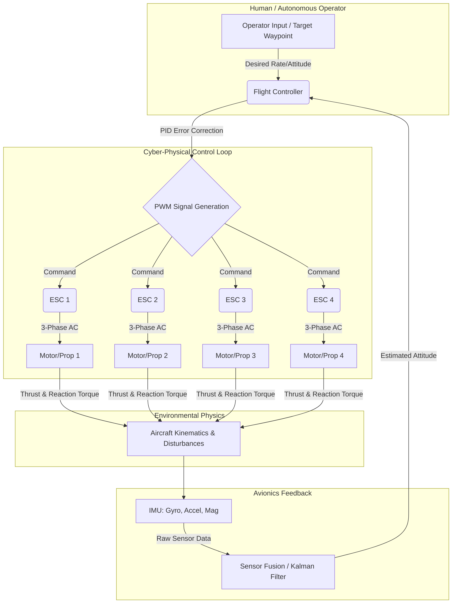

# 1.4 The Drone Ecosystem

> [!abstract] Learning Objectives
> Map the full drone technology stack: hardware, software, regulations, and commercial applications.

# The Drone Ecosystem: A Systems-Level Architecture

The unmanned aerial vehicle (UAV) ecosystem is a synthesis of aerodynamics, closed-loop cyber-physical systems, complex regulatory frameworks, and diverse socio-economic applications. Understanding this ecosystem requires dissecting it from the first principles of physical flight up to the macro-level impact on global industries.

## 1. Hardware: The Physics of Flight and Propulsion

At its most fundamental level, a multirotor drone overcomes gravity by applying Newton’s Third Law of Motion: forcing air molecules downward to generate an equal and opposite upward lift [1-3]. The hardware architecture is designed to manage these aerodynamic forces precisely.

*   **Propellers (Rotary Wings):** The aerodynamic profile of a propeller generates lift based on its rotational speed ($\omega$), diameter ($D$), and the density of the air ($\rho$). The thrust force ($F_T$) is defined as $F_T = C_t \rho D^4 \omega^2$, and the drag torque ($Q$) is $Q = C_p D^5 \omega^2 / 2\pi$ . Crucially, the resistant torque of a propeller is quadratic ($K \cdot V^2$), meaning that doubling the rotational speed requires quadrupling the motor torque, which exponentially increases electrical current consumption .
*   **Brushless DC Motors (BLDC):** Operating as synchronous electrical machines, BLDCs rely on electronic switching to sequentially energize stator coils, interacting with permanent rare-earth magnets (like NdFeB) on the rotor . They are characterized by their $K_v$ rating (RPM per Volt) and are favored for their high torque-to-weight ratio and reliability . 
*   **Electronic Speed Controllers (ESCs):** ESCs act as the power interface, converting low-power Pulse Width Modulation (PWM) signals from the flight controller into high-power, three-phase alternating currents . They utilize arrays of low-resistance MOSFET transistors to switch currents at high frequencies, dictated by sensorless control algorithms that measure back-electromotive force (back-EMF) to determine rotor position [12-14].
*   **Power Systems:** High-energy-density Lithium-Polymer (Li-Po) or Lithium-Ion Polymer batteries provide the necessary electrical power . Power Distribution Boards (PDB) route the high current to the ESCs, while Battery Elimination Circuits (BEC/UBEC) step down the voltage via linear or DC-DC converters to safely power the 5V logic of the avionics [17-19].

## 2. Software and Avionics: Closed-Loop Autonomy

A quadcopter is inherently aerodynamically unstable; it cannot fly without a "fly-by-wire" control system continuously calculating error corrections . The software architecture transforms human or programmed inputs into physical stability.

*   **Inertial Measurement Unit (IMU):** A micro-electromechanical system (MEMS) sensor suite that measures the aircraft's specific force, angular velocity, and magnetic orientation . It typically includes a 3-axis accelerometer (measuring linear motion and gravitational vectors), a 3-axis vibrating structure gyroscope (measuring angular velocity via the Coriolis effect), and a magnetometer (measuring the earth's magnetic field via the Hall effect) [22-24].
*   **Sensor Fusion Algorithms:** Because raw sensor data—especially from accelerometers experiencing vibration and gyroscopes suffering from integration drift—is noisy, the flight controller employs mathematical algorithms like Kalman filters, Extended Kalman Filters (EKF), or Direction Cosine Matrices (DCM) [25-27]. These algorithms fuse the disparate data streams into a single, highly accurate estimation of the drone's spatial attitude (pitch, roll, and yaw).
*   **PID Control Loop:** The core flight controller software calculates the difference (error) between the estimated attitude (from the sensor fusion) and the target attitude (requested by the operator or autonomous waypoint system) . It feeds this error into a Proportional-Integral-Derivative (PID) controller, which dictates rapid micro-adjustments to individual ESCs to stabilize the aircraft .

## 3. Operators and Human-Machine Interaction

As autonomy increases, the role of the human operator shifts from manual stick-and-rudder piloting to mission supervision. 

*   **Degrees of Autonomy:** Drones utilize various degrees of autonomy, ranging from basic altitude hold and self-leveling to GPS waypoint navigation, collision avoidance, and swarm coordination [29-31]. This is heavily dependent on computer vision and exteroceptive sensors like LiDAR or ultrasonic rangefinders .
*   **Occupational Workload:** Operating in 3D space induces cognitive loads higher than standard 2D tasks . Designing intuitive Human-Machine Interfaces (HMIs) is recognized as critical for Occupational Safety and Health (OSH) . Poor interface design or an operator's lack of situational awareness can lead to fatal errors, increasing the risk of collisions .

## 4. Regulatory Frameworks and Ethics

The rapid massification of drones has outpaced traditional aviation laws, leading to a complex, evolving regulatory and ethical landscape.

*   **Airspace Integration and U-Space:** Regulators like the FAA (US) and EASA (Europe) categorize drones largely by weight, speed, and operational altitude . A massive challenge is integrating drones into shared airspace with manned aircraft, particularly for Beyond Visual Line of Sight (BVLOS) operations, which requires robust Unmanned Aircraft System Traffic Management (UTM) and Remote ID tracking [39-41].
*   **Liability and Safety:** The physical safety of bystanders is paramount. Kinetic energy from a drone crash can cause severe bodily injury or property damage . While hardware failsafes (like deployable parachutes) exist, legal liability heavily falls on the operator and mission planners, necessitating strict maintenance and operational protocols .
*   **Privacy and Surveillance Ethics:** Drones present unprecedented threats to personal privacy. Their agility allows them to bypass traditional physical barriers (fences, walls) silently . Furthermore, the lack of transparency regarding drone operations means the public rarely consents to being filmed or tracked . 
*   **Algorithmic Bias:** As drones increasingly use AI for autonomous surveillance or target identification, there is a risk of embedding algorithmic bias. Facial recognition systems deployed via drone can misidentify individuals, leading to disproportionate monitoring of specific populations and raising severe environmental justice concerns .

## 5. Real-World Impact

The capacity of UAVs to safely enter the "dull, dirty, or dangerous" environments previously inhospitable to humans has catalyzed profound industrial transformations .

*   **Civil and Industrial:** Drones are revolutionizing logistics, from warehouse inventory management to the delivery of critical healthcare supplies (vaccines, blood) to remote areas [54-56]. In agriculture and environmental science, multispectral imaging drones monitor crop health, target pesticide application, and create high-resolution topological models of geological hazards like landslides [57-59].
*   **Military:** Militaries globally rely on UAVs for intelligence, surveillance, reconnaissance (ISR), and targeted kinetic strikes . Systems range from micro-drones for tactical squad-level awareness to Medium Altitude Long Endurance (MALE) drones carrying Hellfire missiles, fundamentally altering modern asymmetrical warfare .
*   **Societal and Occupational Shifts:** As drones become ubiquitous, they are transitioning from mere "tools" into "co-workers" or social entities within workspaces . This integration requires societal adaptation, standardizing how humans and autonomous machines communicate intentions (e.g., social proxemics) to minimize psychological stress and ensure workplace safety [65-67].

---

---

## 📊 Slide Deck
> [!info] Presentation Available
> 📎 [[1.4 The Drone Ecosystem.pdf]]

## 📎 Supplementary PDF Resources
> - [[40 Sources/PDF Library/Drone Ecosystem Architecture.pdf]] — Systems architecture view of the drone ecosystem.

### 🧭 Navigation
⬅️ **Previous:** [[1.3 Types and Configurations]]
⬆️ **Module:** [[1.0 Module Overview]]
➡️ **Next:** [[Overview|Back to Main Menu]]

