# 2.0 Module Overview

> [!abstract] Learning Objectives
> A comprehensive guide to the physical hardware systems that enable drone flight.

# Module 2: Drone Hardware Architecture and First Principles

## 1. Aerodynamics and Propulsion Systems
The propulsion system is the physical executor of flight, relying on fundamental electromagnetic and aerodynamic principles to convert stored chemical energy into directed thrust.

*   **Brushless DC Motors (BLDC):** The foundation of modern drone propulsion is the brushless motor, prized for its lack of mechanical friction and high efficiency . It consists of a fixed **stator** with copper windings and a rotating **rotor** lined with permanent magnets . Through electromagnetic induction, applying direct current to the stator windings creates a rotating magnetic field. This field continuously attracts and repels the rotor's permanent magnets, generating torque . In sensorless motors, the position of the rotor is determined by measuring **Back-Electromotive Force (Back-EMF)**—a voltage induced in the stator windings as the rotor's magnetic field cuts through them .
*   **Electronic Speed Controllers (ESCs):** The ESC is the hardware brain of the motor, acting as a highly precise switch. It utilizes a **Microcontroller (MCU)** to process throttle signals, a **Gate Driver** to amplify the signal, and a bank of **MOSFETs** (Metal Oxide Semiconductor Field Effect Transistors) to strategically deliver power [7-9]. The ESC translates direct current (DC) from the battery into a three-phase alternating current (AC) by turning the MOSFETs on and off at frequencies between 8 kHz and 50 kHz . 
*   **Propellers and Thrust Generation:** Propellers transform the motor's mechanical torque into lift by accelerating air downward . Flight stability and responsiveness are heavily dictated by propeller geometry; high-pitch blades provide speed but less fine control, while smaller propellers increase responsiveness . From a first-principles perspective, aerodynamic performance can be modeled using **Blade Element Momentum Theory (BEMT)**, which combines momentum theory and blade element theory to predict required power, utilizing equations that incorporate **Prandtl’s tip-loss function** to account for the physical reality of zero lift at the blade tips [14-16].

## 2. Flight Controllers, Sensors, and Control Theory
A quadcopter is an inherently unstable, underactuated system with six degrees of freedom controlled by only four actuators . Constant algorithmic intervention is required to prevent catastrophic failure.

*   **The Inertial Measurement Unit (IMU):** The IMU is the sensory core of the drone, granting it spatial awareness through a combination of Micro-Electro-Mechanical Systems (MEMS) . 
    *   **Gyroscopes** measure angular velocity (rotation speed) across the pitch, roll, and yaw axes. They are hyper-responsive but suffer from "drift," where minor measurement errors accumulate over time .
    *   **Accelerometers** measure linear motion and proper acceleration relative to the 1G downward pull of gravity. They provide an absolute reference for "down," which the flight controller uses to correct gyroscopic drift . Together, these provide **6 Degrees of Freedom (6 DoF)** tracking .
    *   **Magnetometers and Barometers** serve as digital compasses and pressure sensors, providing absolute yaw heading and altitude data, respectively .
    *   **Optical Flow and Rangefinders:** For precision hovering, optical flow sensors (like the PMW3901) track ground imagery to calculate horizontal translation, while Time-of-Flight (TOF) rangefinders emit light pulses to measure altitude within millimeters .
*   **Sensor Fusion and Control Loops:** Because no single sensor is perfect, algorithms like the Kalman filter fuse this data to produce a single, highly accurate orientation estimate . This data is fed into the **Flight Controller (FC)**.
    *   **PID Control:** The industry standard is the reactive Proportional-Integral-Derivative (PID) loop. It calculates corrections based on current error (Proportional), accumulated past error (Integral), and the predicted rate of change (Derivative) . The FC then uses a "mixer" table based on the drone's specific frame geometry (e.g., an "X" configuration) to distribute power to individual motors .
    *   **Reinforcement Learning (RL):** Cutting-edge research replaces the reactive PID loop with proactive, feedforward neural networks. Using algorithms like **Proximal Policy Optimization (PPO)**, these networks learn the underlying non-linear dynamics of the drone, allowing them to anticipate error and execute motor commands proactively. PPO-driven controllers have demonstrated up to a 44% decrease in overall error, a 2.5x faster rise time, and less overshoot compared to highly tuned PID controllers [32-35].

## 3. Frame Dynamics and Structural Integrity
The drone's chassis houses all components, but its structural properties directly affect control loops. 

*   **Rigidity:** Frame rigidity is vital. Flexible frames allow motors to shift relative to the IMU, creating a mechanical lag between the commanded correction and the actual physical change, severely degrading flight stability . 
*   **Configurations:** The physical layout of the motors impacts torque generation. An "X" configuration is preferred over a "+" configuration because it distributes the torque generated across multiple axes more symmetrically, yielding superior stability and control . 

## 4. Energy Storage and Endurance
The limiting factor in all electric drone operations is the comparatively low energy density of current battery technology.

*   **Lithium Polymer (LiPo) Fundamentals:** Drones overwhelmingly utilize LiPo batteries due to their ability to discharge massive amounts of current instantaneously to meet the demands of rapid motor acceleration .
*   **Multi-Stage Battery Separation:** The physics of drone flight dictate that hovering endurance rapidly decreases as weight increases . Because battery weight traditionally remains constant even as energy is depleted, efficiency constantly drops . Advanced theoretical frameworks suggest **multi-stage battery separation**, where discharged batteries are physically dropped mid-flight, steadily reducing the aircraft's mass . Because batteries contain non-energy storage components like the Battery Management System (BMS) and heavy casings, dropping them sheds absolute dead weight, improving flight endurance by over 120% in theoretical models .

## 5. Telemetry, Radios, and Digital Protocols
Communication between the pilot, the flight controller, and the ESCs requires high-speed, noise-resistant protocols.

*   **ESC Protocols:** Historically, flight controllers communicated with ESCs using analog **Pulse Width Modulation (PWM)**, where the length of a voltage pulse (e.g., 1000μs to 2000μs) dictated motor speed . Modern systems utilize digital protocols like **DShot** (Digital Shot), which send distinct data packets (e.g., DShot1200 sends 1,200,000 bits per second) . 
*   **Bi-directional Communication:** Updates to DShot allow ESCs to send telemetry data (like exact motor RPM) *back* to the flight controller over the same wire. This enables dynamic RPM notch filtering, eliminating specific mechanical noise from the gyro data and drastically reducing signal latency .
*   **CAN Bus Networking:** For industrial UAVs, point-to-point wiring is being replaced by **Controller Area Network (CAN)** bus architectures (utilizing protocols like Cyphal). Instead of individual signal wires for each ESC, all ESCs, GNSS modules, and sensors share a single two-wire network. CAN bus prioritizes messages by ID (ensuring throttle commands always override GPS updates) and provides extreme noise immunity and hardware redundancy [49-51].

---

### Hardware Architecture and Feedback Loop Diagram

```mermaid
graph TD
    subgraph Pilot / External
        R[Radio Transmitter] --> |RF Signal| RX[Radio Receiver]
    end

    subgraph Flight Controller Core
        RX --> |Control Input| FC[Flight Controller MCU]
        IMU[IMU: Gyro & Accelerometer] --> |6-DoF Data| SF[Sensor Fusion / Kalman Filter]
        MAG[Magnetometer / Barometer] --> |Heading / Altitude| SF
        SF --> |State Estimate| FC
        FC --> |PID or RL Algorithm| MIXER[Geometry Mixer]
    end

    subgraph Power & Propulsion
        BATT[LiPo Battery] --> |Direct Current| ESC
        MIXER --> |DShot / CAN Bus Signal| ESC[Electronic Speed Controller]
        ESC --> |MOSFET Switching / 3-Phase AC| MOTOR[Brushless DC Motor]
        MOTOR --> |Torque| PROP[Propeller]
        ESC -.-> |Bi-directional Telemetry RPM| FC
    end

    subgraph Physical Environment
        PROP --> |Thrust / Aerodynamic Lift| DYN[UAV Spatial Dynamics]
        DYN -.-> |Physical Motion| IMU
        DYN -.-> |Physical Motion| MAG
    end
```

---

## Lessons in this Module
- [[2.1 Aerodynamics and Physics of Flight]]
- [[2.2 Propulsion Systems]]
- [[2.3 Frame Design and Materials]]
- [[2.4 Flight Controllers and Sensors]]
- [[2.5 Power Systems and Batteries]]
- [[2.6 Communication and Radio Systems]]
- [[2.7 Edge AI Hardware]]

---
⬅️ **Back to Course:** [[Overview]]
