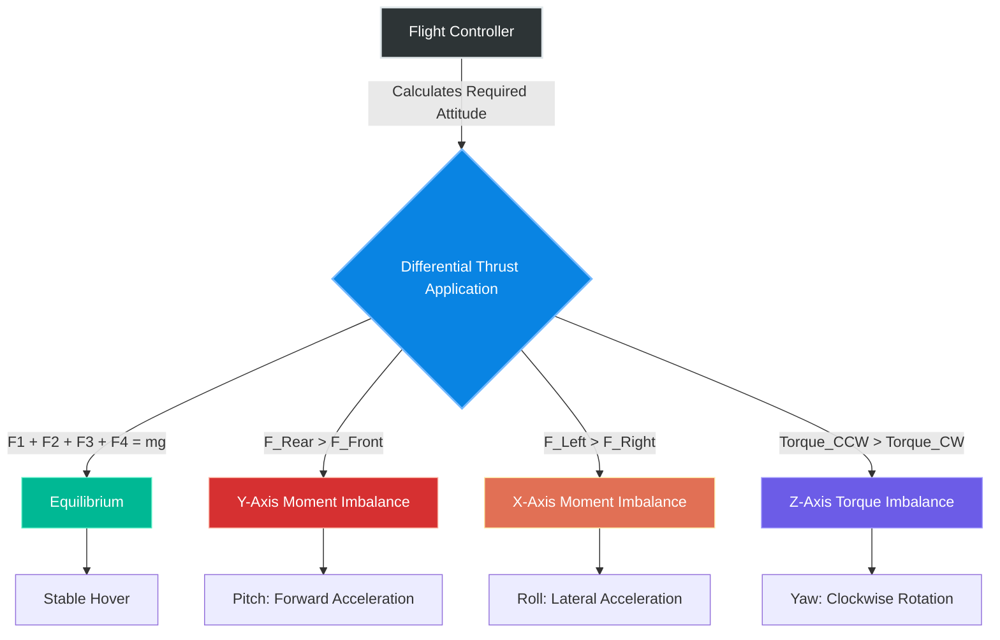

# 2.1 Aerodynamics and Physics of Flight

> [!abstract] Learning Objectives
> Master the aerodynamic forces, rotor physics, and flight dynamics governing UAV stability.

# First Principles of Drone Aerodynamics

To achieve and sustain stable flight in a three-dimensional space, a drone must fundamentally overcome the Earth's gravitational pull, which constantly accelerates the object downward at $9.8 \text{ m/sec}^2$ . Based on Newton's third law of motion—which dictates that every action has an equal and opposite reaction—a multicopter relies on mechanical lift to exert a downward force that counteracts its own mass . 

The primary aerodynamic forces acting on a drone during flight are defined as follows:

*   **Thrust:** The primary reaction force produced by the rapid rotation of the brushless DC (BLDC) motors and aerodynamic propellers . According to first principles, the thrust force ($F$) generated by each rotor is proportional to the square of its angular velocity ($\omega$) . This is mathematically modeled as $F = k_f \omega^2$, where $k_f$ is a proportionality constant based on the propeller's design and air density . For safe and responsive maneuvers, a drone should maintain a Thrust-to-Weight Ratio (TWR) of at least 2:1, meaning the propulsion system can generate twice the thrust needed to lift the gross weight of the vehicle .
*   **Weight:** The total gravitational force acting downward upon the center of mass of the drone ($W = mg$) .
*   **Lift:** The vertical vector component of thrust that actively propels the multirotor upwards against gravity .
*   **Drag:** An aerodynamic frictional force generated by air resistance interacting with the drone's body, acting in direct opposition to the direction of motion . The drag moment ($M$) created by a spinning propeller is calculated as $M = k_m \omega^2$ . Approximately one-fourth of the total force produced by the spinning rotors is consumed purely to overcome this rotational drag .

# Multirotor Kinematics and Differential Thrust

Unlike fixed-wing aircraft that rely on forward airspeed over airfoils to generate lift, multirotors depend entirely on differential thrust—the precise, independent adjustment of individual motor RPMs—to control their attitude and maneuver across the X, Y, and Z axes [10-12]. 

### Hovering (Equilibrium)
A multirotor enters a stable hover when the total vertical lift perfectly equals the vehicle's weight, expressed as $F_{Total} = F_1 + F_2 + F_3 + F_4 - mg = 0$ . Additionally, all aerodynamic moments across the center of mass must sum to zero . To cancel out the anti-torque generated by the spinning propellers, a standard quadcopter configuration relies on two diagonal motors rotating clockwise and the other two rotating anti-clockwise .

### Vertical Motion (Throttle)
According to the equation of linear motion ($F = ma$), vertical acceleration is achieved by breaking the hover equilibrium . To ascend, the flight controller increases the RPM of all four motors equally so that the total thrust exceeds the drone's weight ($F_{Total} > mg$) . Conversely, a controlled descent is achieved by uniformly lowering the motor speeds so that thrust falls below the drone's weight ($F_{Total} < mg$) .

### Pitch (Y-Axis Movement)
Pitch dictates forward and backward movement . To accelerate forward, the flight controller slows down the two front motors while equally speeding up the two rear motors . The total thrust remains sufficient to maintain altitude, but the moment across the center of gravity shifts forward ($F_{front} \times L < F_{back} \times L$), tilting the drone . 

### Roll (X-Axis Movement)
Roll governs sideward movement and functions identically to pitch, but across the lateral axis . To travel right, the drone slows the right-side motors and accelerates the left-side motors, shifting the moment and tilting the drone to a specific roll angle ($\phi$) . In this tilted state, the total thrust vector is split into two components: a vertical component ($F \sin\phi$) that counters gravity, and a horizontal component ($F \cos\phi$) that dictates the speed of the lateral acceleration . 

### Yaw (Z-Axis Movement)
Yaw alters the drone's heading without changing its position, relying entirely on Newton's third law and the manipulation of motor torque . In a stable hover, the opposing rotational forces of the clockwise and anti-clockwise motors perfectly cancel each other out ($M = M_1 + (-M_2) + (-M_3) + M_4 = 0$) . To rotate the drone clockwise, the flight controller decreases the speed of the two clockwise-spinning motors and proportionally increases the speed of the two anti-clockwise-spinning motors . This maintains overall vertical thrust but creates a net resultant torque in the clockwise direction, forcing the airframe to rotate on its Z-axis .

---

---

## 📊 Slide Deck
> [!info] Presentation Available
> 📎 [[2.1 Aerodynamics and Physics of Flight.pdf]]

## 📎 Supplementary PDF Resources
> - [[Multirotor Dynamics.pdf]] — Supplementary visual explanation of multirotor flight dynamics.

### 🧭 Navigation
⬅️ **Previous:** [[2.0 Module Overview]]
⬆️ **Module:** [[2.0 Module Overview]]
➡️ **Next:** [[2.2 Propulsion Systems]]

