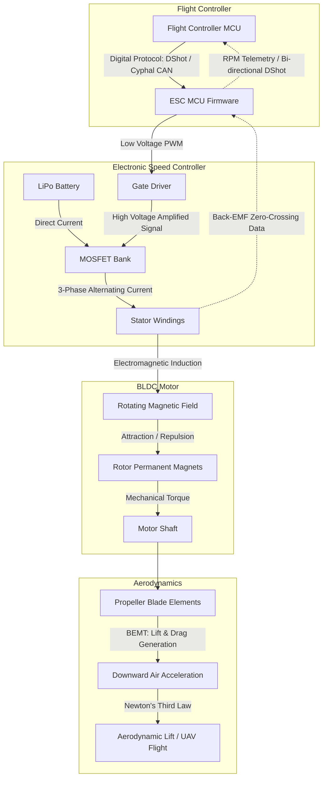

# 2.2 Propulsion Systems

> [!abstract] Learning Objectives
> Understand brushless motors, ESCs, propeller design, and thrust-to-weight optimization.

# Drone Propulsion Systems: A First Principles Architecture

The propulsion system of a multirotor drone acts as the physical executor of flight, converting stored chemical energy into directed aerodynamic thrust. This complex energy conversion process relies on the precise synchronization of three primary subsystems: Electronic Speed Controllers (ESCs), Brushless DC (BLDC) motors, and propellers . 

## 1. Electronic Speed Controllers (ESCs): The Solid-State Brain

The ESC serves as the regulating intermediary between the direct current (DC) battery and the alternating current (AC) requirements of the BLDC motor . It achieves this through rapid solid-state switching.

### Core Hardware Components
*   **Microcontroller Unit (MCU):** The MCU houses the ESC's firmware (such as BLHeli_32) . It performs three essential functions: interpreting throttle signals from the flight controller, tracking the motor's rotor position, and sending timing pulses to the gate driver .
*   **Gate Driver:** Operating as an amplifier, the gate driver receives low-voltage signals from the MCU and boosts them to high-voltage signals capable of rapidly switching the MOSFETs, allowing for fast switching with minimal heat generation .
*   **MOSFETs (Metal Oxide Semiconductor Field Effect Transistors):** An ESC contains a bank of six MOSFETs . Each of the three motor wires connects to two transistors . By rapidly opening and closing these switches, the ESC converts DC power into a three-phase alternating current, delivering high voltage, low voltage, or a grounded state to the motor's coils .

### Control Frequencies vs. Switching Frequencies
The operation of an ESC is governed by two distinct timing rates. The **control frequency** dictates how often the flight controller sends throttle commands to the ESC's MCU (e.g., 490 Hz for older analog PWM systems) . In contrast, the **MOSFET switching frequency** is the internal rate at which the transistors actuate to generate the 3-phase AC signal, typically operating between 8 kHz and 50 kHz . Higher switching frequencies yield a smoother current waveform and better efficiency at low throttles, but can cause excessive heat generation at high throttles due to switching losses .

### Digital Communication Protocols
Modern propulsion systems have shifted from analog Pulse Width Modulation (PWM) to digital protocols. 
*   **DShot (Digital Shot):** Protocols like DShot1200 deliver up to 1,200,000 bits of data per second digitally, requiring no oscillator calibration between the flight controller and ESC . Bi-directional DShot allows the ESC to send telemetry data (such as exact motor RPM) back over the signal wire, enabling dynamic RPM notch filtering that isolates and eliminates specific mechanical frequencies from the gyroscope .
*   **CAN Bus (Controller Area Network):** Industrial drones utilize protocols like Cyphal over CAN bus . Instead of individualized signal wires for each ESC, all ESCs share a resilient two-wire network . The CAN architecture arbitrates messages by priority ID, ensuring time-critical ESC throttle commands always override less critical data like GPS updates .

## 2. Brushless DC (BLDC) Motors: Electromagnetic Energy Conversion

BLDC motors eliminate the physical friction and mechanical wear of traditional commutators, relying entirely on the ESC for electronic commutation [17-19]. 

### Electromagnetic First Principles
The BLDC motor consists of a fixed **stator** wound with copper coils and a rotating **rotor** lined with permanent magnets . As the ESC energizes the stator windings in a precise three-phase sequence (Phase A → Phase B → Phase C), it induces a continuously rotating electromagnetic field . The permanent magnets on the rotor are fundamentally forced to align with this rotating field through magnetic attraction and repulsion, thereby generating continuous mechanical torque [19-21].

### Back-Electromotive Force (Back-EMF) and Sensorless Drive
For the ESC to energize the correct phase at the precise moment, it must know the exact position of the rotor . Most drone motors are "sensorless" and rely on **Back-Electromotive Force (Back-EMF)** . As the rotor's permanent magnets spin past the unenergized stator windings, they induce a voltage . The magnitude of this Back-EMF is directly proportional to the rotor's RPM, and its waveform indicates the rotor's precise alignment . The ESC detects the zero-crossing points of the Back-EMF to dynamically time the next electronic commutation . 

## 3. Propeller Design and Blade Element Momentum Theory (BEMT)

The propeller serves as the final physical actuator, converting the motor's mechanical torque into downward aerodynamic thrust . 

### Physical Design Parameters
Propeller geometry fundamentally dictates drone stability and response times . 
*   **Size and Pitch:** Larger propellers generate more absolute lift for heavy payloads but suffer from high rotational inertia, limiting their response speed . High-pitch blades accelerate air faster but sacrifice fine control, whereas low-pitch blades prioritize granular stability .
*   **Material Rigidity:** Propellers must resist aerodynamic deformation under load. Carbon fiber blades are significantly stiffer than plastic, offering enhanced stability and fewer vibrations that could disrupt the drone's IMU sensors .

### Blade Element Momentum Theory (BEMT)
From a first-principles perspective, aerodynamic performance and required power can be modeled using **Blade Element Momentum Theory (BEMT)** . BEMT integrates two distinct fluid dynamics frameworks:
1.  **Momentum Theory:** Assumes thrust is generated by the difference in fluid momentum flowing through a one-dimensional, non-viscous, and incompressible stream tube surrounding the propeller . 
2.  **Blade Element Theory (BET):** Divides the physical propeller blade into infinitesimally small geometric elements (denoted as $dy$) . The relative airflow across each element generates specific lift ($dL$) and drag ($dD$) forces .

By synthesizing these approaches, BEMT calculates the total thrust ($dT$) and required torque ($dQ$) for any given blade element using the inflow angle of attack ($\phi$) and the number of rotor blades ($N_b$) :
*   $dT = N_b(dL \cos\phi - dD \sin\phi)$ 
*   $dQ = N_b(dL \sin\phi + dD \cos\phi)$ 

Because theoretical BEMT does not inherently account for the physical reality that a blade generates zero lift at its absolute tip, mathematical models incorporate **Prandtl’s tip-loss function** ($F$) . By integrating this function alongside factors like the blade's solidity ratio ($\sigma$) and inflow ratio ($\lambda$), engineers can accurately predict the exact power required to maintain flight as the drone's mass or environmental conditions change [32-34].

---

### Propulsion System Architecture Diagram

---

---

## 📊 Slide Deck
> [!info] Presentation Available
> 📎 [[2.2 Propulsion Systems.pdf]]

## 📎 Supplementary PDF Resources
> - [[Quadcopter Propulsion Systems.pdf]] — Supplementary propulsion-system visual deck.

### 🧭 Navigation
⬅️ **Previous:** [[2.1 Aerodynamics and Physics of Flight]]
⬆️ **Module:** [[2.0 Module Overview]]
➡️ **Next:** [[2.3 Frame Design and Materials]]

