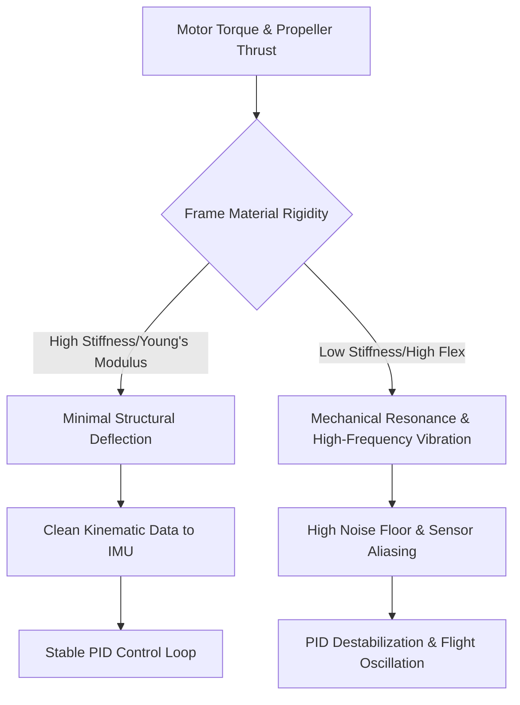

# 2.3 Frame Design and Materials

> [!abstract] Learning Objectives
> Explore carbon fiber, composite materials, and structural engineering for drone airframes.

### The First Principles of Drone Structural Dynamics

The design of an uncrewed aerial system (UAV) airframe is fundamentally an exercise in managing kinetic energy, structural load paths, and mechanical resonance. At the core of multirotor flight is the Proportional-Integral-Derivative (PID) control loop, which relies on an Inertial Measurement Unit (IMU) to continuously calculate the error between a pilot's commanded orientation and the aircraft's actual physical state . 

From a first-principles perspective, the drone frame acts as the physical medium transmitting mechanical forces between the propulsion system (motors and propellers) and the avionics (IMU). If a frame lacks sufficient rigidity, the high-torque loads of rapid motor acceleration induce structural flexing . This flexibility generates mechanical resonance and high-frequency vibrations that propagate to the flight controller, creating a "noise floor" that obscures the actual attitude data, thereby blinding the IMU and destabilizing the PID control loop . Consequently, UAV structural engineering demands materials that satisfy the conflicting constraints of extreme stiffness, high impact tolerance, and minimal mass .

### Carbon Fiber Reinforced Polymers (CFRP)

Carbon Fiber Reinforced Polymer (CFRP) dominates high-performance drone manufacturing due to its exceptional structural efficiency. It is constructed from thin strands of crystalline carbon atoms bonded within a polymer matrix . 

**Mechanical Properties:**
*   **Density:** ~1.60 g/cm³ .
*   **Tensile Strength:** 3.5 to 6.0 GPa .
*   **Young’s Modulus (Stiffness):** 200 to 800 GPa .
*   **Weight Efficiency:** Carbon fiber is approximately 30-50% lighter than aluminum and up to 70% lighter than steel, yielding an unparalleled strength-to-weight ratio .

**Aerospace Advantages and Limitations:**
The exceptionally high Young's Modulus of carbon fiber ensures that the multirotor arms do not flex under dynamic thrust vectors, preserving the structural geometry required for precise flight . Furthermore, carbon fiber possesses a negative coefficient of thermal expansion, meaning it remains dimensionally stable and resists shrinking or expanding across extreme temperature variations . 

However, carbon fiber's primary engineering weakness is its brittle nature . It has an elongation-to-break of only ~1.5% . Instead of undergoing plastic deformation (bending) to dissipate kinetic energy during a crash, carbon fiber reaches its ultimate yield strength abruptly, causing it to shatter, fracture, or delaminate . Additionally, carbon fiber is electrically conductive, necessitating the careful insulation of mounted electronics and power distribution boards to prevent short circuits .

### Kevlar (Para-Aramid Synthetics)

Kevlar is a para-aramid synthetic fiber fundamentally distinct from carbon fiber in its response to kinetic stress . While it lacks the absolute rigidity of carbon fiber, its molecular structure excels at energy dispersion.

**Mechanical Properties:**
*   **Density:** ~1.44 g/cm³ (slightly lighter than CFRP) .
*   **Tensile Strength:** 3.0 to 3.6 GPa .
*   **Young’s Modulus:** 60 to 120 GPa .
*   **Elongation to Break:** 2.5% to 4.0% .

**Aerospace Advantages and Limitations:**
Kevlar’s primary structural asset is its extreme toughness and fracture resistance . During a sudden impact, its high elongation-to-break allows the material to stretch and absorb kinetic energy, preventing catastrophic shattering [9-11]. This makes it highly advantageous for tactical or industrial UAVs operating in environments where crash survivability is critical . As an electrical insulator, it also prevents the short-circuit risks associated with bare carbon .

The engineering trade-offs of Kevlar include a significantly lower stiffness (Young's modulus) than carbon fiber, which can allow unwanted flex in drone arms if used exclusively . Kevlar is also notoriously difficult to cleanly machine, cut, or drill, and its polymer chains degrade rapidly under UV exposure, requiring specialized protective coatings for prolonged outdoor use .

### Hybrid Composite Engineering

To bypass the binary limitations of these materials—the brittleness of CFRP and the flexibility of Kevlar—engineers frequently utilize **hybrid composites** . By strategically mapping load paths, designers create composite layups that leverage the strengths of both materials:
1.  **Outer Laminates (CFRP):** Stiff carbon fiber is utilized on the exterior layers of the frame to provide the absolute rigidity necessary for aerodynamic stability and PID loop precision .
2.  **Inner Core (Kevlar):** Tough, flexible Kevlar is layered inside the carbon shell. When the drone suffers an impact, the internal aramid fibers stretch to absorb and disperse the shockwave, preventing the outer carbon layers from fully fracturing or shattering . 

### Structural Engineering for Vibration Dampening

Vibration mitigation is paramount to preserving the drone's signal-to-noise ratio at the IMU . Structural engineering attacks this problem from both material and mechanical fronts:
*   **High-Frequency Attenuation:** The inherent rigidity of carbon fiber elevates the frame's natural resonant frequency. While this prevents low-frequency flexing, high-frequency oscillations from the BLDC motors can still propagate through the carbon weave. 
*   **Mechanical Isolation:** To decouple the propulsion system's vibrations from the avionics, engineers utilize mechanical low-pass filters. Soft-mount gaskets (typically made of silicone or TPU) are placed between the motors and the carbon arms to absorb and dampen mechanical noise before it can travel through the frame . 
*   **Digital Filtering:** Any residual vibration that physically reaches the flight controller must be scrubbed digitally using dynamic notch filters or Extended Kalman Filters (EKF), which continuously merge and filter sensor data to maintain an accurate state vector of the drone's actual orientation against the background mechanical noise .

---

---

## 📊 Slide Deck
> [!info] Presentation Available
> 📎 [[2.3 Frame Design and Materials.pdf]]

### 🧭 Navigation
⬅️ **Previous:** [[2.2 Propulsion Systems]]
⬆️ **Module:** [[2.0 Module Overview]]
➡️ **Next:** [[2.4 Flight Controllers and Sensors]]

