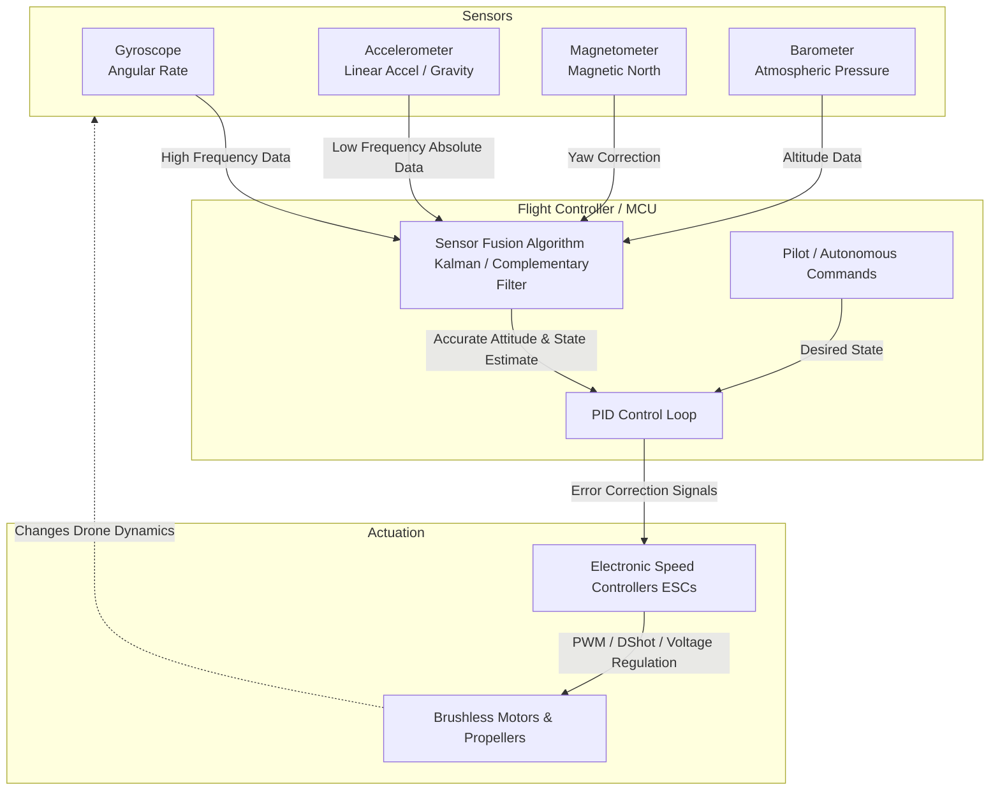

# 2.4 Flight Controllers and Sensors

> [!abstract] Learning Objectives
> Deep dive into IMUs, barometers, GPS modules, and sensor fusion architectures.

# Flight Controllers: The Central Processing Unit of Unmanned Aerial Vehicles

The flight controller (FC) operates as the indispensable "brain" or nerve center of a drone . At its hardware core, the FC is built around a Microcontroller Unit (MCU), an integrated circuit that houses a processor, memory architecture, and input/output (I/O) peripherals . In high-performance or mission-critical applications, advanced flight controllers may even utilize dual MCUs or Field-Programmable Gate Arrays (FPGAs) to guarantee redundant processing capabilities and high reliability . 

The primary function of the flight controller is to maintain the drone's attitude and execute navigation commands. It continuously receives input data from internal sensors, interprets the operator's commands, mathematically calculates the necessary dynamic adjustments, and transmits high-frequency signals to the Electronic Speed Controllers (ESCs) to modulate motor thrust . To maintain a stable attitude (the drone's orientation in three-dimensional space defined by pitch, yaw, and roll ), the FC relies on closed-loop control algorithms, most notably the Proportional-Integral-Derivative (PID) controller . The PID controller continuously calculates the error between the desired flight state and the current state, dynamically adjusting control surfaces or motor RPMs to minimize this error and reject external disturbances like wind gusts .

# Internal Sensors and the Inertial Measurement Unit (IMU)

To govern flight dynamics accurately, the flight controller relies on an array of micro-electromechanical systems (MEMS) sensors. The core of this sensory network is the Inertial Measurement Unit (IMU), which typically comprises accelerometers and gyroscopes, and is frequently augmented by magnetometers and barometers to provide a comprehensive state estimate of the vehicle .

### 1. Gyroscopes
*   **First Principles:** A gyroscope measures the angular velocity (rate of rotation) of the drone around its primary axes . 
*   **Role in Attitude Estimation:** The gyroscope provides immediate, high-frequency data regarding how fast the drone is pitching, rolling, or yawing . By mathematically integrating this angular velocity over time, the flight controller can estimate the drone's current angle. However, due to sensor noise and minute measurement errors, integrating gyroscope data inherently introduces "drift," meaning the calculated angle will slowly deviate from the true absolute angle over time. 

### 2. Accelerometers
*   **First Principles:** An accelerometer measures linear acceleration across the drone's spatial axes . Crucially, even when the drone is perfectly stationary, the accelerometer measures the proper acceleration of Earth's gravitational pull (the $g$-force vector).
*   **Role in Attitude Estimation:** Because gravity provides a constant, absolute downward vector, the accelerometer acts as an absolute reference for the drone's tilt relative to the Earth . In attitude estimation, accelerometer data is fused with gyroscope data to correct the integration drift of the pitch and roll axes. However, accelerometers are highly susceptible to high-frequency noise from motor vibrations and linear flight accelerations, making them unsuitable as a standalone attitude sensor.

### 3. Magnetometers
*   **First Principles:** A magnetometer functions as a highly sensitive digital compass that measures the strength and direction of the local magnetic field, including the Earth's magnetic field .
*   **Role in Attitude Estimation:** While the accelerometer provides an absolute reference for pitch and roll (gravity), it cannot provide a reference for yaw (rotation around the vertical axis parallel to gravity). The magnetometer solves this by providing the drone's absolute heading relative to magnetic north . This corrects the yaw drift inherent in the gyroscope data, ensuring the drone maintains a stable and accurate heading. Proper calibration of the magnetometer is critical, as electromagnetic interference from the drone's own power distribution systems can easily distort readings .

### 4. Barometers
*   **First Principles:** A barometer measures static atmospheric pressure. According to the barometric formula, atmospheric pressure decreases at a predictable rate as altitude increases.
*   **Role in Attitude Estimation:** While not directly responsible for calculating pitch, roll, or yaw, the barometer is essential for estimating the drone's vertical state (Z-axis translation). It allows the flight controller to maintain a stable height above ground level (Altitude Hold) by detecting minute changes in air pressure .

# Sensor Fusion: Synthesizing the State Estimate

Because no single sensor provides a perfect, noise-free representation of the drone's physical state, flight controllers rely on a mathematical process known as **sensor fusion** . 

The flight controller employs advanced algorithms, such as the **Kalman filter** or the **complementary filter**, to merge the high-frequency, responsive (but drifting) data from the gyroscopes with the low-frequency, absolute (but noisy) data from the accelerometers and magnetometers . The filter effectively trusts the gyroscope for short-term, rapid movements while trusting the accelerometer and magnetometer for long-term, absolute orientation correction. This computationally intensive synthesis results in a highly accurate, real-time estimate of the drone's position, velocity, and spatial orientation .

### System Architecture Diagram

---

---

## 📊 Slide Deck
> [!info] Presentation Available
> 📎 [[2.4 Flight Controllers and Sensors.pdf]]

### 🧭 Navigation
⬅️ **Previous:** [[2.3 Frame Design and Materials]]
⬆️ **Module:** [[2.0 Module Overview]]
➡️ **Next:** [[2.5 Power Systems and Batteries]]

