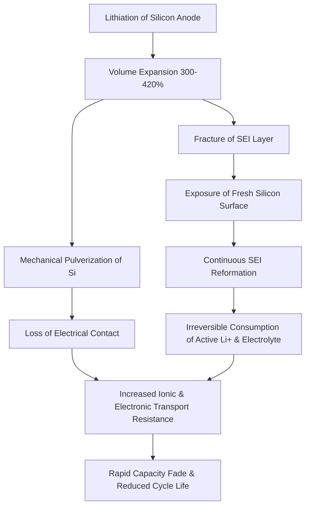

# 2.5 Power Systems and Batteries

> [!abstract] Learning Objectives
> Analyze LiPo chemistry, silicon anode technology, and power distribution systems.

# Advanced Unmanned Aerial Power Systems: A Technical Analysis

The fundamental endurance and performance limits of unmanned aerial vehicles (UAVs) are dictated by the electrochemical properties of their power systems. Optimizing drone flight requires balancing **specific energy** (Wh/kg, governing endurance) with **specific power** (W/kg, governing thrust and maneuverability) . 

## 1. First Principles of Lithium-Ion Energy Storage
In classical lithium-based secondary cells, energy is stored and released via the movement of lithium ions ($Li^+$) between the positive electrode (cathode) and negative electrode (anode) through a conductive electrolyte . 

In traditional graphite-anode systems, lithium ions intercalate into the carbon lattice structure. Because it takes six carbon atoms to host a single lithium ion (forming the compound $LiC_6$), the theoretical specific capacity of a graphite anode is stoichiometrically capped at approximately 372 mAh/g . While this intercalation mechanism provides excellent structural stability, it acts as a hard ceiling on the energy density of the pack, limiting flight times [7-9].

## 2. Traditional LiPo (Lithium-Polymer) Architecture
Lithium-Polymer (LiPo) batteries are a ubiquitous subset of lithium-ion chemistry that utilize polymer electrolytes and are typically packaged in flexible pouch cells . 

**Electrochemical Characteristics:**
*   **High Specific Power:** LiPo chemistry is engineered to deliver high discharge rates, making them ideal for the rapid bursts of current required by multirotor drones for aggressive maneuvering and payload stabilization .
*   **Voltage Stability:** They maintain the highest voltage under load compared to other conventional lithium variants .
*   **Thermal Under Load:** Under high discharge, LiPo pouch cells typically maintain lower temperatures compared to tightly wound cylindrical Li-ion cells .
*   **Energy Density Limitations:** The practical energy density for LiPo cells remains relatively low, hovering between 150–220 Wh/kg .
*   **Degradation and Safety:** LiPo cells suffer from a shorter cycle life (typically 200–400 cycles) and are highly susceptible to swelling and catastrophic thermal runaway if physically punctured or subjected to improper charging .

## 3. High-Performance Silicon Anode Chemistry
To shatter the limitations of carbon intercalation, high-performance batteries substitute graphite with silicon. Instead of intercalation, lithium electrochemically alloys with silicon at ambient temperatures . 

**The Silicon Advantage:**
*   A single silicon atom can bond with up to 3.75 lithium ions (forming lithium-rich phases like $Li_{15}Si_4$) .
*   This specific stoichiometric ratio unlocks a theoretical anode capacity of 3569 to 4200 mAh/g—roughly ten times that of conventional graphite .
*   In commercial and pilot applications, pure silicon anodes achieve unprecedented cell-level specific energies ranging from 350 Wh/kg up to 500 Wh/kg .
*   For UAV applications, upgrading from graphite to a silicon anode can practically double operational flight times without increasing payload weight .

## 4. Thermomechanical Degradation and Thermal Management Issues
While silicon offers unparalleled energy metrics, it presents severe thermomechanical and safety challenges that stem from the basic physics of its lithiation process.

**Volume Expansion and Mechanical Failure:**
During charging, the absorption of large quantities of lithium causes the silicon host lattice to undergo extreme volume expansion—swelling by 300% to over 420% of its original size . In traditional pack designs, this expansion can cause 18650-format cell windings to deform or even crack the external metal can, immediately exposing internal electrolytes and resulting in sudden cell failure . 

**SEI Destabilization:**
This massive volumetric shift pulverizes the silicon material and constantly fractures the protective Solid-Electrolyte Interphase (SEI) layer that forms on the anode when the potential drops below ~1 V vs. $Li/Li^+$ .

**Thermal Safety Risks:**
Because silicon-anode batteries inherently pack a significantly higher energy content per unit of mass and volume, their failure modes are mathematically more violent . If a cell is compromised, the ensuing thermal runaway event is markedly more severe, making cell-to-cell fire propagation far harder to contain . Furthermore, under heavy UAV loads, high-energy silicon cells generate substantial heat, necessitating advanced cooling systems to mitigate performance drops and safety hazards .

## 5. Next-Generation Structural and Chemical Mitigations
To commercialize silicon anodes for drone operations, several cutting-edge structural engineering approaches are being utilized:
*   **Silicon Nanowire Templates:** Companies like Amprius utilize 100% silicon nanowires grown directly onto the substrate. The micro-spacing between nanowires physically accommodates the 400% volume expansion without utilizing inactive binders or suffering from material pulverization . This structure also provides straight conductive paths for ions, enabling extremely fast charge rates (80% in under six minutes) and high specific power [31-33].
*   **Silicon-Carbon Composites:** Blending nano-silicon (5% to 10% mass fraction) with a durable carbon matrix buffers the volume expansion while retaining high electrical conductivity, though it dilutes the maximum theoretical capacity [34-36].
*   **Advanced Additives:** The introduction of self-healing poly(ether-thioureas) binders and electrolyte additives like fluoroethylene carbonate (FEC) help chemically passivate the anode, creating a much more stable, less porous SEI layer that can withstand structural flexing [37-40].
*   **Solid-State Integration:** Future architectures intend to pair silicon anodes with solid-state electrolytes. By eliminating highly flammable liquid electrolytes and preventing lithium dendrite growth, this combination promises to suppress thermal runaway risks while pushing boundaries beyond 500 Wh/kg .

---

---

## 📊 Slide Deck
> [!info] Presentation Available
> 📎 [[2.5 Power Systems and Batteries.pdf]]

### 🧭 Navigation
⬅️ **Previous:** [[2.4 Flight Controllers and Sensors]]
⬆️ **Module:** [[2.0 Module Overview]]
➡️ **Next:** [[2.6 Communication and Radio Systems]]

