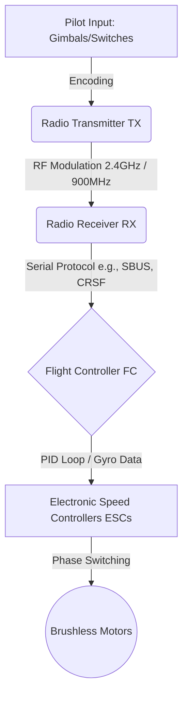

# 2.6 Communication and Radio Systems

> [!abstract] Learning Objectives
> Examine radio link protocols, frequency bands, telemetry, and signal integrity.

# First Principles of Drone Avionics and Communication

At its core, a drone's communication system is a sophisticated chain of signal processing, translating human intent into physical thrust. The process begins with mechanical inputs on a radio transmitter, which are encoded into radio frequency (RF) waves . These waves are captured by an onboard receiver (RX) and decoded into a digital protocol . The Flight Controller (FC) interprets this data as a desired attitude or rotational rate, compares it against real-time sensor data, and instructs the Electronic Speed Controllers (ESCs) to dynamically switch power to the motors using transistors [4-6]. 

# Internal Communication Protocols: PWM vs. Serial (SBUS)

Once the receiver captures the RF signal, it must pass the control data to the Flight Controller. This internal communication relies on distinct protocols that have evolved significantly over time.

### Pulse Width Modulation (PWM)
PWM is a fundamental analog-style protocol where the length of an electrical pulse dictates the command value . 
*   **Mechanism:** A typical PWM signal sends pulses varying between 1000µs (minimum) and 2000µs (maximum) . 
*   **Limitation:** It requires a dedicated physical wire for every single channel . For a modern multirotor requiring a minimum of four channels (throttle, yaw, pitch, roll) plus auxiliary switches, a PWM setup demands a cumbersome parallel wiring harness consisting of many wires [8-10]. 

### Serial Protocols: SBUS
Modern drones universally utilize digital serial protocols to eliminate wiring complexity and improve data integrity . SBUS, originally developed by Futaba and FrSky, is one of the most prominent examples .
*   **Multiplexing:** SBUS is a lossless digital protocol that transmits up to 18 channels of data over a single signal wire (using just 3 wires total: signal, power, ground) [11-13]. 
*   **Inverted Logic:** On a physical hardware level, SBUS is an inverted UART signal . Because standard microcontrollers natively read standard UART, the flight controller must have a hardware signal inverter to successfully interpret SBUS data . 

# RF Link Physics: 2.4GHz vs. 900MHz Bands

The choice of radio frequency dictates the fundamental limits of the drone's range, penetration, and latency.

*   **900MHz Band (868MHz in EU / 915MHz in US):** Following the principles of wave physics, lower frequencies have longer wavelengths. This grants 900MHz signals superior diffraction capabilities, allowing them to penetrate solid objects like trees and buildings, and bend around terrain much more effectively than higher frequencies [14-16]. However, the trade-off for this extreme range is a narrower bandwidth, which necessitates larger antennas and limits the maximum data packet rate .
*   **2.4GHz Band:** Operating at a higher frequency, 2.4GHz waves have shorter wavelengths. They are more easily absorbed or reflected by obstacles . However, the wider bandwidth allows for vastly superior packet refresh rates and utilizes highly compact antennas . Thanks to modern modulation techniques, 2.4GHz can now achieve ranges stretching several kilometers, making it the preferred standard for almost all FPV applications .

# Modern FPV RF Technologies: ExpressLRS vs. TBS Crossfire

The FPV industry relies heavily on proprietary and open-source RF ecosystems to maximize the capabilities of the 2.4GHz and 900MHz bands.

### ExpressLRS (ELRS)
ExpressLRS is a highly advanced, open-source radio link that has become the dominant standard in modern FPV . 
*   **LoRa Modulation:** ELRS achieves its extreme range by utilizing Long Range (LoRa) modulation across *all* packet rates . 
*   **Unprecedented Latency:** By stripping away legacy overhead, ELRS achieves a blistering maximum update rate of 1000Hz on 2.4GHz hardware and 200Hz on 900MHz hardware . This means the transmitter updates the receiver with new stick positions up to 1000 times per second, offering near-zero latency .
*   **Security Trade-off:** Because of its focus on speed and range, ELRS communication is not encrypted and lacks specialized anti-jamming security measures .

### TBS Crossfire
Crossfire is a legacy, premium closed-source system operating exclusively on the 900MHz band .
*   **Modulation Shifting:** While highly reliable for long-range, Crossfire tops out at a 150Hz update rate . Unlike ELRS, Crossfire only uses LoRa modulation at its 50Hz mode; to achieve 150Hz, it shifts to FSK (Frequency-Shift Keying) modulation, which sacrifices range performance for speed . 
*   **Encryption:** Unlike most hobby-grade protocols, Crossfire features data encryption over the air . 

# The Control Loop: From Signal to Thrust

Once the radio receiver passes the digital serial data (via SBUS or the ELRS CRSF protocol) to the Flight Controller, the avionics take over . 

1.  **Set-Point Generation:** The pilot's stick inputs are converted into a "set-point"—the exact mathematical rotational rate the pilot is requesting (e.g., a roll of 500 degrees per second) .
2.  **Error Calculation:** The onboard MEMS gyroscopes continuously measure the drone's actual physical rotation. The FC calculates the "error," which is the precise difference between the requested set-point and the current gyro reality . 
3.  **PID Algorithm:** A Proportional-Integral-Derivative (PID) control loop analyzes this error. The *Proportional* term reacts to the immediate error size, the *Derivative* term predicts future error to dampen overshoots, and the *Integral* term accumulates past errors to correct for persistent external forces like wind . This entire calculation can loop up to 8,000 times a second (8KHz) .
4.  **Motor Actuation:** The FC outputs the resulting correction data to the ESCs. The ESCs use electronic switches (transistors) to rapidly route high-current battery power in sequence to the three phases of the brushless motor's electromagnets, reacting instantly to the PID loop's demands to achieve the pilot's requested trajectory .

---

---

## 📊 Slide Deck
> [!info] Presentation Available
> 📎 [[2.6 Communication and Radio Systems.pdf]]

### 🧭 Navigation
⬅️ **Previous:** [[2.5 Power Systems and Batteries]]
⬆️ **Module:** [[2.0 Module Overview]]
➡️ **Next:** [[2.7 Edge AI Hardware]]

