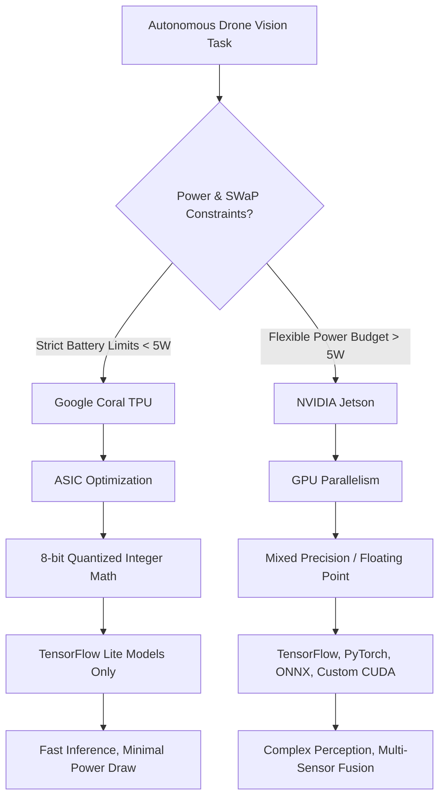

# 2.7 Edge AI Hardware

> [!abstract] Learning Objectives
> Compare NVIDIA Jetson, Google Coral TPU, and onboard compute for real-time inference.

# Edge AI Hardware for Autonomous Drones: First Principles and Hardware Accelerators

The integration of onboard neural networks has revolutionized autonomous drone operations by enabling real-time data processing and decision-making without relying on cloud connectivity or external servers . To achieve vision-based autonomy, such as obstacle avoidance and multi-drone cohesive flight, drones must continuously process high-dimensional unstructured data from onboard cameras [3-5]. 

From a first-principles perspective, executing these algorithms locally dictates a strict balancing act between computational throughput and the vehicle’s Size, Weight, and Power (SWaP) constraints . Because drones possess inherently limited battery capacity, algorithms must be optimized for energy efficiency . To satisfy these mathematical and physical constraints, developers leverage specialized Edge AI accelerators rather than general-purpose CPUs . 

## NVIDIA Jetson Series

The NVIDIA Jetson family is built on the first principle of **highly parallelized GPU computation**. By leveraging hundreds of CUDA cores, Jetson modules execute matrix multiplications—the fundamental operation of neural networks—simultaneously across vast arrays of data .

*   **Architecture & Compute Power:** Jetson devices function as standalone mini-computers featuring powerful GPUs and CPUs . This architecture offers robust parallel processing capable of running large, complex neural networks using mixed precision (e.g., FP16 or FP32) . For instance, the Jetson Nano features 4GB of RAM, significantly outperforming highly constrained boards .
*   **Model Compatibility:** Because it provides a full Linux (Ubuntu) environment and leverages NVIDIA's JetPack SDK, the Jetson ecosystem natively supports full-size frameworks like TensorFlow, PyTorch, ONNX, and custom CUDA kernels .
*   **Power Consumption:** The computational flexibility of the Jetson comes at the cost of higher power draw. The entry-level Jetson Nano consumes approximately 5-10W depending on the workload, while the mid-range Jetson Xavier NX draws 10-15W . 
*   **Drone Applications:** The Jetson architecture is ideal for drones that require complex perception pipelines, multi-modal sensor fusion, advanced driver-assistance systems (ADAS) equivalent algorithms, or real-time video analytics where running diverse, non-quantized models is mandatory [11-13].

## Google Coral TPU

The Google Coral TPU (Tensor Processing Unit) is built on the first principle of **Application-Specific Integrated Circuit (ASIC) optimization**. Rather than offering a generalized parallel processing architecture like a GPU, the Edge TPU is physically hardwired to accelerate a highly specific subset of mathematical operations: quantized 8-bit integer matrix multiplications . 

*   **Architecture & Compute Power:** The Coral TPU trades the flexibility of floating-point math for extreme speed and efficiency in low-power environments . The Coral Dev Board features an NXP iMX8 SOC equipped with a Video Processing Unit (VPU), a Vivante GC700 lite GPU for traditional image processing, a Cortex-M4F microcontroller for interfacing with low-power sensors, and integrated WiFi and Bluetooth capabilities . 
*   **Model Compatibility:** Coral's ASIC design fundamentally restricts its compatibility. It is primarily designed to execute TensorFlow Lite models that have been specifically compiled and quantized (converted to 8-bit integers) for the Edge TPU . 
*   **Power Consumption:** Coral devices are highly optimized for SWaP-constrained applications. The Coral Dev Board consumes only 2-4W, and the USB Accelerator consumes approximately 2W . 
*   **Drone Applications:** The Coral TPU is specifically tailored for drones operating under strict power budgets, enabling fast, simple inference tasks like object detection or keyword spotting without drastically reducing the UAV's flight time . 

## Comparative Decision Matrix

When designing an autonomous vision system for a UAV, the choice between Jetson and Coral requires evaluating the specific algorithmic needs against the drone's physical constraints . 

### Key Trade-offs
1.  **Flexibility vs. Efficiency:** Jetson offers unparalleled flexibility for researchers developing novel vision-based obstacle avoidance algorithms or custom network architectures, whereas Coral provides extreme efficiency for deploying proven, well-understood models . 
2.  **Memory Constraints:** The Jetson Nano's 4GB of RAM accommodates much larger models than the 1GB available on standard Coral Dev Boards, preventing memory-bound bottlenecks during complex inference .
3.  **Peripheral Integration:** While the Jetson Nano requires external dongles for wireless communication, the Coral Dev Board natively supports WiFi and Bluetooth, streamlining the hardware footprint for compact aerial platforms .

---

---

## 📊 Slide Deck
> [!info] Presentation Available
> 📎 [[2.7 Edge AI Hardware.pdf]]

## 📎 Supplementary PDF Resources
> - [[Modern Edge AI Flight Engineering.pdf]] — Supplementary edge-AI flight engineering deck.

### 🧭 Navigation
⬅️ **Previous:** [[2.6 Communication and Radio Systems]]
⬆️ **Module:** [[2.0 Module Overview]]
➡️ **Next:** [[Overview|Back to Main Menu]]

