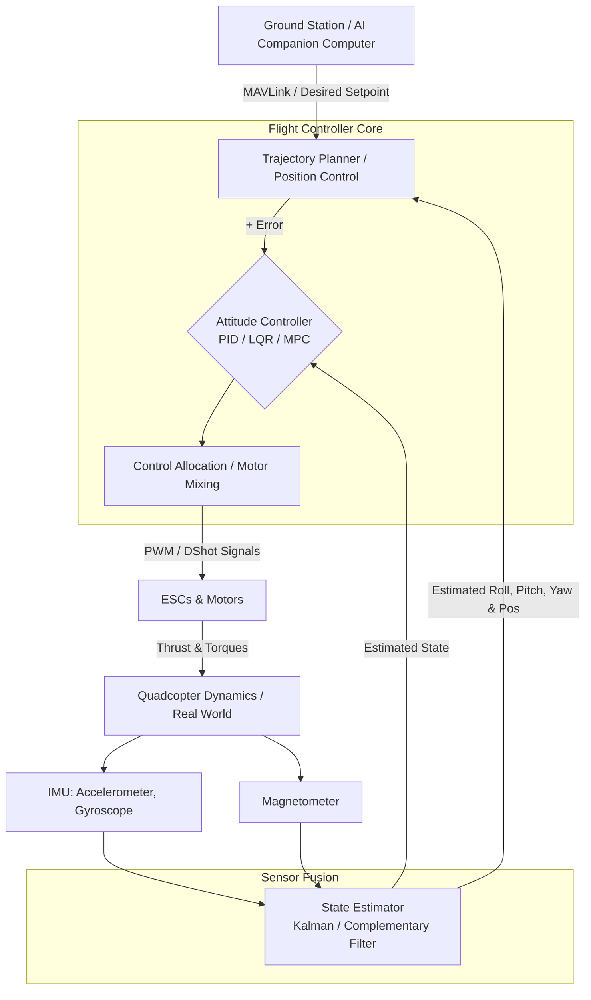

# 3.0 Module Overview

> [!abstract] Learning Objectives
> The complete drone software stack — from control algorithms to AI and swarm coordination.

# Module 3: Drone Software Architecture and Advanced Control

Welcome to Module 3 of the Drone Curriculum. This module shifts focus from physical hardware and aerodynamics to the software stack and mathematical principles that keep a drone stable and capable of autonomous missions. We will build from the first principles of sensor physics and mathematical control loops up to high-level open-source architectures and artificial intelligence. 

*Note: While this overview relies heavily on the provided course sources, specific definitions of ArduPilot and MAVLink incorporate industry-standard knowledge from outside the provided materials, as the sources focus predominantly on PX4 and generic wireless data links.*

---

## 1. First Principles of Attitude Estimation and Sensor Fusion

To control a drone, the software must first understand its orientation in 3D space. Because no single sensor provides perfect data, **Sensor Fusion** is required to combine inputs and calculate accurate Pitch, Roll, and Yaw . 

*   **The Sensor Triad:**
    *   **Accelerometers:** Measure linear acceleration (including gravity). They are excellent for determining long-term tilt but are heavily corrupted by high-frequency noise and motor vibrations .
    *   **Gyroscopes:** Measure angular velocity. They provide precise, instantaneous rotational data but suffer from low-frequency drift over time, accumulating integration errors .
    *   **Magnetometers:** Measure the earth's magnetic field to determine absolute Yaw (heading), though they are highly susceptible to localized magnetic interference .

*   **Fusion Algorithms:**
    *   **Complementary Filters:** A computationally lightweight approach that applies a low-pass filter to the accelerometer (trusting it over the long term) and a high-pass filter to the gyroscope (trusting it for fast, short-term changes) [4-6].
    *   **Kalman Filters:** A statistically optimal algorithm that operates in two stages: prediction (using dynamic models and gyro data) and correction (using accelerometer and magnetometer data). It explicitly models the noise covariance matrices ($Q$ for process noise, $R$ for measurement noise) to dynamically estimate the true angle and sensor bias [2, 7-9].

---

## 2. Low-Level Flight Control Algorithms

Once the drone's attitude is estimated, the flight controller must compute the necessary motor commands to reach a desired state. Due to human reaction times, a fast, automated, closed-loop system operating at frequencies like 250 Hz (calculating a new command every 4 milliseconds) is required . 

### Proportional-Integral-Derivative (PID) Control
The standard for basic flight stabilization is the PID controller, which continuously calculates an error value (desired state vs. measured state) and applies a correction :
*   **Proportional ($K_p$):** Reacts to the current error. A higher $P$ reduces settling time but causes aggressive overshoot .
*   **Integral ($K_i$):** Sums past errors to eliminate steady-state error (e.g., when the drone is constantly drifting due to an off-center center of mass), ensuring the target is ultimately reached .
*   **Derivative ($K_d$):** Predicts future error by calculating the rate of change. This acts as a damper to reduce the oscillations and overshoot caused by the Proportional term [14-16].

### Advanced Optimal and Predictive Control
While PID controllers are effective, quadcopters are underactuated, nonlinear systems with coupled dynamics . More advanced algorithms explicitly utilize mathematical models of the drone's physics:
*   **Linear Quadratic Regulator (LQR):** An optimal controller that minimizes a cost function $J = \int (X^T Q X + U^T R U) dt$, where $Q$ penalizes state errors and $R$ penalizes control effort . Unlike tuning six distinct PID loops, LQR optimizes the entire state-space model simultaneously via the Algebraic Riccati Equation to calculate a full state feedback matrix $K$ [19-21]. LQR offers mathematically guaranteed stability margins and eliminates the multi-overshoot behavior common to aggressively tuned PIDs [22-24].
*   **Model Predictive Control (MPC):** Calculates control inputs by forecasting the system's behavior over a receding prediction horizon . MPC is uniquely powerful because it natively handles real-world constraints (e.g., maximum motor RPM limits, strict obstacle avoidance boundaries) while optimizing the trajectory [26-28]. Nonlinear MPC (NMPC) allows the drone to perform aggressive, large-angle maneuvers across its entire flight envelope where linear approximations fail .

---

## 3. Autopilot Ecosystems: PX4, ArduPilot, and MAVLink

At the architecture level, custom algorithms are deployed within standardized, open-source middleware platforms to avoid reinventing the wheel for hardware integration.

*   **PX4 Autopilot:** Supported by the Dronecode Foundation, PX4 is an industry-standard, vendor-neutral open-source autopilot platform . It provides a scalable software stack for everything from DIY multirotors to commercial VTOL applications and autonomous underwater vehicles . 
*   **ArduPilot** *(Outside Knowledge)*: An alternative, highly mature open-source autopilot suite heavily utilized in both hobbyist and professional sectors, boasting extensive support for complex autonomous missions. 
*   **MAVLink Protocol** *(Outside Knowledge)*: The Micro Air Vehicle Link (MAVLink) is the underlying lightweight messaging protocol used by PX4, ArduPilot, and ground control stations. While our sources note the use of wireless data links and ZigBee/XBee protocols for PC-to-drone transmission , MAVLink is the standard software language structuring those data packets, allowing the ground station, flight controller, and companion computers to communicate telemetry and commands seamlessly. 

---

## 4. Artificial Intelligence, Reinforcement Learning, and Swarms

The cutting edge of drone software pushes beyond classical control theory into Machine Learning and collaborative autonomy .

*   **Deep Reinforcement Learning (RL) in Flight Control:** 
    Because solving complex MPC optimization problems over long time horizons requires heavy onboard computation , researchers are replacing components of MPC with Neural Networks. Deep RL agents learn state-transition dynamics or terminal cost functions through trial-and-error simulation, effectively compressing a computationally heavy MPC policy into a fast, real-time neural network inference [36-38].
*   **Perception-Aware Navigation & Fault Tolerance:** AI allows drones to navigate GPS-denied environments utilizing computer vision and optical flow sensors to maintain stability . Furthermore, predictive algorithms can identify motor failures mid-flight and dynamically re-allocate control authority to surviving rotors, enabling fault-tolerant survival .
*   **Swarm Robotics:** As individual drone stability is mastered, software is scaling up. Swarm robotics leverage algorithms to enable multi-robot synergy . This includes intelligent collaborative aerial systems solving shared tasks, such as two quadrotors cooperatively transporting a cable-suspended slung payload .

---

## System Architecture Diagram

The following Mermaid diagram visualizes the closed-loop software architecture of a modern multirotor, integrating the sensors, filters, and control algorithms discussed above.

---

## Lessons in this Module
- [[3.1 Flight Control Algorithms]]
- [[3.2 Autopilot Platforms - PX4 and ArduPilot]]
- [[3.3 FPV Software and Video Systems]]
- [[3.4 MAVLink Protocol and Communication]]
- [[3.5 Ground Control Stations and Mission Planning]]
- [[3.6 AI and Machine Learning for Drones]]
- [[3.7 Swarm Intelligence and Coordination]]
- [[3.8 Simulation and Digital Twins]]
- [[3.9 UTM - Unmanned Traffic Management Systems]]

---
⬅️ **Back to Course:** [[Overview]]
