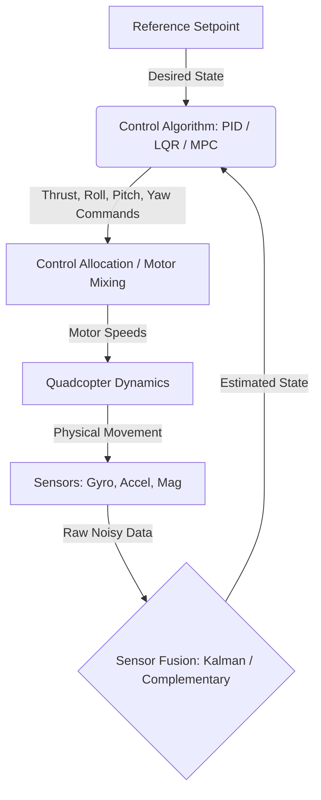

# 3.1 Flight Control Algorithms

> [!abstract] Learning Objectives
> Master PID, LQR, and MPC control theory for multirotor attitude stabilization.

### Fundamentals of Quadcopter Dynamics

A quadcopter is an underactuated, nonlinear, complex dynamical system characterized by six degrees of freedom (DoF)—three translational and three rotational coordinates—controlled by only four inputs (the rotors) . The basic mathematical model of a quadrotor's motion is formulated using principles of physics such as the Newton-Euler or Euler-Lagrange equations [3-5].

Flight control relies on the differential modulation of rotor speeds to generate torques and thrust:
*   **Thrust:** Modifying all four rotor velocities equally to control altitude .
*   **Roll and Pitch:** Differentially adjusting the speed of opposite rotor pairs on the lateral and longitudinal axes, creating torque to tilt the body .
*   **Yaw:** Creating a reactive torque imbalance by speeding up the clockwise-spinning rotor pair while simultaneously slowing down the counter-clockwise pair .

To stabilize this inherently unstable system, high-speed closed-loop control architectures are required to repeatedly read sensor data, compute errors, and adjust motor commands .

### Sensor Fusion: Estimating the System State

Before any control algorithm can compute the required motor inputs, it must know the exact orientation (attitude) and position of the drone. Inertial Measurement Units (IMUs) continuously gather data, but individual sensors have inherent physical limitations:
*   **Accelerometers:** Measure gravitational and linear acceleration but are extremely noisy and susceptible to high-frequency mechanical vibrations .
*   **Gyroscopes:** Measure precise short-term angular velocity but suffer from low-frequency drift over time, causing cumulative errors .
*   **Magnetometers:** Measure absolute heading (yaw) against the Earth's magnetic field but are highly sensitive to local magnetic interference .

**Sensor Fusion** is the mathematical process of combining these disparate data streams to output an accurate state estimate (pitch, roll, yaw, and position). Two primary algorithms process this data for flight controllers:

1.  **Complementary Filter:** A frequency-domain approach well-suited for embedded systems lacking computational power . It applies a low-pass filter to the accelerometer (to reject high-frequency vibrational noise) and a high-pass filter to the integrated gyroscope signal (to reject low-frequency drift) . 
2.  **Kalman Filter:** An optimal stochastic estimator that minimizes the mean squared error of the state estimate . The Kalman Filter predicts the future state using a kinematic model (primarily integrating gyroscope data) and then corrects this prediction using the absolute references provided by the accelerometer and magnetometer . The Kalman filter fundamentally assumes that the process and measurement noises are independent, zero-mean Gaussian processes .

### Control Architecture and Algorithm Comparison

Once the fused state estimate is available, the flight control algorithm computes the necessary control actions. 

#### Proportional-Integral-Derivative (PID) Control
The PID controller is a classical linear time-invariant Single-Input Single-Output (SISO) mechanism . It calculates an error value $e(t)$ as the difference between a desired setpoint and the fused sensor measurement, applying a transformation based on three terms:
*   **Proportional (P):** Multiplies the current error by a constant. It dictates the immediate responsiveness of the quadcopter but causes oscillation and steady-state error if used alone .
*   **Integral (I):** Integrates past errors over time to eliminate steady-state error, ensuring the drone eventually reaches the exact target rate or angle .
*   **Derivative (D):** Calculates the rate of change of the error, predicting its future value to dampen the system and reduce overshoot [20-22].

**Implementation & Sensor Processing:** Because quadcopters are heavily coupled 6-DoF systems, standard PID implementation requires decoupling the system into multiple loops. Typically, six separate PID controllers are used (e.g., a fast inner loop for roll/pitch rotational rates and a slower outer loop for absolute angles) . A major limitation of PID is that the non-linear dynamics of the quadrotor must be linearized around an operating point (usually a flat hover) . While fast and ubiquitous, PID control exhibits aggressive behavior, often resulting in multiple overshoot peaks during aggressive maneuvers .

#### Linear Quadratic Regulator (LQR)
LQR is an optimal control strategy that departs from the SISO limitations of PID by processing the entire state matrix simultaneously as a Multi-Input Multi-Output (MIMO) system . 

**Implementation & Sensor Processing:** Like PID, LQR requires a linearized state-space representation of the quadcopter ($\dot{X} = AX + BU$) . LQR optimizes a specific mathematical cost function:
$$ J = \int (X^T Q X + U^T R U) dt $$
Where $Q$ is the weight matrix penalizing state errors (prioritizing fast response) and $R$ is the weight matrix penalizing actuator effort (minimizing power consumption) . By solving the Algebraic Riccati Equation, LQR computes a full-state feedback gain matrix $K$ . 

The fused sensor data is fed into a single control loop as the state vector $X$, and the optimal control inputs are calculated simply as $U = -KX$ . LQR is generally more robust than PID; comparative simulations show that while PID generates multiple overshoots when tracking a setpoint, LQR can achieve steady-state with a smooth, single-overshoot response, resulting in superior stability .

#### Model Predictive Control (MPC)
MPC is an advanced optimal control framework that computes control actions by solving a constrained finite-horizon optimization problem in real-time . Rather than acting only on current error (like PID) or an infinite-horizon linear model (like LQR), MPC looks ahead a set number of timesteps (the prediction horizon) to predict how the quadcopter will behave, applying only the first step of the optimized control sequence before recalculating [36-38].

**Implementation & Sensor Processing:** MPC directly handles both state constraints (e.g., avoiding obstacles) and input constraints (e.g., motor saturation limits) . 
*   **Linear MPC (LMPC):** Utilizes a linearized model of the quadcopter dynamics around hover. It is computationally lighter but loses accuracy when the quadcopter departs significantly from the linear operating point .
*   **Nonlinear MPC (NMPC):** Optimizes directly over the nonlinear kinematic equations of the quadcopter ($ \dot{x} = f(x,u) $) . NMPC strongly outperforms LMPC during aggressive maneuvers with large tilt angles because it accurately predicts the nonlinear aerodynamic couplings .

In modern MPC architectures, the processing of sensor fusion data is often natively integrated via an augmented state observer, such as an Extended Kalman Filter (EKF). The EKF not only estimates the standard states (pitch, roll, yaw, position) but also estimates unmodeled external disturbances (like wind gusts or slung loads) . The MPC algorithm uses this augmented state estimation to achieve offset-free tracking, aggressively rejecting disturbances that would otherwise cause a steady-state error in the physical environment .

---

---

## 📊 Slide Deck
> [!info] Presentation Available
> 📎 [[3.1 Flight Control Algorithms.pdf]]

### 🧭 Navigation
⬅️ **Previous:** [[3.0 Module Overview]]
⬆️ **Module:** [[3.0 Module Overview]]
➡️ **Next:** [[3.2 Autopilot Platforms - PX4 and ArduPilot]]

