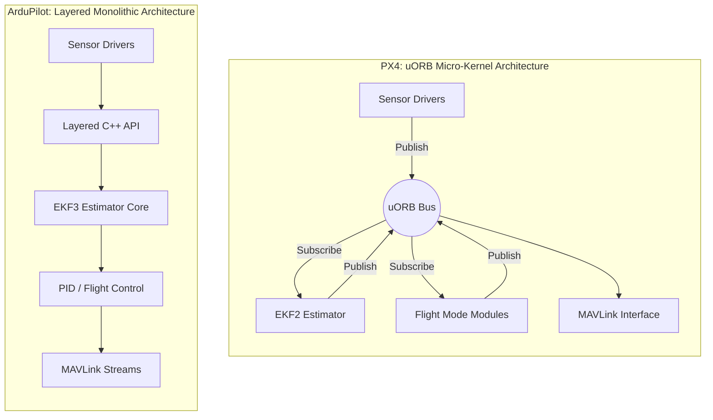

# 3.2 Autopilot Platforms - PX4 and ArduPilot

> [!abstract] Learning Objectives
> Compare the two dominant open-source autopilot ecosystems and their architectures.

# Technical Comparison: PX4 vs. ArduPilot Autonomous Systems

To understand the divergence between PX4 and ArduPilot, one must analyze them from first principles: how they handle state estimation and process scheduling (Architecture), how they treat intellectual property (Licensing), and how they interact with external command loops (Ground Control Stations). 

## 1. Architectural First Principles: Micro-kernel vs. Monolithic Design

At the core of any autopilot is the method by which sensor data is ingested, processed into state estimates, and translated into actuator commands. The platforms take fundamentally different approaches to this data pipeline.

### PX4: The Modular Micro-kernel
PX4 operates on a micro-kernel philosophy centered around the **uORB (micro-Object Request Broker)**, an asynchronous publish/subscribe messaging bus . 

* **Event-Based Isolation:** In PX4, every component—from sensor drivers to flight mode controllers—operates as a discrete, isolated module . A sensor driver reads hardware registers and publishes time-stamped data to a specific uORB topic. The estimator (EKF2) and flight controllers independently subscribe to these topics .
* **Fault Tolerance via Decoupling:** Because of this strict separation, a driver crash is isolated to its specific module; the system can seamlessly switch to a healthy topic instance without halting the core flight loop . Voting for sensor redundancy happens at this driver layer .
* **Latency Profile:** The internal hop count (Driver → uORB → Flight-Mode → MAVLink) is optimized for deterministic, low-latency execution, achieving sub-10 millisecond latency on modern H7 reference boards .

### ArduPilot: The Layered Monolith
ArduPilot utilizes a monolithic, tightly integrated C++ architecture running predominantly on the ChibiOS Real-Time Operating System . 

* **Direct Data Funneling:** Instead of an asynchronous message bus, sensor data is ingested through a layered C++ API and fed directly into the Extended Kalman Filter (EKF3) core . 
* **Estimator-Level Voting:** Rather than isolating redundancy at the driver level, ArduPilot achieves robustness through deep integration. In recent versions, it runs multiple EKF3 instances in parallel, continuously voting sensor sets in or out directly at the estimator layer . 
* **Bandwidth and Efficiency:** This monolithic structure introduces less messaging overhead, making it highly memory-efficient for constrained microcontrollers and highly disciplined with bandwidth . ArduPilot's "High-Latency Mode" can throttle telemetry to under 100 bytes per second, which is critical for remote satellite-linked operations .

## 2. Licensing: The Economics of Intellectual Property

The licensing model of a flight stack dictates the legal framework for commercialization. This is often the deciding factor for enterprise deployments.

### ArduPilot: GNU General Public License v3 (GPLv3)
ArduPilot operates under a strict "copyleft" GPLv3 license [10-12]. 
* **Derivative Obligations:** Any modifications made to the ArduPilot source code must be made open-source and shared back with the community if the resulting product is distributed commercially . 
* **The Companion Computer Exemption:** While the flight controller code must remain open, proprietary IP (such as computer vision, AI, or specialized mission logic) can be securely encapsulated on an off-board companion computer (e.g., NVIDIA Jetson) . Because this computer communicates with ArduPilot purely via the MAVLink protocol, its software does not trigger the GPLv3 derivative clause .

### PX4: Berkeley Software Distribution (BSD 3-Clause)
PX4 utilizes the highly permissive BSD 3-Clause license .
* **Proprietary Encapsulation:** BSD allows organizations to fork the codebase, make deep, proprietary modifications to the core flight algorithms, and commercialize the resulting binaries without ever disclosing the source code . 
* **Strategic Fit:** This is the standard choice for defense contractors, venture-backed startups, and dual-use export operations that require strict code escrow, ensuring their core navigational IP remains a protected trade secret .

## 3. Ground Control Station (GCS) Integration & Tooling

Both systems rely on the **MAVLink 2.4** middleware protocol to communicate with Ground Control Stations [19-21]. However, their primary GCS environments cater to entirely different operational philosophies.

### QGroundControl (QGC) - The Mobile-First UX
QGC is the primary GCS for the PX4 ecosystem, though it supports ArduPilot [22-24].
* **Architecture:** Built on modern C++ and the Qt/QML framework, QGC is natively cross-platform (Windows, macOS, Linux, iOS, Android) .
* **UI/UX:** It utilizes hardware-accelerated, adaptive widgets that dynamically resize from a 6-inch mobile screen to a 32-inch desktop monitor, significantly reducing cognitive load [24-26].
* **Performance:** QGC is highly optimized for fast boot times (approx. 3.7 seconds to a live HUD) and maintains a low idle resource footprint (4% CPU) .
* **SDK Synergy:** Automation is typically handled externally via **MAVSDK**, a high-level API with bindings in C++, Python, Swift, and Kotlin .

### Mission Planner - The Forensic Workhorse
Mission Planner is the undisputed standard for ArduPilot .
* **Architecture:** Developed as a Windows-first application using C# and WinForms .
* **UI/UX:** The interface is incredibly dense, providing instant access to parameter trees, deep dataflash log analyzers, and complete SITL (Software In The Loop) simulation harnesses .
* **Embedded Scripting:** Mission Planner uniquely embeds an **IronPython** engine directly into the .NET Common Language Runtime (CLR) . This allows scripts to directly manipulate UI buttons, read real-time status variables, and execute complex conditional failsafes without requiring an external IDE or compiled API .
* **Performance:** Due to the WinForms draw loop, it carries a slightly heavier footprint (6.1 second boot, 7% idle CPU) but remains the definitive tool for engineers requiring forensic-level data manipulation .

---

---

## 📊 Slide Deck
> [!info] Presentation Available
> 📎 [[3.2 Autopilot Platforms - PX4 and ArduPilot.pdf]]

### 🧭 Navigation
⬅️ **Previous:** [[3.1 Flight Control Algorithms]]
⬆️ **Module:** [[3.0 Module Overview]]
➡️ **Next:** [[3.3 FPV Software and Video Systems]]

