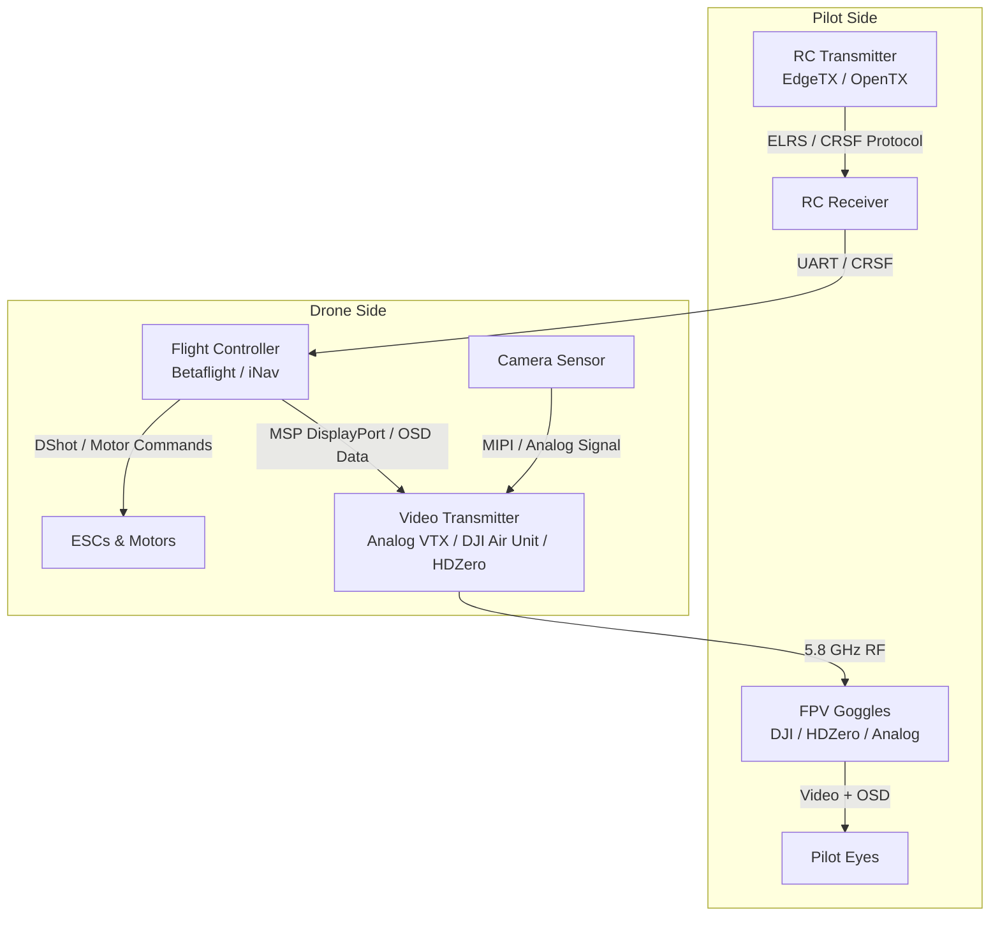

# 3.3 FPV Software and Video Systems

> [!abstract] Learning Objectives
> Explore Betaflight firmware, video transmission protocols, OSD systems, and FPV simulators. Technical deep dive into the software stack powering First-Person View (FPV) drone flight — from video transmission protocols and on-screen displays to flight controller firmware, radio link software, and the simulator ecosystems used for pilot training.

## Introduction

First-Person View (FPV) flying represents one of the most technically demanding and exhilarating applications of drone technology. Unlike autonomous mission-based operations covered in previous lessons, FPV places a human pilot directly "inside" the drone via a real-time video feed, demanding an extremely low-latency, tightly integrated software stack that spans the entire signal chain — from camera sensor to pilot goggles.

This lesson examines the complete FPV software ecosystem from first principles: the firmware running on flight controllers, the protocols governing radio links and video transmission, the on-screen display (OSD) systems that overlay critical telemetry, and the PC-based simulators that allow pilots to train safely.

---

## 1. Flight Controller Firmware: Betaflight, iNav, and KISS

The heart of any FPV drone is the flight controller firmware — the real-time software executing PID loops, processing RC inputs, and managing hardware peripherals at rates of 4–8 kHz.

### Betaflight
- **Architecture:** Open-source firmware forked from Cleanflight (itself derived from MultiWii). Written in C, targeting STM32 microcontrollers (F405, F722, H743).
- **Core Features:** RPM filtering (bidirectional DShot telemetry for per-motor notch filters), dynamic idle, anti-gravity gain, feedforward control for stick prediction, and configurable rate profiles.
- **Configurator:** The Betaflight Configurator (Electron-based GUI) provides visual PID tuning, receiver mapping, OSD element placement, and firmware flashing over USB/DFU.

### iNav
- **Differentiation:** Extends the Cleanflight/Betaflight lineage with a strong focus on GPS-assisted navigation — waypoint missions, return-to-home, position hold, and altitude hold.
- **Use Case:** Long-range FPV fixed-wing and multirotor cruising where autonomous failsafes and navigation are critical.

### KISS (Keep It Super Simple)
- **Philosophy:** Closed-source, commercially developed firmware emphasizing minimal latency and clean flight feel through optimized, hand-tuned control loops.

---

## 2. Radio Link Software and Protocols

The RC (Radio Control) link is the digital tether between pilot and drone. Modern FPV systems have moved far beyond legacy analog PWM signals.

### ExpressLRS (ELRS)
- **Architecture:** Open-source, long-range, low-latency radio link protocol operating on 2.4 GHz and 900 MHz ISM bands.
- **Key Innovation:** Achieves sub-millisecond latency at 500 Hz packet rates on 2.4 GHz — the fastest open-source RC link available.
- **Software Stack:** Lua-based configuration scripts run on the transmitter (EdgeTX/OpenTX), with firmware updates flashed via Wi-Fi or USB to both TX and RX modules.

### TBS Crossfire / Tracer
- **Crossfire:** 900 MHz proprietary long-range system by Team BlackSheep, known for robust penetration and range (40+ km).
- **Tracer:** 2.4 GHz variant optimized for ultra-low latency racing applications.
- **CRSF Protocol:** The Crossfire Serial Protocol (CRSF) has become a de-facto standard for high-speed bidirectional telemetry between receivers and flight controllers, adopted even by competing systems.

### EdgeTX / OpenTX
- **Role:** Open-source firmware for RC transmitters (RadioMaster, Jumper, FrSky). Provides model configuration, mixer logic, switch assignment, telemetry display, and Lua scripting for custom UIs and ELRS configuration.

---

## 3. Video Transmission Systems

The video link is arguably the most latency-sensitive component in the entire FPV stack.

### Analog Video
- **Standard:** Traditional 5.8 GHz analog transmission using NTSC/PAL signals. Near-zero latency (~5 ms glass-to-glass), but limited resolution (roughly 480–540 TVL) and susceptible to interference.
- **OSD Integration:** Analog On-Screen Displays (e.g., via MAX7456 chip) overlay telemetry data directly onto the analog video signal before transmission.

### DJI Digital FPV System
- **Architecture:** Proprietary H.264/H.265 encoded digital video at 720p/120fps or 1080p/60fps over a custom OFDM radio link.
- **Latency:** ~28–40 ms glass-to-glass (higher than analog, but with dramatically superior image quality).
- **Software Integration:** DJI Air Units communicate with Betaflight via the MSP (MultiWii Serial Protocol) DisplayPort for OSD rendering, allowing Betaflight's OSD elements to be rendered in the DJI goggles natively.

### HDZero
- **Philosophy:** Open-standard digital FPV system designed to match analog latency (~15 ms) while providing 720p digital clarity.
- **Key Feature:** Near-zero latency digital encoding using a custom ASIC, race-legal and supported by major FPV racing leagues.

### Walksnail Avatar
- **Architecture:** Digital HD system competing with DJI, offering 1080p recording, lower latency than DJI (~22 ms), and open OSD support via MSP DisplayPort.

---

## 4. On-Screen Display (OSD) Systems

The OSD is the pilot's instrument panel — telemetry data overlaid directly onto the video feed.

### Key OSD Elements
- **Flight Data:** Battery voltage, current draw, mAh consumed, RSSI (signal strength), link quality percentage.
- **Navigation:** GPS coordinates, altitude, speed, distance from home, heading arrow, artificial horizon.
- **System Health:** CPU load, gyro temperature, ESC RPM (via bidirectional DShot), warnings and arming flags.

### OSD Rendering Pipeline
1. **Betaflight OSD:** The flight controller formats telemetry into character-map or canvas-mode frames.
2. **Analog Path:** MAX7456 chip physically overlays characters onto the composite video signal.
3. **Digital Path (MSP DisplayPort):** Betaflight transmits OSD data over UART to the digital VTX (DJI/HDZero/Walksnail), which renders it in the goggles' display pipeline.

---

## 5. FPV Simulators and Training Software

Modern simulators provide physics-accurate flight models that allow pilots to develop muscle memory without destroying hardware.

### Key Simulators
- **Velocidrone:** Highly regarded physics model, widely used for competitive FPV racing training. Supports multiplayer racing and custom tracks.
- **Liftoff:** Unreal Engine-based simulator with realistic graphics and a large community track library.
- **DRL Simulator:** Official Drone Racing League simulator, used for virtual tryouts and professional pilot recruitment.
- **Orqa FPV.SkyDive:** Free simulator by Orqa, focused on freestyle with accurate physics.

### Sim-to-Real Transfer
- Simulators accept direct USB input from real RC transmitters (via HID/joystick protocols), ensuring identical stick feel and muscle memory transfer.
- Rate profiles and expo curves configured in simulators can be matched exactly to Betaflight/EdgeTX settings for seamless real-world transition.

---

## 6. Ecosystem Integration Diagram

---

## 📊 Slide Deck
> [!info] Presentation Available
> 📎 [[3.3 FPV Software and Video Systems.pdf]]

### 🧭 Navigation
⬅️ **Previous:** [[3.2 Autopilot Platforms - PX4 and ArduPilot]]
⬆️ **Module:** [[3.0 Module Overview]]
➡️ **Next:** [[3.4 MAVLink Protocol and Communication]]

*Generated for the Drone Curriculum · 2026-04-19*
