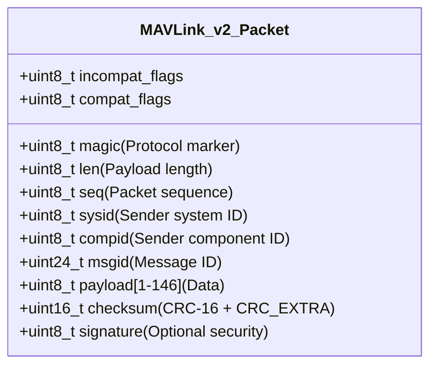
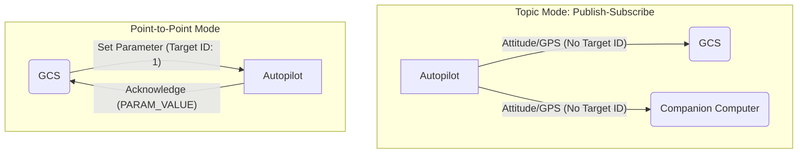

# 3.4 MAVLink Protocol and Communication

> [!abstract] Learning Objectives
> Understand the MAVLink binary telemetry protocol for drone-to-GCS communication.

### MAVLink Protocol: Architecture and First Principles

MAVLink is a highly efficient, lightweight binary telemetry protocol engineered specifically for bandwidth-constrained communication links and resource-constrained autonomous systems (such as drones, onboard companion computers, and ground control stations) . Operating fundamentally on a hybrid network model, it allows for both multi-node data streaming and highly reliable point-to-point configuration management .

#### Binary Telemetry Structure and Serialization

At its core, MAVLink dictates a strict, byte-level packet structure designed to minimize overhead. MAVLink v1 requires only 8 bytes of overhead per packet, while the highly extensible and secure MAVLink v2 requires 14 bytes .

**Serialization Algorithm:** To maximize packing efficiency and eliminate memory alignment issues across disparate microcontrollers, MAVLink does not serialize data in the order defined by its XML message specifications. Instead, the over-the-wire generator utilizes a stable sorting algorithm to order fields strictly by their data size—largest types (e.g., `uint64_t`) are packed first, down to the smallest bytes . 

**Integrity and Validation:** MAVLink enforces integrity at two levels :
1. **Link Integrity:** A `CRC-16/MCRF4XX` checksum validates that the payload has not been corrupted over the physical transmission link .
2. **Definition Integrity:** To prevent catastrophic misinterpretation of payload data between nodes running different protocol versions, MAVLink generates a `CRC-16-CCITT` hash of the underlying XML data definition. This hash (stored as `CRC_EXTRA`) is used to seed the packet's transmission CRC, guaranteeing that a packet is only accepted if both the sender and receiver share the exact same structural understanding of the message ID .

**

#### Communication Paradigms: Publish-Subscribe vs. Point-to-Point

MAVLink optimizes link bandwidth by deploying two distinct communication topologies depending on the nature of the data .

*   **Publish-Subscribe (Topic Mode):** Telemetry streams (e.g., IMU data, GPS positioning, attitude) flow as high-rate multicast topics . In this mode, the protocol omits target system (`sysid`) and component (`compid`) IDs. This allows a drone to broadcast its state once, while multiple data sinks—such as a Ground Control Station (GCS), an onboard companion computer, and a cloud interface—subscribe and ingest the stream simultaneously with zero redundant bandwidth overhead .
*   **Point-to-Point Mode:** Critical system changes requiring guaranteed delivery (such as mission routing or parameter adjustments) are routed directly to a specific target system and component ID . This mode utilizes rigorous request-acknowledge handshake mechanisms .

#### Drone Control and Sub-Protocols

While MAVLink fundamentally just passes messages, drone control is abstracted into specialized sub-protocols operating on top of the binary layer:

*   **Command Protocol:** Real-time instructions are transmitted using the `COMMAND_LONG` message (Message ID 76) . This single message ID can instruct the drone to perform hundreds of actions by specifying a standard `MAV_CMD` enumeration. For example, setting the command field to `21` instructs the drone to land, while `16` establishes a navigation waypoint, with the message's parameter fields acting as dynamic variables for the chosen command (e.g., defining loiter time, latitude, and longitude) .
*   **Mission Protocol:** This point-to-point sub-protocol manages the upload, download, and execution of flight plans, geofences, and rally points . Because communication links can be lossy, it employs a timeout and re-request architecture. A GCS initiates an upload by declaring a `MISSION_COUNT`; the drone iterates sequentially by requesting each item via `MISSION_REQUEST_INT`, and the GCS responds with `MISSION_ITEM_INT` messages containing coordinate frames (scaled by `1E7` for float precision optimization) .
*   **Parameter Protocol:** Autopilot configuration variables are manipulated via key-value pairs (maximum 16-character keys) . Due to strict payload definitions, all parameter values are encapsulated within a 4-byte IEEE 754 single-precision float (`param_value`). To accommodate complex variable types (like 32-bit integers), the protocol defines specific capability flags (`MAV_PROTOCOL_CAPABILITY_PARAM_ENCODE_BYTEWISE` or `MAV_PROTOCOL_CAPABILITY_PARAM_ENCODE_C_CAST`) that instruct the system whether to bit-shift the data directly into the bytes or use a C-style cast, preventing floating-point precision loss on large values .

#### Global Communication and Limitations

Because MAVLink natively utilizes UDP/TCP protocols when extended beyond serial limits, it can be forwarded securely over wide-area networks . By running a MAVLink router on a companion computer (like a Raspberry Pi), developers can interface the UART serial stream with a VPN (e.g., NetBird, ZeroTier, Tailscale) via 4G/5G connections, enabling encrypted, global publish-subscribe control of a drone from any internet-connected GCS .

**Architectural Limits:** It is critical to recognize that MAVLink is standardized for stability and efficiency, not hard real-time latency . If a system architecture demands microsecond-level synchronization or high-frequency access to raw internal state variables (like raw un-filtered IMU access for ROS2), MAVLink's standard polling rates become a bottleneck. In such edge cases, bridging frameworks like `uXRCE-DDS` (MicroXRCEAgent) are advantageous, as they bypass MAVLink's serialization standards for direct, low-latency access to the flight controller's internal publish-subscribe bus [141, 143-145].

---

---

## 📊 Slide Deck
> [!info] Presentation Available
> 📎 [[3.4 MAVLink Protocol and Communication.pdf]]

### 🧭 Navigation
⬅️ **Previous:** [[3.3 FPV Software and Video Systems]]
⬆️ **Module:** [[3.0 Module Overview]]
➡️ **Next:** [[3.5 Ground Control Stations and Mission Planning]]

