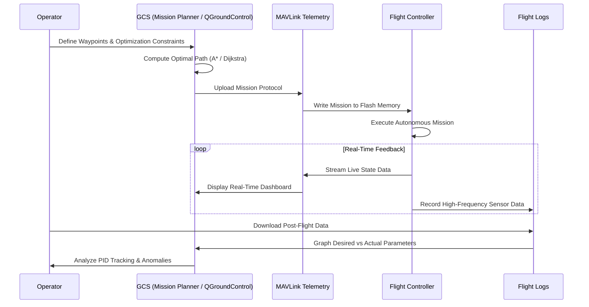

# 3.5 Ground Control Stations and Mission Planning

> [!abstract] Learning Objectives
> Learn QGroundControl, Mission Planner, and autonomous waypoint mission design.

# Ground Control Stations (GCS): Architecture and First Principles

A Ground Control Station (GCS) functions as the terrestrial command-and-control nexus for an Unmanned Aerial Vehicle (UAV). From a first-principles perspective, the GCS acts as the human-machine interface (HMI) that translates operator intent into machine-readable digital commands, transmitted via radio frequency telemetry to the drone's flight controller . 

Modern flight controllers are configured, monitored, and steered through these sophisticated software platforms, allowing operators to tune control parameters, calibrate micro-electromechanical sensors (IMUs), plan autonomous missions, and conduct flight simulations . 

### Prominent GCS Platforms
*   **Mission Planner:** Widely utilized in conjunction with the ArduPilot ecosystem, Mission Planner is a Windows-based GCS that provides a comprehensive, user-friendly graphical interface for drone configuration, monitoring, and mission design .
*   **QGroundControl:** Frequently used alongside PX4 and other flight stacks, QGroundControl serves as an intuitive interface for setting complex waypoints, defining autonomous actions, and can even function as a specialized integrated development environment (IDE) for drone software development .
*   **MAVProxy:** For highly technical and debugging applications, MAVProxy operates as a command-line GCS built upon the MAVLink communication protocol, facilitating advanced network routing and scripting functions .

# Autonomous Mission Planning

Autonomous mission planning transforms a drone from a remotely piloted vehicle into an intelligent, self-navigating agent. This process is mathematically and computationally grounded in graph theory and spatial geometry, where the GCS defines a sequence of target states for the drone to achieve .

### Waypoint Taxonomy
In tools like Mission Planner and QGroundControl, mission planning is accomplished by programming a chronological sequence of waypoints, actions, and conditional logic . These waypoints are classified into distinct types based on their functional requirements:
1.  **Position Waypoints:** The foundational elements of navigation, defining the precise 3D spatial target using GPS coordinates (latitude, longitude, and altitude) .
2.  **Action Waypoints:** Spatial markers that trigger a specific hardware or software execution upon arrival, such as lowering altitude, releasing a payload, or triggering a camera shutter .
3.  **Conditional Waypoints:** Logical nodes that dictate the drone's progression based on environmental or internal sensor feedback (e.g., waiting to reach a specific altitude or verifying an object detection threshold before proceeding) .
4.  **Dynamic Waypoints:** Target vectors that are continuously recalculated and updated in real-time based on live data feeds or sensor fusion outputs .

### Route Optimization
Setting waypoints is only the foundational layer of mission planning. The GCS and onboard algorithms must compute an optimal flight path. This route planning requires solving optimization problems using classical graph-search algorithms like **Dijkstra’s algorithm** and **A* (A-Star)** to calculate the most efficient path . An optimized route must actively account for multiple operational constraints, including finite energy resources, prevailing wind conditions, and regulatory no-fly zones . 

# Telemetry and Log Analysis

Once an autonomous mission is executed, the continuous evaluation of the drone's performance is governed by real-time telemetry and post-flight log analysis. Drones rely on sophisticated data logging architectures that continuously capture high-frequency flight parameters from the flight controller and its array of sensors . 

### The Analytical Process
1.  **Data Capture:** During flight, the onboard memory records massive amounts of internal state data (e.g., desired vs. actual roll/pitch/yaw rates, motor PWM outputs, GPS coordinates, and barometer readings) alongside external data from cameras and sensors .
2.  **Visualization and Graphing:** Post-flight, operators extract these flight logs into the GCS or specialized analysis software. This raw numerical data is graphed to visualize the drone's dynamic behavior . 
3.  **PID Tuning Validation:** A primary use case for log analysis is evaluating the efficacy of the Proportional-Integral-Derivative (PID) control loop. By graphing the "desired attitude" against the "actual attitude" over time, engineers can visualize overshoots or oscillations, allowing them to precisely tune the PID parameters for optimal stability .
4.  **Incident Diagnostics:** In the event of an anomaly or mechanical failure, expert teams conduct root-cause analysis by meticulously reviewing the flight logs . Spikes in motor output, sudden drops in battery voltage, or GPS multipath errors can be isolated within the logs to diagnose exactly what triggered the incident .

### GCS and Autonomous Operation Architecture

---

---

## 📊 Slide Deck
> [!info] Presentation Available
> 📎 [[3.5 Ground Control Stations and Mission Planning.pdf]]

### 🧭 Navigation
⬅️ **Previous:** [[3.4 MAVLink Protocol and Communication]]
⬆️ **Module:** [[3.0 Module Overview]]
➡️ **Next:** [[3.6 AI and Machine Learning for Drones]]

