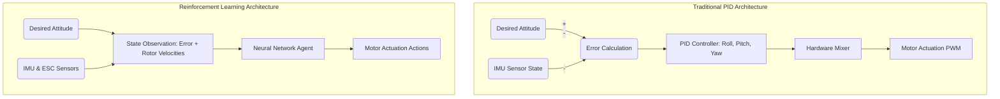

# 3.6 AI and Machine Learning for Drones

> [!abstract] Learning Objectives
> Apply deep reinforcement learning and neural networks to autonomous flight control.

# First Principles of UAV Dynamics and Attitude Control

To fundamentally understand the shift from traditional linear controllers to intelligent Reinforcement Learning (RL) agents, one must first examine the flight dynamics of a multirotor Unmanned Aerial Vehicle (UAV). A quadcopter operates as an underactuated system; it possesses six degrees of freedom (three rotational and three translational) but is driven by only four control inputs corresponding to its rotors . 

The rotational movement—expressed as Euler angles representing roll ($\phi$), pitch ($\theta$), and yaw ($\psi$)—is generated by manipulating the angular velocities ($\omega_i$) of the four independent rotors . The torque and thrust aerodynamic effects are mathematically deterministic based on the frame's geometry. For an "X" configuration quadcopter, the roll control input ($u_\phi$) is dictated by the difference in thrust generated by opposing pairs of motors: 
$u_\phi = b(\omega_1^2 + \omega_2^2 - \omega_3^2 - \omega_4^2)$, where $b$ is the thrust factor . 

The autopilot system governing this dynamic environment is typically split into an "outer loop" for mission-level navigation, and an "inner loop" for time-critical attitude control . The inner loop is responsible for manipulating the rotor velocities to minimize the error between the aircraft's current angular velocity ($\Omega$) and the desired target angular velocity ($\Omega^*$) .

# Traditional PID Control: Mechanics and Limitations

The vast majority of commercial quadcopters utilize Proportional-Integral-Derivative (PID) controllers for their inner attitude control loops . A PID controller is a linear feedback mechanism that computes a control signal $u(t)$ based on the current angular velocity error $e(t)$ using three terms :

1.  **Proportional ($K_p$):** Reacts to the current magnitude of the error.
2.  **Integral ($K_i$):** Accounts for the historical accumulation of past errors.
3.  **Derivative ($K_d$):** Estimates the future trajectory of the error to dampen the response.

### Limitations of PID

While highly tuned PID systems (using methods like Ziegler-Nichols tuning) demonstrate exceptional performance in stable environments, they present fundamental limitations when subjected to real-world nonlinear dynamics . 
*   **Reactive Nature:** Because they are strictly feedback controllers, they can only output a correction *after* an error has already occurred, limiting proactive stabilization .
*   **Integral Windup and Mixing:** PID controllers require a separate "mixing" table to translate the computed axis control signals into raw power distributions for specific motor layouts . Furthermore, they are susceptible to integral windup during prolonged disturbances .
*   **Vulnerability to Environmental Dynamics:** PID networks struggle with unknown dynamic elements such as wind turbulence, variable payloads, and voltage sag, often requiring complex gain-scheduling to adapt .

# Reinforcement Learning for Attitude Control

To develop resilient flight controllers, researchers are turning to artificial neural networks trained via Reinforcement Learning . Rather than manually tuning linear parameters, an RL agent operates within a Markov Decision Process (MDP), interacting with a high-fidelity digital twin simulation to learn an optimal control policy ($\pi$) mapping states to actions . 

*   **State Space ($x_t$):** The neural network agent observes continuous parameters, including the angular velocity error for each axis ($e = \Omega^* - \Omega$) and the current angular velocity of each individual rotor ($\omega_i$) .
*   **Action Space ($a_t$):** The network outputs four continuous control signals mapping directly to the individual motor Electronic Speed Controllers (ESCs), bypassing the need for a traditional hardware mixer completely .
*   **Reward Function ($r_t$):** The agent learns by maximizing a normalized reward signal that heavily penalizes the sum of the absolute angular velocity errors across all axes .

## Algorithmic Comparison: PPO vs. TRPO vs. DDPG

State-of-the-art RL methods designed for continuous action spaces yield vastly different capabilities when tasked with high-precision, sub-second UAV attitude control. The primary baseline algorithms evaluated are Deep Deterministic Policy Gradient (DDPG), Trust Region Policy Optimization (TRPO), and Proximal Policy Optimization (PPO) .

### 1. DDPG & TRPO (Instability and Oscillation)
*   **DDPG:** An actor-critic, model-free architecture . During training, DDPG displayed significant instability, with agents entirely failing to respond to certain flight command inputs, indicating a failure to effectively map the underlying physics . 
*   **TRPO:** Relies on natural gradient policy methods to theoretically guarantee monotonic improvements . However, in time-critical flight tasks, TRPO displayed massive confidence intervals and struggled with extreme control oscillations, particularly in the roll and yaw axes . For instance, the best TRPO agent failed to achieve its pitch target within a $\pm10\%$ acceptable error band over 39% of the time .

### 2. PPO (Superior Convergence and Precision)
*   **Proximal Policy Optimization:** PPO operates similarly to TRPO but is much more stable and reliable . When analyzing training data, PPO converged consistently and successfully learned flight dynamics, accumulating far higher rewards than its peers . 
*   **State Memory Anomaly:** Interestingly, increasing the agent's historical state memory ($m > 1$) actually decreased convergence and stability, likely due to the RL algorithm requiring vastly more time to map an expanded state space to an optimal action .

## The Paradigm Shift: PPO Outperforming PID

When the highly tuned baseline PID controller was directly pitted against the trained PPO agent (memory $m=1$), the neural network demonstrated unprecedented control metrics .
*   **Total Error:** The PPO controller achieved a 44% decrease in tracking error compared to the PID controller .
*   **Rise Time & Tracking Response:** Despite the conventional control theory paradigm dictating that faster rise times generally cause significant overshoot, the PPO agent achieved a 2.25x faster roll response and a 2.5x faster pitch response without the overshoot explicitly seen in the PID controller .
*   **Proactive Adjustments:** While the PID signal steadily leveled off, the neural network's control signals (Pulse Width Modulation signals to the ESC) exhibited rapid micro-oscillations, indicating continuous, complex micro-adjustments being synthesized by the network to preemptively hold stability . 

Ultimately, PPO's ability to maintain near-perfect success rates (99.8% to 100% across all axes within strict error margins) establishes it as a superior method for replacing traditional PID inner-loops in complex, high-performance aerospace applications .

---

---

## 📊 Slide Deck
> [!info] Presentation Available
> 📎 [[3.6 AI and Machine Learning for Drones.pdf]]

### 🧭 Navigation
⬅️ **Previous:** [[3.5 Ground Control Stations and Mission Planning]]
⬆️ **Module:** [[3.0 Module Overview]]
➡️ **Next:** [[3.7 Swarm Intelligence and Coordination]]

