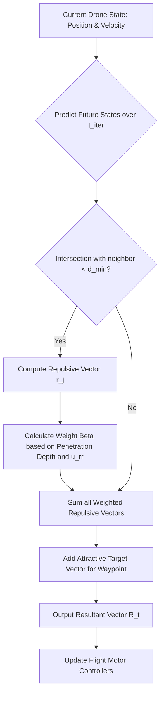

# 3.7 Swarm Intelligence and Coordination

> [!abstract] Learning Objectives
> Explore decentralized algorithms enabling multi-drone collaborative autonomy.

# Principles of Drone Swarm Intelligence and Coordination

From a first-principles perspective, a drone swarm is a multi-agent system designed to achieve a global objective strictly through localized, decentralized interactions without a single point of failure . Driven by biomimetics—mimicking the stigmergic and cohesive behaviors of ants, bees, and birds—swarm logic replaces traditional centralized command structures with distributed, peer-to-peer algorithms .

In a true swarm, every Uncrewed Aerial Vehicle (UAV) is computationally homogeneous, possessing identical capabilities and decentralized decision-making power . The foundational properties governing swarm intelligence include:
*   **Decentralization:** The elimination of a master-slave hierarchy; agents rely entirely on local sensing and peer-to-peer communication .
*   **Scalability:** Control logic functions identically regardless of whether the swarm contains ten or ten thousand nodes .
*   **Fault Tolerance:** The swarm dynamically redistributes tasks or positional volumes if individual agents suffer hardware or communication failures . 

## Decentralized Navigation and State Estimation

Autonomous navigation relies on a drone's ability to constantly estimate its state vector (position, velocity, and orientation) while sharing this telemetry over a mesh network topology . To navigate through 3D space, trajectories are typically optimized by mapping motion onto a discrete structural grid. Drones leverage their differential flatness to approximate complex positional trajectories using polynomial functions (motion primitives), iteratively calculating position and velocity using control vectors . 

### Coping with GPS-Denied Environments
When Global Navigation Satellite Systems (GNSS) are degraded or actively jammed, swarms can no longer rely on external absolute positioning . Under these conditions, dead reckoning—integrating inertial measurements over time—is utilized, though it suffers from rapid, compounding error accumulation (drift) . 

To mathematically correct this drift, swarms utilize **Multi-Target Gaussian Conditional Random Fields (MT-GCRF)**, a structural machine learning framework. 
1.  **Spatio-Temporal Data Extraction:** The swarm forms a nearest-neighbor communication graph . 
2.  **Environmental Modeling:** By continuously monitoring the structural deformations of the swarm network, the MT-GCRF model predicts how environmental deviances (e.g., wind gusts) affect individual drones . 
3.  **Covariance Filtering:** A supra-matrix captures the Euclidean distance similarities between drones, smoothing out the instability of unstructured regressors to continuously correct the dead-reckoned position estimates .

## Trajectory Optimization and Collision Avoidance

To prevent catastrophic physical interference, drone swarms utilize advanced collision avoidance algorithms governed by potential field mechanics and predictive cost functions. Instead of solving continuously heavy differential equations, computation is reduced to evaluating discrete trajectory segments modeled as a graph search problem .

### Predictive Repulsion Vector Mechanics
Collision avoidance logic only activates when a defined minimum safety distance ($d_{min}$) is breached . Drones project future state coordinates over a time step ($t_{iter}$) to predict the exact location of potential intersections . If an incursion is detected, the drone calculates an evasive **Resultant Vector**, heavily weighted by artificial repulsive forces:

*   **Repulsive Vector ($r$):** The directional vector pointing away from an encroaching neighbor or obstacle .
*   **Weight Function ($\beta$):** A non-linear scale applied to the repulsive force depending on how deeply the safety sphere is penetrated . The softness of the avoidance response is dictated by the parameter $u_{rr}$, which divides the safety zone into inner and outer shells . 
*   **Resultant Control Vector ($R(t)$):** The final velocity adjustment is calculated by summing the weighted repulsive vectors of all nearby obstacles and combining them with the attractive vector ($\lambda v_d$) drawing the drone to its target waypoint . 

Alternatively, using the MT-GCRF model framework, a swarm estimates its "center" and computes a volumetric sphere of variance based on the predicted maximum standard deviation of its peripheral drones . If the variance spheres of two independently operating swarms intersect, both swarms autonomously shift their target trajectories along the vector connecting their centers to avoid collision safely .

## Precision Choreography via RTK GPS

While fully autonomous swarms dynamically generate flight paths, choreographic swarms (used in entertainment drone shows) rely on absolute, pre-calculated, deterministic flight logic . Drone counts are largely irrelevant to the execution; if every single drone can mathematically guarantee it will occupy a specific $X, Y, Z$ coordinate at a specific time $T$, collisions are structurally impossible, and the drones do not actually need to be aware of their neighbors .

This demands extraordinary precision in both spatial positioning and temporal synchronization.

### Spatial Calibration: Real-Time Kinematics (RTK)
Standard GPS signals are subject to atmospheric delays and hardware noise, yielding an operational accuracy of roughly 1 to 5 meters—far too imprecise for drones flying in tightly packed formations . To achieve sub-decimeter accuracy, choreographic swarms utilize **RTK GPS** . 

RTK resolves the carrier-phase tracking of the GNSS signal rather than just the information content . 
1.  A stationary base station is established at the launch site, providing a known, static reference datum .
2.  Because the base station knows its exact absolute position, it calculates the difference between its actual position and the position reported by the raw GPS satellite signal, isolating the atmospheric and systemic signal delays .
3.  The base station broadcasts these phase corrections via high-bandwidth radio to the mobile drone units .
4.  The drone's onboard receiver applies these corrections to its own GPS observations, resulting in pinpoint spatial resolution down to a few centimeters . 

### Temporal Synchronization and Show Execution
GPS satellites do not merely transmit position; they transmit an exceptionally accurate time signal driven by atomic clocks (accurate to roughly 100 billionths of a second) . 

Before a performance, a central design studio simulates the entire flight path. It verifies that physical constraints—maximum velocity, maximum acceleration, and inter-drone safety distances—are mathematically respected . This deterministic 4D show file (containing exact positions per fraction of a second) is completely uploaded to every drone prior to launch . 

When the "start" command is given, it is scheduled for a specific global GPS timestamp in the near future . Upon reaching that exact microsecond, every drone continuously evaluates its RTK-provided coordinates against its intended location in the pre-loaded flight file. If a drone is pushed by wind, internal accelerometers and gyroscopes instantly measure the angular velocity and displacement, driving a high-frequency PID controller to speed up or slow down the motors and force the drone back to its required position in space-time .

---

---

## 📊 Slide Deck
> [!info] Presentation Available
> 📎 [[3.7 Swarm Intelligence and Coordination.pdf]]

### 🧭 Navigation
⬅️ **Previous:** [[3.6 AI and Machine Learning for Drones]]
⬆️ **Module:** [[3.0 Module Overview]]
➡️ **Next:** [[3.8 Simulation and Digital Twins]]

