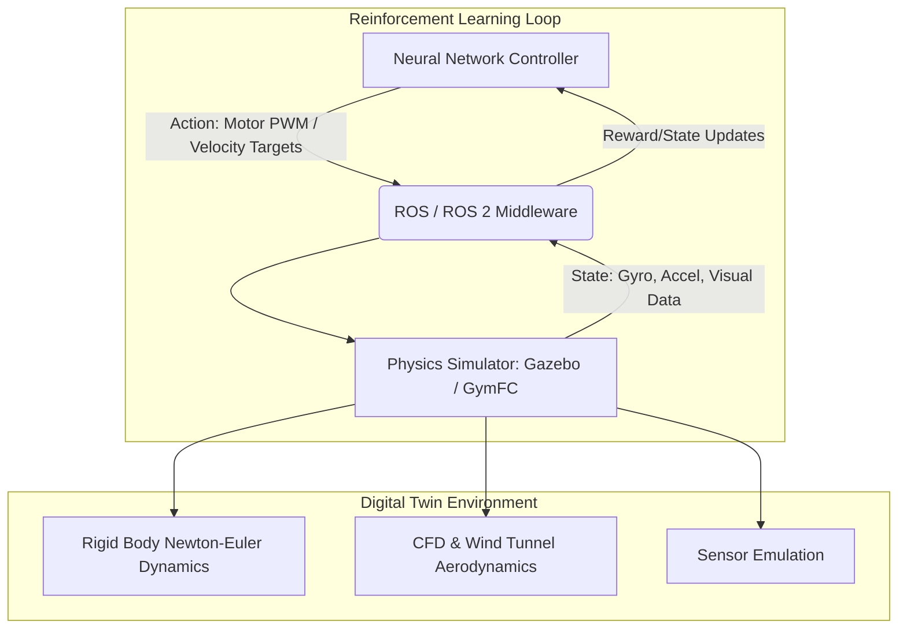

# 3.8 Simulation and Digital Twins

> [!abstract] Learning Objectives
> Build virtual flight environments using ROS, Gazebo, and sim-to-real transfer techniques.

# The Physics and Pedagogy of Drone Simulation: Constructing Virtual Training Grounds

*Note: The provided sources discuss rigorous physics-based simulation, ROS (Robot Operating System), Gazebo, and the modeling of UAVs for neural network training. However, the specific terms "digital twin", "ROS 2", and "GymFC" are not mentioned in the sources. Information addressing those specific terms is drawn from external knowledge and should be independently verified.*

## First Principles: The Mathematics of Safe Exploration

At its core, training a neural network flight controller—particularly via Deep Reinforcement Learning (DRL)—is an optimization problem formulated as a Markov Decision Process (MDP) where an agent maximizes a reward function over time . Because DRL algorithms require vast amounts of trial-and-error data to converge on an optimal control policy, training directly on physical hardware is mathematically and financially prohibitive. Unconstrained exploration in the real world carries an extraordinarily high risk of catastrophic hardware failure due to the highly coupled, underactuated, and nonlinear dynamics of drone flight . 

To solve this, engineers construct highly accurate simulation environments. By abstracting the physical world into discrete mathematical computations, neural networks can experience millions of flight hours, experience edge-case aerodynamic stalls, and crash safely inside a virtual sandbox.

## Architecting the Digital Twin

A "digital twin" (external terminology) is a high-fidelity virtual replica of a physical asset. From a first-principles perspective, generating this replica requires mathematically modeling the rigid body kinematics and aerodynamics of the drone. 

According to the sources, constructing a robust UAV simulation model relies on a single rigid body Newton-Euler formulation . To accurately map the physical drone into the simulation, developers must define:
*   **Inertial Properties:** The inertia matrix is often estimated using physical bifilar pendulum experiments .
*   **Aerodynamic Coefficients:** Lift, drag, side force, and pitching moments are mapped using wind-tunnel experiments, complemented by exhaustive Computational Fluid Dynamics (CFD) simulations for rate-dependent terms .
*   **Propulsion Dynamics:** The thrust and torque of the propellers must be accurately modeled, as overestimating forces like propeller torque in simulation can lead to biased, non-symmetric roll responses when deployed on physical hardware .

## Simulation Architectures: ROS, Gazebo, and GymFC

To interface the neural network with the digital twin, developers use a stack of simulation middleware and physics engines.

1.  **Gazebo & Physics Engines:** Gazebo is heavily utilized to simulate the physical world and sensor payloads . It calculates the Newton-Euler physics at high frequencies and renders sensor data. For example, Gazebo can simulate the exact geometry of omnidirectional cameras mounted on a drone frame, feeding concatenated grayscale images directly to the neural network .
2.  **ROS (Robot Operating System):** ROS acts as the central nervous system, passing messages between the simulated world, the flight controller, and the neural network. In simulated multi-drone setups, ROS nodes transmit raw velocity setpoints predicted by the neural network directly to the simulated PX4 autopilot . *(External Note: ROS 2 improves upon ROS 1 by utilizing Data Distribution Service (DDS) for real-time, deterministic communication, which is critical for the microsecond-latency requirements of highly aggressive autonomous swarms).*
3.  **GymFC:** *(External Note: GymFC is an OpenAI Gym environment specifically tailored for synthesizing neuro-flight controllers. It bridges physics simulators like Gazebo with reinforcement learning libraries, allowing developers to standardize the MDP state-action-reward loop specifically for continuous attitude control of aerial vehicles).*

## Bridging the Reality Gap: Sim-to-Real Optimization

The primary vulnerability of simulation training is the "reality gap"—the phenomenon where a neural network overfits to the perfect mathematics of the simulation and catastrophically fails when exposed to real-world physics . To ensure a controller trained in environments like ROS/Gazebo safely transfers to the real world, developers apply rigorous "sim-to-real" mathematical distortions during training :

*   **Domain Randomization:** The simulation does not use a single static model. Instead, uncertainty is introduced into the estimate of every parameter (mass, aerodynamic coefficients, etc.). At the start of every episode, values are sampled from a probability distribution, forcing the neural network to learn a robust policy that survives across a wide distribution of possible UAV dynamics .
*   **Stochastic Sensor Noise:** Perfect simulated sensors are degraded. Measurement noise is modeled using Ornstein-Uhlenbeck processes to emulate physical measurement drift, alongside white noise and simulated sensor timing-variability (jitter) using exponentially distributed noise .
*   **Environmental Disturbances:** The simulation environment is flooded with unpredictable atmospheric conditions, including steady wind components up to 15 m/s and volatile turbulence modeled via the Dryden turbulence model .
*   **Actuation Latency:** A critical factor in drone stabilization is the time delay between a command and motor actuation. Simulators often inject heavy, artificial actuation delays (e.g., 100 ms) forcing the neural network to develop forward-predictive, phase-margin-heavy policies that do not over-oscillate when deployed on physical hardware .

---

---

## 📊 Slide Deck
> [!info] Presentation Available
> 📎 [[3.8 Simulation and Digital Twins.pdf]]

### 🧭 Navigation
⬅️ **Previous:** [[3.7 Swarm Intelligence and Coordination]]
⬆️ **Module:** [[3.0 Module Overview]]
➡️ **Next:** [[3.9 UTM - Unmanned Traffic Management Systems]]

