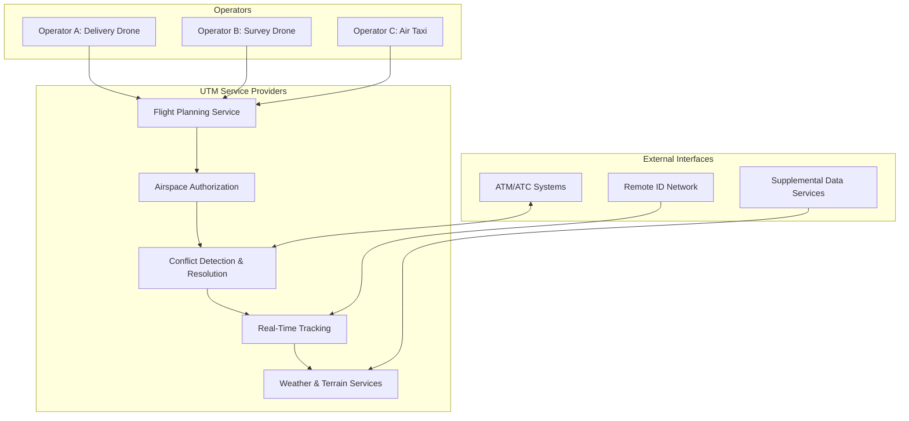

# 3.9 UTM — Unmanned Traffic Management Systems

> [!abstract] Learning Objectives
> Understand the architecture, protocols, and operational concepts behind UTM systems that enable safe, scalable drone operations in shared airspace.

## Introduction

Unmanned Traffic Management (UTM) is the technological and procedural framework designed to manage low-altitude drone operations safely and efficiently — separate from, but interoperable with, traditional Air Traffic Management (ATM) systems that handle manned aviation. As drone density increases from hundreds to potentially millions of concurrent operations, human air traffic controllers become a physical impossibility. UTM replaces human-in-the-loop deconfliction with automated, software-driven airspace management.

This lesson examines UTM from first principles: the computational architecture, the communication protocols, the service layers, and the leading global implementations.

---

## 1. The Fundamental Problem UTM Solves

Traditional ATM operates in controlled airspace (Class A–E) using radar surveillance and voice-based pilot-controller communication. This model breaks down for drones because:

- **Volume:** Millions of low-altitude drone flights cannot be individually managed by human controllers.
- **Altitude:** Drones typically operate below 400 ft AGL — below traditional radar coverage.
- **Autonomy:** Many drone operations are fully autonomous, requiring machine-to-machine communication rather than voice.
- **Heterogeneity:** A single urban airspace may simultaneously contain delivery drones, inspection drones, air taxis, and recreational quadcopters — all with different performance envelopes.

UTM provides the automated infrastructure to deconflict, authorize, and track these operations.

---

## 2. UTM Architecture

### Core Components

### Service-Oriented Architecture (SOA)

UTM systems are built on microservices architecture where each function (registration, flight planning, tracking, deconfliction) operates as an independent service communicating via REST APIs and WebSocket connections. This enables:

- **Horizontal Scalability:** Adding compute resources as drone density increases.
- **Multi-Provider Ecosystems:** Multiple UTM Service Suppliers (USS) can interoperate through standardized data exchange protocols.
- **Fault Tolerance:** No single point of failure — if one USS goes down, operations managed by other USSs continue.

---

## 3. Key UTM Standards and Protocols

### ASTM F3548 — UTM Service Supplier Interoperability

The primary technical standard defining how USS platforms communicate with each other and with operators:

- **Strategic Conflict Detection:** Pre-flight deconfliction by comparing 4D operational volumes (3D space + time).
- **Operational Intent Sharing:** USS providers share flight plans in real-time to detect potential conflicts before they occur.
- **Conformance Monitoring:** Continuous tracking to ensure drones remain within their declared operational volumes.
- **Constraint Management:** Dynamic no-fly zones, temporary flight restrictions, and emergency airspace closures pushed to all USS providers simultaneously.

### ASTM F3411 — Remote ID

The companion standard to UTM, providing real-time drone identification via:
- **Broadcast Remote ID:** Direct BLE/Wi-Fi broadcasts for local awareness.
- **Network Remote ID:** Internet-connected reporting to the UTM network for centralized tracking.

### ED-269 / EUROCAE

European standard for UTM operations defining minimum performance requirements for U-Space services.

---

## 4. Flight Authorization Workflow

A typical UTM-managed operation follows this sequence:

1. **Pre-Flight Registration:** Operator registers the drone and themselves on the UTM platform. Remote ID serial number is linked.
2. **Operational Intent Declaration:** Operator submits a 4D operational volume — the geographic boundary, altitude range, and time window for the flight.
3. **Strategic Deconfliction:** The USS checks the proposed volume against all other accepted operations, airspace constraints, and NOTAMs. Conflicts trigger volume negotiation.
4. **Authorization:** If no conflicts exist, the USS authorizes the operation and assigns a unique operation ID.
5. **Activation & Tracking:** The drone begins transmitting its position via Remote ID. The USS monitors conformance in real-time.
6. **Conformance Alerts:** If the drone deviates from its declared volume, the USS alerts the operator and adjacent operations.
7. **Contingency/Emergency:** Pre-declared contingency volumes activate if the drone enters off-nominal states (lost link, battery emergency).

---

## 5. Global UTM Implementations

### NASA UTM (United States)

NASA pioneered the UTM concept through a four-phase Technology Capability Level (TCL) program:

| Phase | Focus | Key Milestone |
|---|---|---|
| **TCL-1** | Rural operations, geofencing | Basic volume management |
| **TCL-2** | BVLOS, sparse population | Dynamic airspace updates |
| **TCL-3** | Urban operations, congested airspace | Detect-and-avoid integration |
| **TCL-4** | High-density urban, UAS-ATM integration | Full autonomous deconfliction |

The FAA has operationalized this through the **LAANC (Low Altitude Authorization and Notification Capability)** system, providing near-real-time airspace authorization.

### EASA U-Space (European Union)

Europe's UTM implementation through four progressive service layers:
- **U1:** E-registration, e-identification, geofencing
- **U2:** Flight authorization, tracking, airspace management
- **U3:** Advanced conflict detection, dynamic capacity management
- **U4:** Full integration with manned aviation ATM

### China UTMISS

China's centralized UTM platform managed by CAAC, handling real-name registration, automated flight plan filing, and real-time surveillance. Supports corridor-based BVLOS approvals for logistics operators.

### Singapore UTM

The Civil Aviation Authority of Singapore (CAAS) has deployed one of the most advanced UTM testbeds, enabling high-density urban drone operations in one of the world's busiest airspaces.

---

## 6. Technical Challenges

- **Latency:** Real-time deconfliction requires sub-second communication between drones, USS providers, and ATM systems. Network latency over cellular (4G/5G) introduces uncertainty.
- **Cyber Resilience:** UTM infrastructure is critical. GPS spoofing, USS platform DDoS attacks, and fraudulent operational intent declarations are active threat vectors.
- **Spectrum Management:** As drone density increases, the radio spectrum for C2 (Command and Control) links, Remote ID broadcasts, and DAA sensors becomes congested.
- **Contingency Management:** When a drone enters an emergency state (lost link, battery failure), the UTM must autonomously propagate alerts and clear adjacent airspace — all within seconds.

---

## 📊 Slide Deck
> [!info] Presentation Available
> 📎 [[3.9 UTM - Unmanned Traffic Management Systems.pdf]]

### 🧭 Navigation
⬅️ **Previous:** [[3.8 Simulation and Digital Twins]]
⬆️ **Module:** [[3.0 Module Overview]]
➡️ **Next:** [[4.0 Module Overview|Module 4 - Use Cases]]
