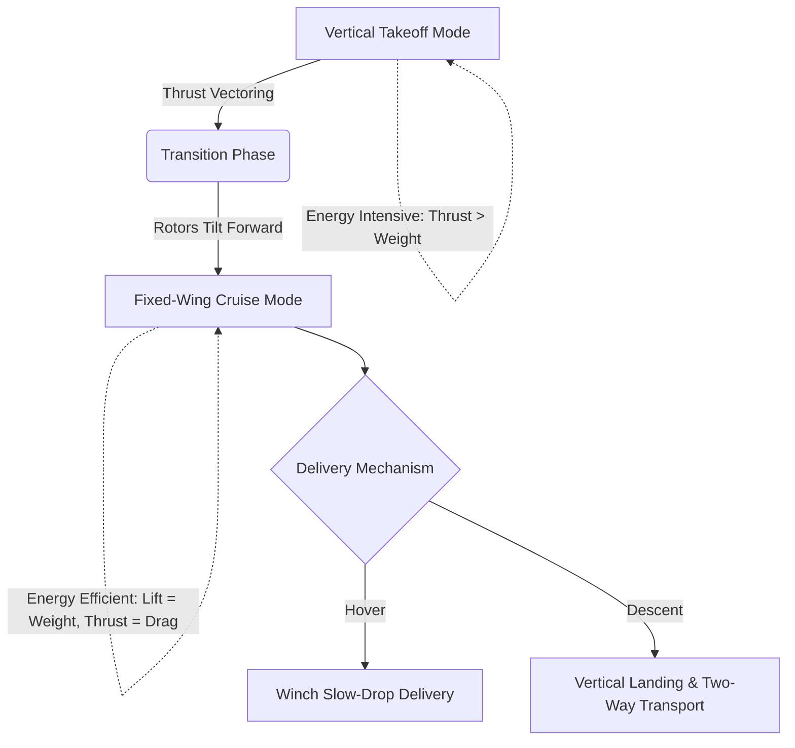

# 4.0 Module Overview

> [!abstract] Learning Objectives
> Real-world drone applications across agriculture, logistics, defense, and entertainment.

# Drone Curriculum: Module 4 Overview
## Applied UAV Dynamics and Industry-Specific Operational Architectures

Welcome to Module 4. In this segment, we will transition from theoretical aerodynamics to applied operational frameworks, evaluating how fundamental physics and first principles of engineering dictate the design and deployment of Unmanned Aerial Vehicles (UAVs) across specialized sectors. We will analyze the optimization problem of range versus infrastructure dependence, specifically focusing on how electric Vertical Take-Off and Landing (eVTOL) systems utilize proprietary tilt-rotor mechanisms to balance the high energy requirements of vertical lift (thrust = weight) with the aerodynamic efficiency of fixed-wing forward flight (lift = weight, thrust = drag) [1-3].

### Core First Principles: eVTOL Flight Mechanics

Before examining specific use cases, it is crucial to understand the energetic first principles driving modern drone utility. Traditional multicopters are limited by the constant power expenditure required to maintain downward thrust against gravity. Conversely, fixed-wing aircraft utilize aerodynamic lift to minimize energy consumption but require runway infrastructure. Modern eVTOLs resolve this limitation through tilt-rotor vectoring [2-4]. 

### 1. Medical Delivery: Thermodynamics and Time-Critical Kinematics
Medical delivery systems must adhere strictly to the first principles of thermodynamics and kinetic efficiency to maintain sample integrity and minimize transit time . 
*   **Cold Chain Thermodynamics:** Systems must utilize heavily insulated, qualified cold chain boxes designed to maintain strict temperature equilibrium. For example, specialized medical drones can maintain an internal thermal environment of 2-8°C for 3 to 18 hours, preserving the molecular stability of up to 200 vaccine vials, 5 blood bags, or 50 lab samples .
*   **Kinematic Delivery:** To minimize infrastructural dependency at the destination, advanced drones deploy a winch mechanism allowing for the "slow-drop" of medical cargo while the drone maintains a precise hover, eliminating the need to land . 

### 2. Commercial Logistics: The Payload-Range Tradeoff
In commercial logistics, operators must solve complex optimization equations involving payload weight, battery energy density, and aerodynamic drag.
*   **Mass vs. Distance Optimization:** The fundamental principle of flight dictates that heavier payloads require higher angles of attack or greater velocity to generate necessary lift, thereby increasing drag and depleting battery reserves faster. For instance, a delivery drone carrying its maximum payload of 5 kg might be restricted to a 75 km range, whereas an empty airframe could theoretically extend its range to 110 km due to the reduced lift requirement .
*   **Multi-Modal Drop Systems:** Modern logistical frameworks utilize triple-drop delivery mechanisms, allowing a single airframe to complete multiple consecutive delivery vectors in a single flight cycle, maximizing the utility of the aerodynamic cruise phase .

### 3. Agriculture: Multispectral Surveying and Precision Indigenization
The agricultural sector utilizes UAVs for high-fidelity spatial data acquisition and precision application.
*   **Surveying and Mapping:** Fixed-wing eVTOLs are ideal for agricultural mapping because their aerodynamic efficiency allows them to cover vast land areas quickly . Utilizing high-resolution cameras and sensors, they capture detailed topological and crop-health data .
*   **Hardware Indigenization:** The industry is moving toward specialized, localized manufacturing, such as the establishment of dedicated agri-drone indigenization facilities designed to scale up manufacturing and provide certified pilot training for agricultural operations .

### 4. Defense: AI-Driven ISR and Tactical Resilience
Defense applications prioritize system resilience, secure communication, and autonomous intelligence gathering.
*   **Intelligence, Surveillance, and Reconnaissance (ISR):** Military operations leverage AI-driven ISR solutions integrated into unmanned systems to process complex environmental data in real-time .
*   **Tactical Navigation:** Defense UAVs demand highly resilient guidance and navigation systems capable of operating in contested environments. European defense initiatives are actively funding the development of next-generation tactical VTOL drones to ensure robust operational capabilities . Furthermore, multi-mission fixed-wing VTOL platforms are being engineered for extended-range civilian and defense applications . 

### 5. Entertainment: Spatial Coordination and Swarm Logic
While highly specialized, the entertainment industry relies heavily on the first principles of spatial computing, precise radio-frequency synchronization, and automated swarm logic.
*   **Drone Shows:** Fleets of drones are programmed to execute complex, synchronized aerial maneuvers to create visual art and lighting displays. This application relies heavily on precise 3D spatial positioning and software automation, as demonstrated by specialized firms dominating national drone show contests .

---

## Lessons in this Module
- [[4.1 Agriculture and Precision Farming]]
- [[4.2 Medical Delivery and Humanitarian Aid]]
- [[4.3 Logistics and Last-Mile Delivery]]
- [[4.4 Military and Defense]]
- [[4.5 Search and Rescue]]
- [[4.6 Entertainment and Drone Shows]]

---
⬅️ **Back to Course:** [[Overview]]
