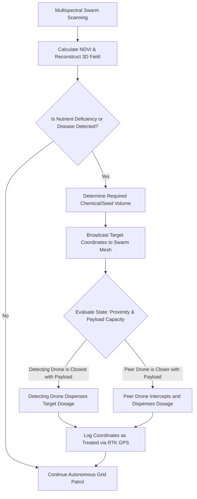

# 4.1 Agriculture and Precision Farming

> [!abstract] Learning Objectives
> Deploy drones for crop monitoring, NDVI mapping, and precision spraying.

# First Principles of Precision Agriculture via Drone Swarms

From a first-principles perspective, traditional agriculture relies on macro-level, broadcast methodologies—applying water, seeds, and chemical inputs uniformly across vast tracts of land regardless of localized micro-variations in soil health or plant vitality. Precision farming via drone swarms inverts this paradigm, treating the field as a high-density, discrete matrix where data acquisition (sensing) and physical intervention (actuation) occur at the micro-level. By leveraging decentralized multi-agent systems, drones provide real-time insights, field-level spatial resolution, and high automation that vastly outperform traditional satellites or manned systems .

## High-Resolution Crop Scanning and Data Analytics

To map the agricultural environment, individual UAVs within the swarm are equipped with sophisticated payloads, notably Real-Time Kinematics (RTK) GPS modules and multispectral cameras . Agricultural RTK GPS systems utilize ground-based reference stations to achieve extreme positional accuracy, often down to a single centimeter .

The primary analytical tool for agricultural swarms is the multispectral camera, which captures data across various electromagnetic wavelengths to calculate the Normalized Difference Vegetation Index (NDVI) . 
*   **Anomaly Detection:** By analyzing NDVI data in real-time, the swarm can detect highly specific localized issues, such as spots suffering from low phosphorus levels .
*   **Predictive Modeling:** Swarms can execute multi-angle imaging to build comprehensive 3D field reconstructions, allowing for the early detection of disease vectors or localized drought stress before they become visibly apparent .
*   **Hardware Democratization:** The economic viability of these analytics is rapidly improving; whereas a multispectral camera for NDVI analysis cost upwards of $6,000 a decade ago, equivalent hardware now costs around $500 .

## Autonomous Actuation: Variable-Rate Spraying and Seeding

Once anomalies are detected, the swarm moves from the data-gathering phase to the actuation phase, utilizing onboard fertilizer tanks and chemical dispensers . This is governed by decentralized swarm logic, mirroring biological stigmergy, to optimize resource expenditure without centralized command.

1.  **Detection and State Evaluation:** A drone identifies a specific zone requiring intervention based on real-time soil type, moisture, and nutrient level data .
2.  **Distributed Task Allocation:** The detecting drone evaluates its own state; if it possesses enough fertilizer and is the closest unit to the target spot, it initiates the spraying protocol . 
3.  **Peer Handoff:** If the detecting drone is low on chemical payload, or if another drone in the swarm is physically closer and possesses the requisite fertilizer, the secondary drone automatically takes over the task .
4.  **Iterative Execution:** This peer-to-peer delegation continues seamlessly across the entire assigned agricultural area, preventing the ecological and financial damage of over- or under-fertilizing .

Beyond chemical application, these exact coordination algorithms are also utilized for highly optimized, coordinated swarm seeding .

## Next-Generation Biomimetic Swarms

The future of agricultural swarms points toward extreme miniaturization and enhanced biomimicry. For example, the Wyss Institute at Harvard is developing "RoboBees"—autonomous flying micro-robots directly inspired by insect swarm behavior . These units are designed to collect granular environmental data and coordinate with one another to monitor crops and identify problem zones in real-time within complex field environments .

---

---

## 📊 Slide Deck
> [!info] Presentation Available
> 📎 [[4.1 Agriculture and Precision Farming.pdf]]

### 🧭 Navigation
⬅️ **Previous:** [[4.0 Module Overview]]
⬆️ **Module:** [[4.0 Module Overview]]
➡️ **Next:** [[4.2 Medical Delivery and Humanitarian Aid]]

