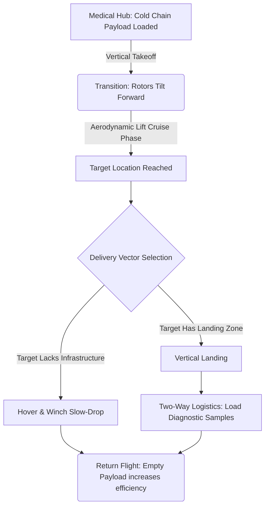

# 4.2 Medical Delivery and Humanitarian Aid

> [!abstract] Learning Objectives
> Examine drone-based medical supply chains and humanitarian logistics networks.

# Aerial Medical Logistics: A First Principles Approach to Humanitarian Drone Deployment

The deployment of Unmanned Aerial Vehicles (UAVs) for medical delivery and humanitarian aid is fundamentally an exercise in bypassing the friction of deficient terrestrial infrastructure. By shifting logistics from a two-dimensional ground plane to a three-dimensional aerial vector, operators can radically optimize the transit time of highly perishable, life-saving biological assets. Wingcopter, a German drone manufacturer, explicitly utilizes this architectural paradigm to deploy specialized electric Vertical Take-Off and Landing (eVTOL) systems that deliver medical supplies to some of the world's most remote regions [1-3].

### 1. First Principles of Medical eVTOL Dynamics

To effectively execute long-range medical transport, drone architecture must resolve competing physics constraints: the high energy demands of vertical lift and the aerodynamic efficiency of sustained flight, all while strictly preserving payload thermodynamics. 

*   **Aerodynamic Energetics:** Traditional multirotor drones expend constant power to generate thrust that counteracts gravity, severely limiting range. Wingcopter addresses this via a patented tilt-rotor mechanism . The drone initiates flight in vertical mode (where thrust equals weight), and upon reaching altitude, physically tilts its rotors to transition into fixed-wing forward flight . In this cruise phase, aerodynamic lift counteracts weight, allowing thrust to solely overcome drag, which drastically reduces power consumption and extends the operational range to as much as 110 km (with an empty payload) or 75 km carrying a maximum 5 kg payload . 
*   **Cold Chain Thermodynamics:** Biological materials like vaccines and whole blood are highly sensitive to thermal degradation. To maintain molecular stability, Wingcopter utilizes a reusable, wipe-disinfectable Qualified Cold Chain Box designed to strictly hold an internal thermal equilibrium of 2-8°C . Due to advanced insulation materials, this temperature range can be maintained for 3 to 18 hours, completely insulating the payload from external weather fluctuations during high-speed transit .
*   **Kinematics and Payload Delivery:** Ground infrastructure is rarely available in remote humanitarian zones. To eliminate the necessity of a landing pad, these drones employ a kinematic winch mechanism . Upon reaching the target coordinates, the drone enters a stable hover and initiates a "slow-drop," lowering a single-use cargo box via a tether directly to medical personnel . 

### 2. Wingcopter's Specialized Medical Capabilities

When applied to medical logistics, these eVTOL platforms are mathematically optimized to transport highly specific quantities of biological material. 

*   **Payload Optimization:** The Wingcopter 198 model is capable of transporting up to 5-6 kg of payload divided among three separate packages, enabling a "triple-drop" delivery architecture on a single flight path [10-12].
*   **Volumetric Capacity:** A single medical delivery flight can be configured to transport 5 whole blood bags, up to 200 vaccine vials, or 50 distinct lab samples . 
*   **Two-Way Logistics Resilience:** Because the drones *can* land vertically if space permits, they facilitate bi-directional supply chains. Drones deliver critical supplies (vaccines, devices) to remote clinics and then return to centralized laboratories carrying time-critical diagnostic materials like genetic tissue or blood samples, drastically reducing the turnaround time for accurate medical diagnoses .

### 3. Case Studies: Humanitarian Aid in Remote Regions

Wingcopter has successfully applied these engineering principles to resolve critical public health supply chain failures in isolated global regions.

*   **Vanuatu Vaccine Network:** In 2019, in partnership with UNICEF, Wingcopter established an on-demand aerial network to supply the remote Pacific island of Pentecost, Vanuatu . The operation delivered vaccines to 18 to 19 deeply remote villages from a single central hub . By flying beyond visual line of sight (BVLOS) and ignoring the rugged topography that hindered ground transport, the eVTOLs collapsed a grueling 7-hour terrestrial journey into a maximum 30-minute flight . 
*   **Malawi Disaster Response and Capacity Building:** During severe flooding in East Africa in 2019 and 2020 that severed ground routes, Wingcopter drones were deployed to transport emergency medicines to isolated communities . Expanding on this, Wingcopter partnered with the African Drone & Data Academy to establish local delivery networks while concurrently running training programs for Malawian youth, embedding the technology's operational knowledge within the local population .
*   **COVID-19 Pandemic Response:** Utilizing its capacity to move over 2,500 vaccine doses per day with minimal human contact, Wingcopter operated actively to distribute COVID-19 vaccines in areas of the global South lacking sufficient cold-storage infrastructure . Furthermore, during the pandemic, the company partnered with the NHS and Skyports to conduct BVLOS deliveries of COVID-19 test samples to a hospital on a remote Scottish island .

---

---

## 📊 Slide Deck
> [!info] Presentation Available
> 📎 [[4.2 Medical Delivery and Humanitarian Aid.pdf]]

### 🧭 Navigation
⬅️ **Previous:** [[4.1 Agriculture and Precision Farming]]
⬆️ **Module:** [[4.0 Module Overview]]
➡️ **Next:** [[4.3 Logistics and Last-Mile Delivery]]

