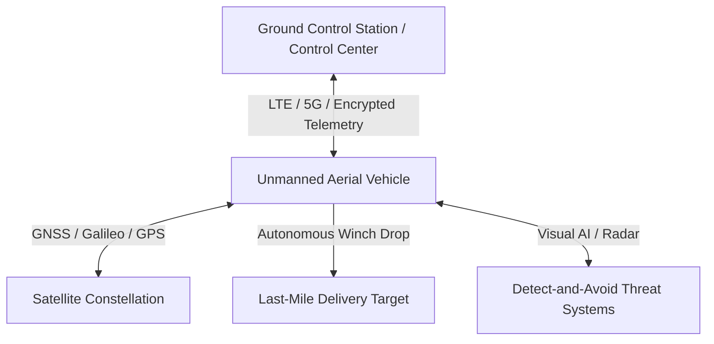

# 4.3 Logistics and Last-Mile Delivery

> [!abstract] Learning Objectives
> Analyze commercial drone delivery operations, regulations, and infrastructure.

### First Principles of Drone Logistics
At its core, last-mile logistics is fundamentally constrained by two-dimensional terrestrial routing. Ground-based transport is inherently bottlenecked by road infrastructure limits, traffic congestion, and high human labor expenditures. Drone logistics resolves this inefficiency by translating the physical transport of goods into an unconstrained three-dimensional vector space. By utilizing low-altitude airspace, Unmanned Aerial Vehicles (UAVs) achieve direct, point-to-point routing, bypassing geographical barriers and reducing the friction of traditional supply chain networks .

### Operational Deployment Configurations
The deployment of a drone delivery network requires highly specific configurations of hardware, communication architectures, and financial structures. 

#### 1. Vehicle Topologies
The physical architecture of the delivery drone determines its operational capabilities and payload constraints:
*   **Fixed-Wing Hybrid VTOL (Vertical Take-off and Landing):** This configuration merges the agility and infrastructure independence of a rotor-based multi-copter with the aerodynamic lift and endurance of a fixed-wing aircraft . 
*   **Tilt-Rotor Mechanisms:** Systems like the Wingcopter 198 utilize patented tilt-rotor technology, allowing them to carry payloads up to 6 kilograms over 75 kilometers on a single battery charge, achieving top speeds of 150 km/h .
*   **Delivery Mechanisms:** Advanced units employ a triple-drop winch mechanism capable of executing precise, automated, and contactless payload deliveries to multiple distinct coordinates within a single flight .

#### 2. System Architecture and Communications
To safely operate beyond visual line of sight (BVLOS), a robust cyber-physical architecture is mandatory.

*   **Telemetry and Links:** Primary communication relies on cellular networks (LTE/5G) backed up by satellite connections, while Global Navigation Satellite Systems (GNSS) supply critical Positioning, Navigation, and Timing (PNT) data .
*   **Safety Redundancies:** Next-generation delivery platforms utilize redundant system architectures (e.g., eight motors instead of four, dual flight controllers) and AI-driven visual detect-and-avoid software combining ADS-B and Flarm to interpret real-time flight environments .

#### 3. Strategic Adoption Models
Organizations must calculate the Total Cost of Ownership (TCO) by weighing Capital Expenditure (CapEx) against Operational Expenditure (OpEx) through two primary models:
*   **Drone Service Provider (DSP) Model:** A third-party provider completely manages the end-to-end drone logistics, regulatory compliance, and scheduling. This shared-network setup converts high CapEx into a recurring monthly OpEx fee, increasing overarching network efficiency .
*   **Direct Ownership Model:** The organization purchases the fleet and manages operations internally. While requiring substantial initial CapEx ($100,000 to $250,000 for infrastructure setup and command centers alone), it provides maximum network autonomy and customization [8-10].

### Supply Chain Impact
The integration of drone logistics fundamentally restructures the economic and temporal dynamics of the supply chain.

*   **B2B Urban Applications:** In densely populated environments, drone routing drastically reduces human labor costs and neutralizes traffic-induced delivery delays, making it highly effective for high-frequency last-mile drops .
*   **B2G Remote Applications:** In business-to-government operations, specifically healthcare, drones bypass mountainous terrain and poor roads. In tests, a 12-kilometer journey requiring hours by foot or vehicle is compressed into a 20-minute flight, revolutionizing the timely distribution of vaccines and automated external defibrillators (AEDs) .
*   **Energy and Route Optimization:** Through advanced route planning algorithms and GPS integration, drones decrease terrestrial fuel consumption. Utilizing automated flight paths can reduce fuel costs by up to 30% compared to traditional delivery vans .

### Regulatory and Maintenance Frameworks
Deployment is strictly gated by legal compliance, cybersecurity, and physical maintenance protocols.

*   **Aviation Certification:** In the United States, operating small drones to carry the property of another for compensation requires Federal Aviation Administration (FAA) Part 135 air carrier certification . The FAA offers varying tiers, moving from Single-Pilot certificates to Standard Operator certificates which impose no limits on the size and scope of BVLOS operations .
*   **Cybersecurity Defense:** Commercial delivery networks are highly vulnerable to localized cyber threats, including GNSS spoofing, Evil Twin Wi-Fi attacks, and de-authentication DDoS protocols targeting the Ground Control Station [18-20]. Robust TLS/AES encryption, two-factor authentication for operators, and anomaly-based Intrusion Detection Systems (IDS) are required to safeguard flight integrity [21-23].
*   **Lifecycle Maintenance:** Hardware endurance necessitates rigorous physical maintenance checklists executed after every 10 flights. This includes inspecting the chassis for micro-cracks, ensuring motors are cleared of environmental debris, validating battery pack integrity against thermal expansion/bulging, and pushing continuous firmware updates to the flight controller 

---

---

## 📊 Slide Deck
> [!info] Presentation Available
> 📎 [[4.3 Logistics and Last-Mile Delivery.pdf]]

### 🧭 Navigation
⬅️ **Previous:** [[4.2 Medical Delivery and Humanitarian Aid]]
⬆️ **Module:** [[4.0 Module Overview]]
➡️ **Next:** [[4.4 Military and Defense]]

