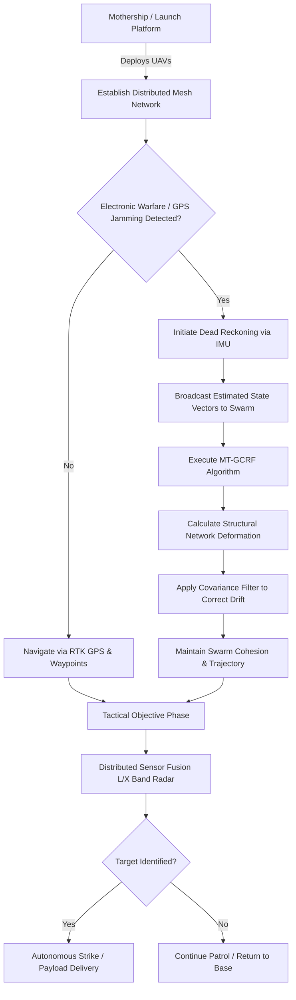

# 4.4 Military and Defense

> [!abstract] Learning Objectives
> Survey military drone systems, ISR platforms, and autonomous combat applications.

# First Principles of Military Drone Swarms

From a first-principles perspective, the integration of autonomous drone swarms into military and defense architectures fundamentally inverts traditional combat economics and force-projection models. Traditional military doctrine relies on highly sophisticated, centralized, and expensive monolithic assets (e.g., manned fighter jets or complex naval vessels). Swarm logic replaces this paradigm with a distributed network of computationally homogeneous, highly expendable autonomous agents. 

Driven by biomimetic algorithms and decentralized mesh-networking, these swarms possess extreme attrition tolerance. If an adversary destroys individual nodes, the swarm dynamically reorganizes, redistributing sensing and strike tasks without catastrophic mission failure [1-3]. 

## Asymmetric Cost-Exchange Mechanics

The tactical utility of a drone swarm is rooted in its economic asymmetry. Swarms mathematically overwhelm traditional kinetic air defense systems through sheer saturation.
*   **The Defender's Dilemma:** Traditional surface-to-air missiles (SAMs) are prohibitively expensive and strictly limited in magazine depth. For instance, a single IRIS-T short-range SAM costs upwards of $450,000 . 
*   **The Attacker's Advantage:** In contrast, a low-cost loitering munition like the Shahed-136 costs approximately $20,000 . Swarms consisting of thousands of inexpensive drones fundamentally break the defender's cost-exchange ratio, quickly depleting interceptor stockpiles and rendering high-value targets vulnerable .

Major defense initiatives are currently operationalizing this principle. The U.S. Department of Defense's *Replicator* program is aggressively pursuing the deployment of thousands of inexpensive, autonomous drones across domains by August 2025, supported by hundreds of millions in funding to develop Autonomous Collaborative Teaming (ACT) and Opportunistic Resilient Network Topology (ORIENT) protocols .

## Decentralized Surveillance and Tactical Reconnaissance

In surveillance and reconnaissance operations, drone swarms act as a massive, distributed, multi-modal sensor array. Instead of a single high-altitude asset sweeping an area, swarms operate close to the terrain, fusing data across multiple units to eliminate blind spots and anomalies.

*   **Multi-Band Threat Detection:** Swarms can be utilized for hazardous area clearing, such as locating explosive remnants of war or performing humanitarian demining. Different swarm units are equipped with varying radar payloads (e.g., L-band for subsurface penetration and X-band for high-resolution surface mapping) . Upon detecting an anomaly, neighboring drones autonomously converge on the spatial coordinates to cross-reference the target from varying angles, subsequently streaming the verified telemetry to a command system .
*   **Cross-Domain Integration:** Reconnaissance is no longer strictly aerial. Programs like the United Kingdom's Mixed Multi-Domain Swarms (MMDS) are developing secure architectures to allow autonomous collaboration between aerial swarms, unmanned ground vehicles (like the Viking), and autonomous naval vessels . 

## Offensive Tactical Operations and Saturation Strikes

Swarms transition from reconnaissance to lethal tactical operations by utilizing onboard AI to engage targets dynamically.
*   **Mothership Deployment:** To circumvent the limited range of small tactical drones, militaries are deploying "system of systems" deployment methods. China's *Jiu Tian* drone, a 10-ton UAV with a modular payload bay, serves as an aerial mothership capable of deploying smaller swarms at speeds of 560 mph deep within contested airspace . 
*   **Autonomous Strike Coordination:** Turkiye's STM Kargu-2 represents a precision-strike multicopter that operates in swarms of up to 20 units . Unlike single-use loitering munitions, these drones utilize decentralized coordination to locate targets and can return to the operator if no viable target is identified .
*   **Base Suppression:** The raw disruptive capability of these tactical operations has already been observed; during the Syrian Civil War, Russian forces reported attacks on their main air force base executed by swarms of fixed-wing drones carrying explosive payloads . 

## Resilience in GPS-Denied and Contested Environments

Military swarms must operate in environments heavily degraded by Electronic Warfare (EW), specifically where Global Positioning System (GPS) signals are jammed or denied . To maintain swarm cohesion and navigational accuracy without satellite links, advanced mathematical models are deployed:

1.  **Dead Reckoning:** Drones integrate instantaneous velocity and acceleration data via onboard Inertial Measurement Units (IMUs) to estimate their current position relative to their last known GPS coordinate .
2.  **Structural Error Correction:** Because dead reckoning suffers from compounding drift (especially due to environmental variables like wind), swarms utilize **Multi-Target Gaussian Conditional Random Fields (MT-GCRF)** . By continuously sharing estimated positions over a local mesh network, the swarm models its own geometric deformation [15-17]. 
3.  **Covariance Filtering:** The MT-GCRF algorithm processes the Euclidean distance similarities between the drones (stored in a supra-matrix) to mathematically smooth out unstructured regression errors, successfully maintaining course trajectories and collision avoidance without any external navigation aids .

---

---

## 📊 Slide Deck
> [!info] Presentation Available
> 📎 [[4.4 Military and Defense.pdf]]

### 🧭 Navigation
⬅️ **Previous:** [[4.3 Logistics and Last-Mile Delivery]]
⬆️ **Module:** [[4.0 Module Overview]]
➡️ **Next:** [[4.5 Search and Rescue]]

