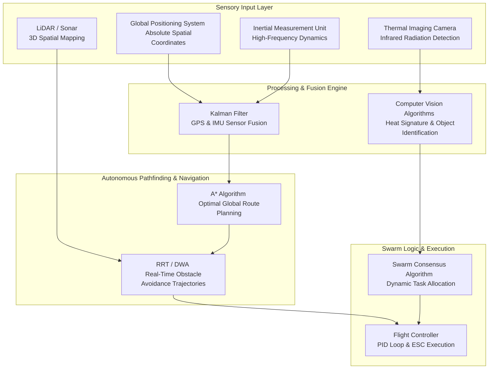

# 4.5 Search and Rescue

> [!abstract] Learning Objectives
> Apply thermal imaging, AI detection, and coordinated SAR drone operations.

# The Architecture of Search and Rescue (SAR) Drones

The integration of Unmanned Aerial Vehicles (UAVs) into Search and Rescue (SAR) operations represents a paradigm shift in emergency response, bypassing the limitations of ground-based teams and manned helicopters . SAR deployments primarily utilize two configurations: multirotor drones, which excel in complex, confined environments due to their ability to hover and conduct meticulous scans, and fixed-wing drones, which provide high-speed, long-endurance coverage over vast expanses for preliminary wide-area surveillance . The efficacy of these machines is fundamentally grounded in advanced payload integration—specifically thermal imaging—and sophisticated autonomous pathfinding algorithms.

# First Principles of Thermal Imaging in SAR

Thermal imaging transforms a drone from a simple visual observer into a highly advanced detection agent capable of operating in obscured conditions . 

### The Physics of Infrared Detection
*   **Electromagnetic Spectrum Utilization:** Unlike traditional optical cameras that capture the visible spectrum of light, thermal cameras operate entirely in the infrared range . They capture the infrared radiation (heat) emitted by all objects. 
*   **Thermographic Heat Maps:** The sensor translates this thermal radiation into a visual "heat map," where distinct temperature differentials correspond to varying color gradients . Because it relies on heat rather than photons of visible light, thermal imaging allows the drone to "see" through absolute darkness, dense smoke, and foliage .

### Tactical SAR Applications
*   **Hotspot Identification:** In cold climates, the stark temperature differential between the environment and a human or animal body makes biological heat signatures easily distinguishable .
*   **Thermal Tracking:** Rescuers can track the movement of lost individuals by following residual heat trails left in the environment, a capability indispensable in forested or rugged terrains .
*   **Water Rescue Operations:** Due to the distinct thermal variance between a cold body of water and human body heat, thermal drones can rapidly pinpoint the location of individuals stranded in aquatic environments .

# Autonomous Pathfinding and Navigation

To execute search patterns autonomously, a drone must transition from manual piloting to intelligent, algorithmic decision-making . This relies heavily on a synthesis of hardware sensors and computational pathfinding mathematics.

### Sensor Fusion: The Navigational Foundation
Autonomous navigation requires an absolute understanding of the drone's spatial state. This is achieved by combining the Global Positioning System (GPS), which provides highly accurate but slow-updating global coordinates, with the Inertial Measurement Unit (IMU), which provides rapid, real-time measurements of linear and angular acceleration . Because the IMU is prone to drift over time and the GPS is susceptible to signal multipath distortion, flight controllers employ **sensor fusion** algorithms, such as the Kalman filter . This mathematical filter merges both data streams, using the absolute reference of the GPS to correct IMU drift, resulting in a highly accurate, real-time navigational state .

### Computational Pathfinding Algorithms
Once the drone's position is known, it must calculate an optimal flight path through three-dimensional space to execute its search grid.
*   **Classical Graph-Search Algorithms (Dijkstra’s and A*):** These algorithms divide the environment into a grid of mathematical nodes . Dijkstra’s algorithm explores all possible node paths to find the one with the lowest cost. The **A* (A-Star)** algorithm improves upon this by applying a heuristic to estimate the cost to the goal, prioritizing promising routes and bypassing inefficient ones, enabling faster computation .
*   **Sampling-Based Algorithms (RRT and PRM):** In highly complex or unstructured environments, drones utilize Rapidly-exploring Random Trees (RRT) . RRT builds a spatial tree by randomly sampling points in the environment and connecting them to the nearest existing node while strictly adhering to the drone's kinematic motion constraints . Probabilistic Roadmaps (PRM) sample the environment to create a pre-processed roadmap, which is highly efficient for multi-query navigation tasks .
*   **Dynamic and Reactive Approaches:** To avoid moving obstacles in real-time, autonomous drones employ the **Dynamic Window Approach (DWA)** and the **Vector Field Histogram (VFH)** . DWA restricts its evaluation to a "dynamic window" of feasible trajectories based on the drone's current velocity and acceleration limits . VFH processes raw sensor data into a histogram to represent obstacle density, calculating the most probable free path in real-time .

# Collaborative Swarm Intelligence

The most advanced frontier of SAR operations is the deployment of collaborative drone swarms, which emulate the collective biological behaviors of flocking birds or schooling fish . 

*   **Democratic Consensus and Task Allocation:** Swarms operate on a distributed computing framework where UAVs share sensory data and utilize consensus algorithms to dynamically "vote" on mission priorities . Algorithms autonomously assign specific roles—such as thermal scouting, hovering for detailed inspection, or acting as a communications relay .
*   **Redundancy and Real-Time Adaptability:** The swarm inherently provides operational redundancy; if one drone suffers mechanical failure, the consensus algorithm immediately reallocates its search grid to the remaining members, ensuring no interruption to the lifesaving mission .

### SAR Autonomous Architecture Diagram

---

---

## 📊 Slide Deck
> [!info] Presentation Available
> 📎 [[4.5 Search and Rescue.pdf]]

### 🧭 Navigation
⬅️ **Previous:** [[4.4 Military and Defense]]
⬆️ **Module:** [[4.0 Module Overview]]
➡️ **Next:** [[4.6 Entertainment and Drone Shows]]

