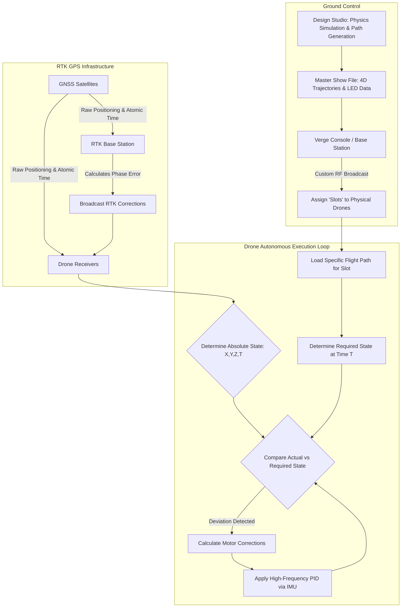

# 4.6 Entertainment and Drone Shows

> [!abstract] Learning Objectives
> Choreograph synchronized drone light shows using RTK GPS and swarm algorithms.

# First Principles of Deterministic Drone Choreography

From a first-principles perspective, a drone light show fundamentally differs from decentralized biological swarm intelligence. Rather than relying on peer-to-peer communication and real-time reactive collision avoidance, entertainment swarms operate as a completely deterministic, centralized multi-agent system . The core operational principle is that if every drone executes a highly precise, pre-calculated 4D state trajectory (comprising $X, Y, Z$ spatial coordinates and $T$ time), collisions are structurally impossible . Each drone acts as a single, independent "pixel" and does not need to be aware of the other drones' positions to maintain complex formations .

To achieve this, the orchestration relies entirely on solving two fundamental physical challenges: **absolute spatial accuracy** and **absolute temporal synchronization**.

## Spatial State Estimation via RTK GPS and Inertial Sensors

Standard Global Navigation Satellite Systems (GNSS) are subject to atmospheric delays and orbital errors, yielding operational accuracies of several meters . To safely pack hundreds of drones into tight spatial formations, sub-decimeter accuracy is strictly required . This is achieved using **Real-Time Kinematic (RTK) GPS**.

1.  **Static Base Reference:** A stationary RTK base station is deployed at the launch site, providing a highly accurate reference datum .
2.  **Differential Correction:** Because the base station is completely static, it can isolate the exact signal delay caused by atmospheric interference. It continuously calculates the differential error between its known physical location and the raw GPS satellite signal .
3.  **Real-Time Broadcast:** The base station broadcasts these phase corrections via a custom high-bandwidth radio link (such as an 802.15.4 network) to the mobile drone units .
4.  **High-Frequency Sensor Fusion:** While RTK GPS provides centimeter-accurate spatial positioning, it updates relatively slowly. Drones fuse this data with internal high-frequency inertial sensors: accelerometers (measuring acceleration and gravity vectors), gyroscopes (measuring angular velocity), and magnetometers (measuring magnetic heading) . This sensor fusion feeds the onboard PID controllers to keep the drone physically balanced in three-dimensional space .

## Temporal Synchronization and Target Tracking

Spatial accuracy is useless without an equivalent temporal mechanism. The drones must occupy their assigned spatial coordinates at the exact same fraction of a second.

*   **Atomic Time Synchronization:** The GNSS network provides an exceptionally accurate time signal, precise to roughly 100 billionths of a second . 
*   **Future-Scheduled Execution:** When the command is given to begin the show, it is not an immediate "go" command. Instead, the launch is scheduled for a specific, synchronized global GPS timestamp in the near future .
*   **4D Target Tracking:** Once the show begins, each drone continuously evaluates its physical state against a moving target: the exact position the flight plan dictates it should occupy at that exact microsecond . If wind pushes a drone off its trajectory, the internal accelerometers detect the deviation instantaneously, and the flight controller drives the motors to reverse direction and force the drone back to its required position in space-time .

## System Architecture and Pre-Flight Orchestration

The orchestration of a show is entirely calculated offline before a single propeller spins. This allows a central ground station to guarantee the safety and physics of the entire fleet.

### The Design Studio Simulation
Using 3D animation software, a master choreographer designs the shapes and formations . The software acts as an automated compiler, translating generic 3D shapes into discrete flight paths for hundreds of individual drones . 
*   **Automated Distribution:** The software automatically calculates drone distribution to maintain constant pixel density and preserve the definition of the target shape .
*   **Path Optimization:** When transitioning between different formations, algorithms automatically generate paths that minimize the total traveled distance across the swarm while guaranteeing that no two paths intersect .
*   **Physical Constraint Simulation:** The studio runs a full physics simulation of the show. It mathematically limits flight speeds, acceleration profiles, and enforces minimum safety distances between drones. A show cannot be exported if it violates safe physical parameters .

### Ground Station Deployment and Slotting
At the venue, drones are laid out on a physical grid (the launchpad) . 

1.  **Global Upload:** The *entire* show file—containing the flight paths and LED lighting sequences for every single drone—is uploaded from the ground station to every connected drone simultaneously .
2.  **Role Assignment ("Slotting"):** Because every drone possesses the complete show data, any drone can fulfill any role. The ground station uses the RTK GPS locations of the grounded drones to bind each physical unit to a specific numerical "slot" or role in the choreography based on its proximity to the virtual launchpad .
3.  **Execution:** Once all hardware passes pre-flight health checks (battery, sensor calibration, RTK lock), the pilot issues the synchronized launch command, and the drones autonomously execute their designated routines .

---

---

## 📊 Slide Deck
> [!info] Presentation Available
> 📎 [[4.6 Entertainment and Drone Shows.pdf]]

### 🧭 Navigation
⬅️ **Previous:** [[4.5 Search and Rescue]]
⬆️ **Module:** [[4.0 Module Overview]]
➡️ **Next:** [[Overview|Back to Main Menu]]

