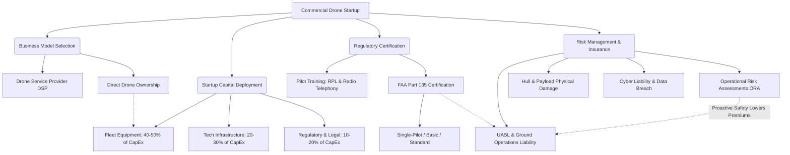

# 5.0 Module Overview

> [!abstract] Learning Objectives
> Building a commercially viable drone operation — from business planning to certification.

### Module 5: Drone Business Models, Insurance, Certification, and Startup Deployment

#### First Principles of Commercial Drone Operations
The fundamental challenge of commercializing drone operations lies in converting the physical advantages of three-dimensional, unconstrained low-altitude routing into a legally compliant, risk-mitigated, and financially viable enterprise. This module deconstructs the operational architecture required to deploy a drone fleet, bridging the gap between aerodynamic capabilities and strict economic and regulatory realities.

#### 1. Strategic Drone Business Models
Operational deployment hinges on calculating and managing the Total Cost of Ownership (TCO) by balancing Capital Expenditure (CapEx) against Operational Expenditure (OpEx) . Organizations must evaluate two primary structural models:
*   **Drone Service Provider (DSP) Model:** Businesses partner with third-party providers who manage end-to-end operations out of their own hubs, assuming responsibility for logistics, regulatory compliance, and scheduling . This shared-network model converts high CapEx into a recurring monthly OpEx fee, distributing drone capacity across multiple customers to increase overarching network efficiency .
*   **Direct Drone Ownership Model:** The organization purchases the fleet directly and establishes its own drone hub, assuming all upfront CapEx and signing annual maintenance contracts (AMCs) . While requiring a substantial initial investment, this model provides exclusive control and maximum autonomy over operations, aligning with long-term strategic objectives requiring specific regulatory control and customization .

#### 2. Startup Deployment and Financial Architecture
Deploying a commercial drone network requires granular financial modeling across distinct infrastructural domains. Initial investments vary heavily based on scale, ranging from $50,000 for localized deliveries up to $525,000+ for multi-regional operations .
*   **Equipment and Drone Fleet:** Procurement of energy-efficient drones, high-precision GPS tracking systems, and a maintenance inventory of spare parts accounts for 40-50% of total startup costs, generally ranging from $50,000 to $100,000 for initial setups .
*   **Technology Infrastructure:** Developing proprietary software for real-time tracking, customer interfaces, and data security protocols requires an investment between $40,000 and $80,000 .
*   **Regulatory Compliance:** Navigating aviation laws, acquiring permits, and performing essential compliance audits requires dedicated legal funding between $20,000 and $50,000 .
*   **Operational Infrastructure:** Establishing physical launch and landing zones, command and control centers, and maintenance facilities constitutes 30-40% of the initial infrastructure investment .
*   **Strategic Funding Mechanisms:** To offset heavy initial outlays, operators can leverage venture capital, crowdfunding, and green technology government grants, the latter of which can subsidize up to 30% of initial costs in certain regions for eco-friendly innovations [12-14].

#### 3. Regulatory Certification Frameworks
To carry the property of another for compensation beyond visual line of sight (BVLOS) in the United States, operators must navigate the Federal Aviation Administration (FAA) Part 135 air carrier certification process . The FAA defines four distinct tiers of operational certification:
*   **Single-Pilot Operator:** The certificate holder is strictly limited to using only one pilot for all Part 135 operations .
*   **Single Pilot in Command:** Includes one pilot in command and up to three second pilots in command, carrying strict limitations on aircraft size and operational scope .
*   **Basic Operator:** Restricted to a maximum of five pilots (including second in command) and a maximum of five aircraft .
*   **Standard Operator:** Holds no intrinsic limits on the size or scope of operations, though the operator must still secure authorization for each specific type of flight conducted .
*   **Pilot Certification:** Operators must also ensure personnel possess foundational qualifications, such as a Remote Pilot License (RPL) and Radio Telephony licenses, which are vital for communicating with air traffic control during BVLOS missions in controlled airspace .

#### 4. Risk Management and the UAV Insurance Ecosystem
Deploying physical assets in public airspace introduces immense liability, necessitating a comprehensive insurance stack to protect against third-party claims, property damage, and data breaches.
*   **Unmanned Aerial System Liability (UASL):** This mandatory policy covers third-party bodily injury and property damage resulting from flight operations, with typical premiums ranging from $600 to $3,500+ annually for $1M-$2M in coverage . UASL often includes Ground Operations Liability for incidents occurring during ground-based setup or maintenance .
*   **Hull and Payload Insurance:** Protects the physical integrity of the drone and its attached payloads (cameras, sensors) against crashes, theft, or vandalism . When financing hardware, lessors require a Certificate of Insurance listing them as a Loss Payee to guarantee compensation .
*   **Errors & Omissions (E&O) and Cyber Liability:** Professional liability (E&O) covers negligence or errors in geospatial mapping or surveying design, while Cyber Liability protects against data breaches and the loss of sensitive information intercepted from the drone's network telemetry .
*   **Premium Mitigation:** Operators can significantly reduce insurance premiums by conducting comprehensive Operational Risk Assessments (ORAs), maintaining strict FAA Part 107 compliance, and demonstrating a proactive safety culture .

#### Ecosystem Architecture

---

## Lessons in this Module
- [[5.1 Building a Drone Business]]
- [[5.2 Insurance and Risk Management]]
- [[5.3 Certification and Type Approval]]
- [[5.4 Case Study - Wingcopter]]
- [[5.5 Startup Costs and Financial Models]]
- [[5.6 Case Study - Zipline]]

---
⬅️ **Back to Course:** [[Overview]]
