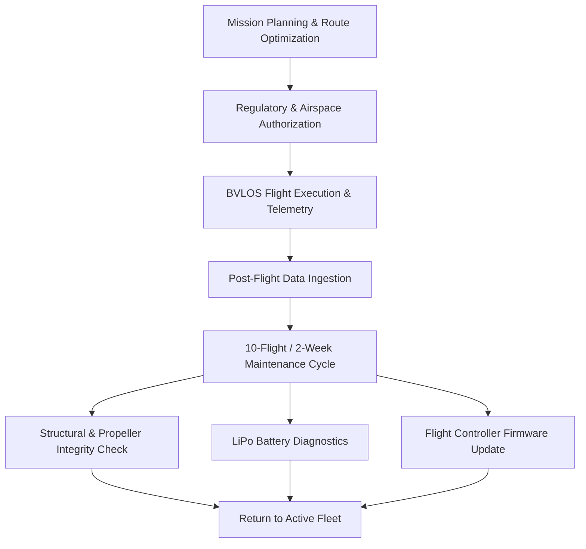

# 5.1 Building a Drone Business

> [!abstract] Learning Objectives
> Develop a drone services business plan covering market analysis and operations.

### First Principles of Commercial Drone Enterprise
Building a commercial drone business relies on the fundamental principle of arbitrating the difference between the high costs of 2D terrestrial operations (labor, traffic, fuel) and the low-friction, high-efficiency vectors of 3D aerial automation. To successfully commercialize Unmanned Aerial Systems (UAS), operators must construct a rigorous architecture combining robust financial planning, strict cyber-physical operational workflows, and rigorous human-in-the-loop safety training. 

### 1. Commercial Business Plan Architecture
A highly technical business plan translates aerial capabilities into predictable economic value. The framework must account for exact capital expenditures (CapEx) and operational expenditures (OpEx), alongside market positioning.

*   **Market & Competitive Analysis:** The plan must identify a precise target market (e.g., real estate, precision agriculture, or last-mile delivery) and analyze competitors . For example, a competitive analysis should map out existing players like "AeroFly Innovations" (agriculture focus) or "UrbanWings Solutions" (urban delivery) to identify gaps in service networks or hardware capabilities .
*   **Startup Cost Capitalization:** Total startup costs for a mid-to-large commercial drone service typically range from $230,000 to $525,000 . The budget must strictly allocate capital across:
    *   *Equipment Investment ($50k - $100k):* High-end drones, spare parts, and payload accessories .
    *   *Technology Infrastructure ($40k - $80k):* Proprietary software development, real-time telemetry tracking, and AES/TLS security measures .
    *   *Regulatory Compliance ($20k - $50k):* Navigating aviation laws, acquiring permits (like FAA Part 135 for delivery), and executing compliance audits .
*   **Financial Projections & Break-Even Analysis:** The plan must feature comprehensive financial models, including Profit & Loss (P&L) statements, cash flow projections, and balance sheets . A critical component is the break-even analysis, calculating the exact unit sales (e.g., aerial photography hours or delivery drops) required to cover the baseline operational overhead .

### 2. Operational Workflows and Maintenance
Drone operations are highly vulnerable to hardware fatigue and software vulnerabilities. A stringent operational workflow dictates the lifecycle of the hardware and data pipeline.

**Routine Maintenance Protocol:**
To prevent catastrophic mid-air failures, units must undergo a rigorous maintenance checklist after every 10 flights or 2 weeks of operation, whichever comes first .
*   **Structural Integrity:** The chassis must be cleaned of mud and dirt to prevent thermal trapping, and meticulously inspected for micro-cracks . Propellers must be checked for free-spinning capabilities and structural damage, as even invisible hairline fractures can be critical . Motors must be cleared of internal debris .
*   **Avionics and Wiring:** Inspect exposed wiring and internal solder joints for fraying or loose connections resulting from flight vibrations . Ensure that LTE/GNSS antennae are properly secured to avoid loss of ground control signals .
*   **Power Systems (LiPo):** Battery packs must be inspected for physical deformities or bulging, which indicates internal cell leakage and immediate failure risk . After inspection, functional batteries should be charged to an optimal 75% for safe storage, avoiding full depletion or overcharging .
*   **Firmware Synchronization:** The drone's flight controller and the ground control station (GCS) software must be updated to the latest firmware to patch security vulnerabilities and optimize flight algorithms . 

### 3. Pilot Training and Certification Standards
The foundational safety of the enterprise rests on the human operators. Commercial pilots must undergo structured, multi-tiered aeronautical training to operate legally and safely.

*   **Remote Pilot License (RPL):** Pilots must complete a formal RPL curriculum consisting of theory and practical modules .
    *   *Theory:* Extensive coursework covering Air Law, Civil Aviation Authority regulations, meteorology, navigation, and the theory of flight .
    *   *Practical:* Minimum recommendation of 5 hours of one-on-one professional flight instruction executing pre-flight checks, in-flight maneuvers, and emergency protocols .
    *   *Skills Test:* A final checkout flight evaluated by a designated flight examiner to ensure strict adherence to airmanship standards .
*   **Radio Telephony Licensing:** For operations involving Beyond Visual Line of Sight (BVLOS) or flights in controlled airspace, pilots must undergo Radio Telephony training . This includes mastering radio phraseology, air traffic control communication, and distress/urgency protocols (VHF propagation) .
*   **Regulatory Endorsements:** In the United States, commercial operators must maintain compliance with FAA Part 107 by passing the aeronautical knowledge test . Cultivating this safety culture, alongside creating Operational Risk Assessments (ORAs), directly decreases Unmanned Aerial System Liability (UASL) insurance premiums .

---

---

## 📊 Slide Deck
> [!info] Presentation Available
> 📎 [[5.1 Building a Drone Business.pdf]]

### 🧭 Navigation
⬅️ **Previous:** [[5.0 Module Overview]]
⬆️ **Module:** [[5.0 Module Overview]]
➡️ **Next:** [[5.2 Insurance and Risk Management]]

