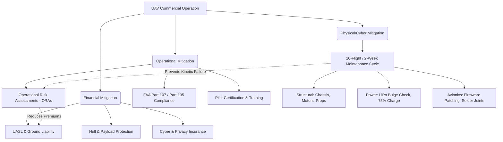

# 5.2 Insurance and Risk Management

> [!abstract] Learning Objectives
> Navigate UAV insurance requirements, liability frameworks, and risk mitigation.

### First Principles of UAV Liability and Risk
The deployment of an Unmanned Aerial Vehicle (UAV) inherently injects a kinetic, cyber-physical mass into shared, low-altitude public airspace. From a first-principles perspective, commercial UAV risk is bifurcated into two vectors: **Kinetic Liability** (the probability of the physical asset causing bodily injury or property damage due to gravity, mechanical failure, or pilot error) and **Digital Liability** (the probability of the data stream being compromised, leading to privacy violations or cyber-attacks). Mitigating these fundamental liabilities requires a tripartite architecture consisting of financial indemnification (insurance), algorithmic and physical preventative maintenance (checklists), and rigorous operational risk management (ORM).

### 1. The Commercial UAV Insurance Ecosystem
To financially insulate a commercial operation, operators must construct a highly specialized insurance stack that covers both the aerial and terrestrial phases of the drone lifecycle.

*   **Unmanned Aerial System Liability (UASL):** This is the foundational policy covering third-party bodily injury and property damage resulting directly from flight operations . This policy often extends to Non-Owned Drone Liability, protecting operations that utilize leased or rented hardware . 
*   **Ground Operations Liability:** Frequently bundled with UASL, this covers kinetic incidents occurring while the drone is terrestrial, such as during setup, maintenance calibration, or transit .
*   **Hull and Payload Insurance:** This protects the CapEx investment of the drone chassis and its attached payloads (e.g., multispectral sensors, cameras, winches) against crashes, theft, or vandalism . If the hardware is financed, lessors mandate a Certificate of Insurance (COI) that legally designates them as a **Loss Payee**, ensuring they receive compensation up to their financial interest before the operator . 
*   **Cyber and Privacy Liability:** Drones are flying data-collection nodes. **Cyber Liability Insurance** protects against data breaches, telemetry interception, and network cyberattacks . Simultaneously, **Personal and Advertising Injury Liability** protects against torts like wrongful entry and invasion of privacy, which is highly critical when executing optical surveying or real estate mapping .
*   **Professional and Product Liability:** If the operation designs UAV systems or provides geospatial data, **Errors & Omissions (E&O)** covers negligence or flaws in the professional data delivered . **Product Liability** is required for manufacturers to cover injuries caused by design defects .

### 2. Operational Risk Management (ORM) and Liability Mitigation
Insurance transfers risk, but ORM reduces the baseline probability of an incident, which directly dictates premium costs.

*   **Operational Risk Assessments (ORAs):** Insurers demand proof of a proactive safety culture. By conducting comprehensive ORAs, operators identify, analyze, and mathematically mitigate risks (such as mid-air collisions or loss of visual line of sight), which heavily suppresses annual premium costs .
*   **Aeronautical Certification:** Strict adherence to regulatory frameworks, such as maintaining Federal Aviation Administration (FAA) Part 107 compliance or advancing to Part 135 air carrier certification, is mandatory . Utilizing certified pilots directly signals a lowered risk profile to underwriters .

### 3. Cyber-Physical Safety and Maintenance Checklists
Mechanical entropy dictates that flight vibrations and environmental exposure will degrade UAV hardware. A stringent maintenance protocol must be executed strictly after every **10 flights or 2 weeks**, whichever comes first .

#### Structural and Mechanical Inspection
*   **Chassis and Fastenings:** The chassis must be cleaned using compressed air and isopropyl alcohol to prevent thermal trapping . The hull must be inspected for micro-cracks, and all screws/fastenings must be checked for torque. Over-tightening must be avoided as it induces excess structural strain .
*   **Propulsion Systems:** Propellers must be inspected for hairline fractures and spun manually to ensure resistance-free rotation . Motors must be cleared of internal debris, grit, and organic matter lodged in the armature .
*   **Avionics and Telemetry:** Exposed wiring and internal solder joints must be inspected for fraying or vibratory separation . The telemetry antennae must be validated for structural integrity to prevent a fatal loss of the Command and Control (C2) link . 

#### Power Systems (LiPo) Diagnostics
*   **Integrity Check:** Lithium Polymer (LiPo) battery packs must be physically inspected. Any bulging or deformity is a critical indicator of internal cell leakage, necessitating immediate disposal and replacement .
*   **Voltage and Storage:** The charging dock must be inspected for voltage compliance . All functional batteries (including spares and controller packs) should be stored at an optimal **75% charge state**; allowing cells to completely drain or remain at 100% capacity degrades the chemical lifespan .

#### Firmware and Software Synchronization
*   The drone's internal flight controller and the Ground Control Station (GCS) application must be updated to the latest firmware . This patches zero-day cybersecurity vulnerabilities and optimizes algorithmic flight stability .

### Liability Mitigation Architecture

---

---

## 📊 Slide Deck
> [!info] Presentation Available
> 📎 [[5.2 Insurance and Risk Management.pdf]]

### 🧭 Navigation
⬅️ **Previous:** [[5.1 Building a Drone Business]]
⬆️ **Module:** [[5.0 Module Overview]]
➡️ **Next:** [[5.3 Certification and Type Approval]]

