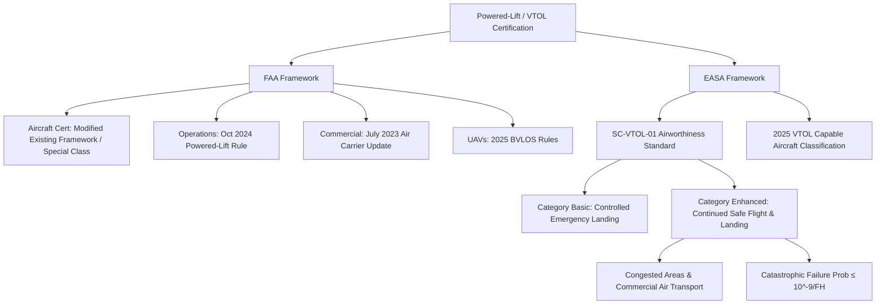

# 5.3 Certification and Type Approval

> [!abstract] Learning Objectives
> Understand FAA, EASA, and ICAO certification pathways for commercial drones.

# Certification Frameworks for Commercial Drones and VTOL Aircraft

The certification of advanced Unmanned Aerial Vehicles (UAVs) and Vertical Take-Off and Landing (VTOL) aircraft represents a paradigm shift in regulatory engineering. Because these platforms utilize distributed electric propulsion and lack classical failure mitigation mechanisms—such as the autorotation capabilities of traditional helicopters or the glide ratios of fixed-wing aircraft—regulators have had to abandon purely prescriptive rules . Instead, the Federal Aviation Administration (FAA) and the European Union Aviation Safety Agency (EASA) rely on **performance-based, risk-proportional safety continuums** derived from first principles of systems engineering and structural reliability.

## 1. First Principles of VTOL Airworthiness

The fundamental challenge in certifying powered-lift aircraft is the inextricable coupling of lift, thrust, and flight control. In a traditional rotorcraft, an engine failure can be mitigated by decoupling the rotor and entering autorotation. In a multicopter or tilt-wing VTOL, propulsion *is* the primary flight control mechanism . 

Consequently, certification shifts from component-level reliability to **system-level fault tolerance**. Regulators mandate that no single failure of a part with critical characteristics can result in a catastrophic effect upon the aircraft , . The loss of a lifting unit is no longer treated merely as a loss of thrust, but as a flight control anomaly, driving all safety objectives through rigorous Functional Development Assurance Levels (FDAL) , .

## 2. EASA Certification Standards: SC-VTOL-01

To ensure a level-playing field among diverse aerodynamic configurations (e.g., tilt-rotors, quad-planes, multicopters), EASA developed **SC-VTOL-01**, a dedicated Special Condition for person-carrying VTOL aircraft in the "small" category—defined as having a maximum certified take-off mass of 2,000 kg or less and a passenger seating configuration of five or fewer , . 

### The Safety Continuum: Basic vs. Enhanced Categories
EASA evaluates risk based on the operational environment and payload, tying airworthiness directly to the type of operation . Aircraft are certified into one of two performance-based categories:

*   **Category Basic:** Designed for non-commercial operations outside of congested areas. Following a critical malfunction of thrust/lift, the aircraft must be capable of a **controlled emergency landing** , . Some damage upon landing is permissible, provided it remains survivable .
*   **Category Enhanced:** Mandated for Commercial Air Transport (CAT) of passengers and operations over congested urban areas , . These aircraft must meet the highest safety objectives to protect third parties on the ground. Following a critical malfunction, the vehicle must be capable of **continued safe flight and landing (CSFL)** . This requires the ability to return to the point of departure or reach a suitable alternate vertiport without requiring exceptional piloting skills or resulting in injuries , .

### Quantitative Safety Objectives (AMC VTOL.2510)
To achieve Category Enhanced certification, the VTOL must meet failure probabilities equivalent to large commercial airliners (CS-25). EASA's Acceptable Means of Compliance (AMC) VTOL.2510 dictates that failure conditions preventing continued safe flight and landing must be **extremely improbable**, quantified as an average probability of $\le 10^{-9}$ per flight hour, necessitating a Functional Development Assurance Level (FDAL) of A , . 

## 3. FAA Certification Framework for Powered-Lift

The FAA defines "powered-lift" as a heavier-than-air aircraft capable of vertical takeoff, vertical landing, and low-speed flight, which depends principally on engine-driven lift devices for those regimes and on a nonrotating airfoil for horizontal cruise flight , . 

Rather than creating a standalone Special Condition like EASA, the FAA utilizes a tailored approach, updating existing regulations to integrate powered-lift vehicles into the National Airspace System (NAS) . 

### Airworthiness and Operational Rules
*   **Aircraft Certification:** The FAA leverages its existing regulatory framework to certificate powered-lift designs, evaluating their production and airworthiness on a highly customized, data-driven basis . Depending on the novelty of the project, the FAA establishes additional specific airworthiness criteria for the aircraft .
*   **Operational and Air Carrier Integration:** In July 2023, the FAA issued a final rule updating the definition of an "air carrier" to explicitly include "powered-lift" operations, allowing these novel vehicles to legally execute commercial charters, air tours, and airline-type operations . 
*   **Pilot and Instructor Certification:** In October 2024, the FAA finalized operational rules and pilot/instructor certification requirements . These rules are strictly performance-based, meaning the regulatory burden applied to a powered-lift aircraft dynamically depends on its specific flight characteristics and the phase of flight . 

## 4. Commercial Drone (UAV) Integration

For unmanned, highly automated commercial drones, regulatory frameworks are rapidly converging to allow scalable logistics and fleet operations without constant human supervision. 

*   **Beyond Visual Line-of-Sight (BVLOS):** The FAA's 2025 BVLOS rules formally authorize operations up to 400 feet for unmanned aircraft weighing under 1,320 lbs . This directly enables heavy fixed-wing VTOL drones to enter the commercial market .
*   **Fleet Scalability:** Regulators are validating unmanned traffic management systems and issuing special class criteria that drastically reduce the pilot-to-drone ratio. For example, Wing Aviation’s Hummingbird platform received approvals allowing a single pilot to simultaneously supervise 20 highly automated drones, demonstrating the economic scalability required for commercial delivery fleets . 
*   **European Harmonization:** EASA’s 2025 VTOL Capable Aircraft classification harmonizes the European approach, shrinking compliance costs and allowing operators to deploy standardized products across continent-wide airspaces .

---

---

## 📊 Slide Deck
> [!info] Presentation Available
> 📎 [[5.3 Certification and Type Approval.pdf]]

### 🧭 Navigation
⬅️ **Previous:** [[5.2 Insurance and Risk Management]]
⬆️ **Module:** [[5.0 Module Overview]]
➡️ **Next:** [[5.4 Case Study - Wingcopter]]

