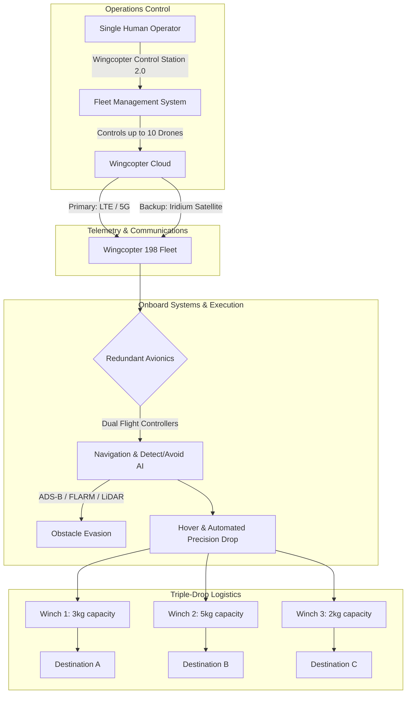

# 5.4 Case Study - Wingcopter

> [!abstract] Learning Objectives
> Analyze Wingcopter eVTOL delivery platform, certification journey, and global deployments.

# Wingcopter 198: Business and Operations Case Study

## 1. First Principles of Aerial Logistics and the Wingcopter Solution

From a first-principles perspective, last-mile drone logistics is constrained by two fundamental bottlenecks: the physical trade-off between vertical agility and aerodynamic efficiency, and the economic barrier of labor costs per delivery. 

Traditional multicopters optimize for vertical takeoff and landing (VTOL) and hovering precision but suffer from high drag and immense battery consumption during forward flight. Conversely, fixed-wing aircraft possess superior lift-to-drag ratios for long-range cruising but require extensive infrastructure (runways) for deployment. Wingcopter solves this physical constraint via a patented tilt-rotor mechanism, enabling an all-electric VTOL (eVTOL) aircraft that seamlessly transitions into highly efficient forward flight , . 

Economically, one-to-one human-to-drone ratios and single-package delivery systems severely limit scalability. Wingcopter addresses this unit economics problem through automation and hardware innovation. The Wingcopter 198 allows a single operator to control a fleet of up to 10 aircraft simultaneously, while a proprietary "triple-drop" winch mechanism facilitates the delivery of multiple packages to separate destinations within a single flight .

## 2. Technical Architecture: The Wingcopter 198

The Wingcopter 198 is an eVTOL delivery platform engineered from the ground up to meet stringent commercial aviation safety standards, targeting beyond-visual-line-of-sight (BVLOS) operations .

### 2.1. Aerodynamics and Propulsion
*   **Tilt-Rotor Architecture:** The aircraft utilizes an octocopter configuration featuring eight rotors, four of which are tiltable to provide forward thrust during fixed-wing cruise mode . 
*   **Performance Metrics:** The drone boasts a top speed of 150 km/h (40 m/s) with a standard cruise speed of 14-28 m/s , . It can achieve a maximum flight time of 90 minutes in fixed-wing mode . 
*   **Range and Payload:** The drone accommodates up to 5-6 kg of payload. Operating with maximum payload yields a range of 75 km, while operating with lighter or zero payloads extends the range up to 110 km on a single battery charge , .

### 2.2. Delivery Mechanics: Triple-Drop System
The Wingcopter 198 distinguishes itself with an automated, multi-modal payload system capable of executing precision drops from a hover without landing , .
*   **Winch Specifications:** The system employs three distinct winches: a front winch (3 kg limit), a center winch (5 kg limit), and a back winch (2 kg limit) .
*   **Payload Configurations:** Operators can equip the drone with three separate 17-liter packages, two 22-liter packages, or one large 57-liter package .

### 2.3. Safety and Redundancy Systems
To achieve regulatory type certification, the Wingcopter 198 is built with a heavily redundant systems architecture:
*   **Dual-Redundant Avionics:** The platform includes dual flight controllers, dual smart Li-Ion batteries (814Wh each), dual barometers, dual-antenna GNSS, and dual airspeed sensors , , .
*   **Situational Awareness:** The aircraft integrates advanced detect-and-avoid capabilities utilizing downward-facing LiDAR, ADS-B In, FLARM in/out, and Remote ID , . AI-based visual sensing handles obstacle avoidance and precision parcel dropping .
*   **Communications:** The primary communication link relies on LTE/5G cellular telemetry, backed up by Iridium satellite connections to ensure continuous command and control , .

## 3. Operational Flow Diagram

## 4. Market Strategy and Business Model

Wingcopter employs a highly targeted B2B and B2G (Business-to-Government) marketing strategy, operating within a commercial drone market projected to reach tens of billions of dollars , .

*   **Product and Price:** Wingcopter operates on a value-based pricing model tailored to large-scale fleet deployments. In an industry where commercial eVTOL systems run between $1.5M and $3M, Wingcopter positions its 198 model as a premium, high-ROI asset capable of reducing operational costs by up to 30% via autonomous flight , . The company supports procurement through flexible financing and leasing options to mitigate high upfront CapEx for its clients .
*   **Place (Distribution):** Direct online sales account for roughly 35% of revenue, but massive scalability is driven by an Authorized Partner Program and strategic alliances with global logistics giants such as DHL, UPS, and ANA Holdings , , . 
*   **Promotion:** Wingcopter drives visibility through targeted digital marketing (SEM), high-profile industry events like the Commercial UAV Expo, and highly publicized pilot projects with NGOs like the World Food Programme and the German Red Cross , , , . 

## 5. Funding and Financials

Wingcopter has aggressively raised capital to fuel hardware R&D, serial production under EN9100 aerospace standards, and global expansion .
*   The company secured a $42 million Series A funding round in 2021 , , .
*   By late 2023, total funding surpassed $60 million .
*   Key investors span global tech and logistics sectors, including Xplorer Capital, Futury Capital, ITOCHU, DRONE FUND, SYNERJET, Expa, and Hessen Kapital III .

## 6. Global Deployment: Case Studies in Operations

### 6.1. Macro-Scale Deployment: Continental Drones in Africa
In what is slated to be the largest commercial drone deployment in history, Wingcopter signed an agreement with Continental Drones to roll out 12,000 Wingcopter 198 units across 49 sub-Saharan African countries over five years , . 
*   **Operational Thesis:** Poor infrastructure creates extreme barriers to healthcare and economic development. Utilizing drones leapfrogs the need for ground infrastructure, transporting vaccines, lab samples, and goods rapidly across vast, remote distances with zero emissions .

### 6.2. High-Value Healthcare Delivery & Certification: Japan
Japan represents a prime market for BVLOS operations due to an aging population, labor shortages, and secluded geographies involving 48 inhabited islands in Okinawa alone , .
*   **Regulatory Milestone:** Backed by partner and investor ITOCHU, Wingcopter became the first foreign company to have a fixed-wing drone accepted for unmanned aircraft class-1 type certification by the Japan Civil Aviation Bureau (JCAB). Successful certification will unlock Level 4 BVLOS flights over populated areas , .
*   **Okinawa Blood Transport POC:** Wingcopter, ITOCHU, ANA Holdings, and the Japanese Red Cross executed a successful 53-kilometer flight transporting critical research blood between Urasoe and Nago in just 32 minutes. The payload utilized custom retrofitted cooling boxes to maintain a strict 2 to 6 degrees Celsius temperature profile. Post-flight analysis confirmed the drone-transported blood maintained a quality comparable to control groups , , .

### 6.3. US Airworthiness Pathway
Wingcopter has closely collaborated with the FAA, successfully obtaining Special Class Airworthiness Criteria approval under 14 CFR § 21.17(b). This represents a vital regulatory moat, defining the exact technological prerequisites Wingcopter must meet to scale commercial operations over populated U.S. airspace , .

## 7. Future Trajectory: Hydrogen Propulsion Integration

To push the physical limits of their range capabilities without sacrificing payload or environmental commitments, Wingcopter has entered a development partnership with the ZAL Center of Applied Aeronautical Research in Hamburg , . 

Engineers are refitting the Wingcopter 198 to run on a green hydrogen fuel cell system rather than standard lithium-ion batteries. Because compressed gaseous hydrogen offers a vastly superior energy-to-weight ratio compared to batteries, this technology is projected to exponentially increase flight endurance—building upon ZAL's previous success of achieving over two hours of flight time with proprietary hydrogen drones—further establishing Wingcopter's dominance in long-distance aerial supply chains , .

---

---

## 📊 Slide Deck
> [!info] Presentation Available
> 📎 [[5.4 Case Study - Wingcopter.pdf]]

### 🧭 Navigation
⬅️ **Previous:** [[5.3 Certification and Type Approval]]
⬆️ **Module:** [[5.0 Module Overview]]
➡️ **Next:** [[5.5 Startup Costs and Financial Models]]

