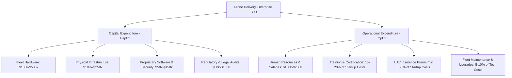

# 5.5 Startup Costs and Financial Models

> [!abstract] Learning Objectives
> Model the economics of a drone business — capital costs, unit economics, and ROI.

### First Principles of Drone Logistics Financials
The foundational economic principle of commercial drone delivery involves arbitrating the difference between high-friction, two-dimensional terrestrial logistics (characterized by labor, fuel, and traffic bottlenecks) and low-friction, high-efficiency three-dimensional aerial automation. To successfully commercialize this capability, operators must calculate a rigorous **Total Cost of Ownership (TCO)**, balancing heavy initial Capital Expenditures (CapEx) with recurring Operational Expenditures (OpEx) .

### Strategic Financial Models
Organizations aiming to launch a drone delivery network must choose between two primary structural deployment models, each dictating a vastly different financial architecture:

*   **Drone Service Provider (DSP) Model:** In this shared-network approach, a business partners with third-party providers (e.g., Wing, Zipline) who manage the end-to-end operations from their own regional hubs . This model is highly cost-effective for end-users, as it **converts high CapEx into a recurring monthly OpEx fee**, distributing network capacity and costs among multiple customers to maximize overall efficiency .
*   **Direct Drone Ownership Model:** Organizations purchase the drone fleet outright and establish proprietary hubs. This necessitates a massive upfront CapEx injection alongside Annual Maintenance Contracts (AMCs) and monthly OpEx for utilities and battery replacement . While capital-intensive, it guarantees maximum operational autonomy and customization, aligning with long-term strategic objectives .

### Startup Capital and Expenditure Breakdown
Scaling a drone delivery network requires highly specific financial modeling across multiple infrastructural and technological domains. Depending on the scope—ranging from localized B2B drops to multi-regional networks—startup costs scale from $50,000 to well over $500,000 .

#### 1. Hardware and Operational Infrastructure
The physical architecture of the delivery fleet and its terrestrial support systems represent the largest CapEx burden.
*   **Drone Fleet Procurement:** Commercial energy-efficient delivery drones generally cost between **$5,000 and $20,000 per unit** depending on payload and technological capabilities . Total fleet investments range from $100,000 to $500,000 for a comprehensive operational setup . 
*   **Telemetry and Tracking Hardware:** Integrating high-precision GPS tracking and real-time data link systems adds an additional **10% to 20% to the base hardware cost** .
*   **Physical Infrastructure:** Establishing launch and landing zones, maintenance facilities, and command centers is vital. Ground infrastructure setup can require **$100,000 to $250,000**, with dedicated command and control centers alone costing between $75,000 and $150,000 to construct . 
*   **Maintenance Inventory:** Stockpiling essential spare parts and maintenance tools to prevent operational downtime accounts for roughly **5% to 10% of overall technology costs** .

#### 2. Software and Technology Development
To operate Beyond Visual Line of Sight (BVLOS), operators must invest heavily in proprietary cyber-physical software.
*   **Core Software Integration:** Developing robust software platforms for fleet orchestration, routing, and real-time customer interfaces requires an investment of **$50,000 to $150,000** . 
*   **Security and Telemetry Defense:** Given the risk of cyber-threats like GNSS spoofing or de-authentication attacks, **15% of the technology budget** (ranging from $20,000 to $80,000) is typically allocated strictly to cybersecurity measures and data encryption protocols .

#### 3. Regulatory Compliance and Liability
The deployment of a network is strictly gated by legal compliance and insurance requirements.
*   **FAA Certification and Permits:** Navigating aviation laws to obtain Federal Aviation Administration (FAA) Part 135 air carrier certification, legal consultations, and essential compliance audits costs between **$50,000 and $150,000**, depending on operational complexity . Securing initial permits and compliance fees alone starts between $10,000 and $25,000 . 
*   **Insurance Stack:** Comprehensive UAV liability, hull insurance, and ground operations liability are non-negotiable. These premiums account for **3% to 8% of the total startup budget** to mitigate physical and digital risks .

#### 4. Staffing and Human Resources
The transition to automated flight still relies heavily on highly trained human-in-the-loop operators.
*   **Human Capital Expenditure:** A comprehensive human resource budget ranges from **$100,000 to $200,000**, accounting for competitive salaries for remote pilots and technical maintenance staff .
*   **Training and Certification:** Training pilots for specific aeronautical certifications (like Remote Pilot Licenses and Radio Telephony) is resource-intensive. Initial training and onboarding costs alone can consume **15% to 20% of total startup expenses**, frequently demanding $40,000 to $70,000 in dedicated capital .

### Total Cost of Ownership (TCO) Architecture

### Strategic Funding Mechanisms
To offset the immense capital required for direct ownership, operators rely on layered funding models. Startups routinely seek venture capital, aiming for initial funding rounds of **$250,000 or more** to scale quickly . Additionally, operators leverage green technology government grants, which can subsidize up to **30% of initial equipment investments** (often providing awards up to $50,000) for prioritizing eco-friendly, energy-efficient drone logistics . Finally, strategic collaborations with established e-commerce platforms can offset early CapEx by providing direct funding and predictable long-term delivery contracts .

---

---

## 📊 Slide Deck
> [!info] Presentation Available
> 📎 [[5.5 Startup Costs and Financial Models.pdf]]

### 🧭 Navigation
⬅️ **Previous:** [[5.4 Case Study - Wingcopter]]
⬆️ **Module:** [[5.0 Module Overview]]
➡️ **Next:** [[5.6 Case Study - Zipline]]

