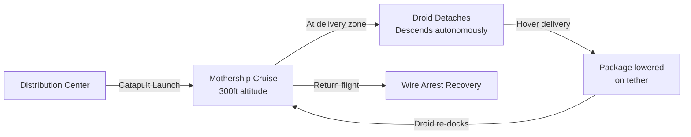

# 5.6 Case Study — Zipline

> [!abstract] Learning Objectives
> Analyze Zipline's autonomous drone delivery platform — its engineering architecture, regulatory strategy, operational logistics, and global scaling from Rwanda to the United States.

## Company Overview

**Zipline International Inc.**, founded in 2014 by Keller Rinaudo Clancy, is the world's largest autonomous drone delivery company. Operating across multiple continents, Zipline has completed over 1 million commercial deliveries — more than all other drone delivery companies combined. The company has fundamentally proven that autonomous BVLOS drone delivery is not a futuristic concept but a commercially viable, life-saving infrastructure layer.

| Metric | Value |
|---|---|
| **Founded** | 2014, San Francisco, CA |
| **Total Deliveries** | 1,000,000+ |
| **Countries Operating** | Rwanda, Ghana, Nigeria, Kenya, Japan, USA |
| **Total Funding** | $750M+ (Series F at $4.2B valuation) |
| **Aircraft Platform** | Zipline P2 "Platform 2" (Zip) |
| **Delivery Range** | 100+ km round trip |
| **Payload Capacity** | Up to 1.8 kg (P1) / 3.5 kg (P2) |

---

## 1. Engineering Architecture

### Platform 1 — The Fixed-Wing Launcher

Zipline's first-generation system was a model example of constrained engineering:

- **Airframe:** Fixed-wing catapult-launched aircraft with a 3-meter wingspan, constructed from lightweight composites.
- **Launch System:** Pneumatic catapult launcher accelerating the drone from 0 to 100 km/h in 0.3 seconds. No runway required.
- **Recovery System:** The drone returns to the distribution center and is caught mid-air by a wire-and-hook arrest system (similar to aircraft carrier landings), eliminating the need for traditional landing gear.
- **Delivery Mechanism:** The drone does not land at the delivery site. Instead, it descends to low altitude, releases the payload on a small parachute, and immediately climbs back to cruise altitude — enabling deliveries to any open space.
- **Navigation:** Fully autonomous GPS-guided navigation with pre-planned routes. No human pilot intervention required during flight.

### Platform 2 — "Zip" Instant Delivery

Zipline's second-generation platform represents a paradigm shift:

- **Architecture:** A high-altitude fixed-wing mothership carries a detachable multirotor delivery drone (the "droid") internally.
- **Operation Sequence:**
  1. The mothship launches and flies to the delivery zone at high altitude (~300 ft).
  2. The droid detaches from the mothership and descends autonomously.
  3. The droid performs precision hover delivery — lowering the package on a tether to the customer's doorstep.
  4. The droid re-ascends and re-docks with the mothership mid-air.
  5. The mothership returns to base.
- **Advantages:** Combines the range and efficiency of fixed-wing flight with the precision delivery capability of multirotor hover — solving the "last 100 feet" problem.
- **Speed:** 10-minute delivery window from order to doorstep within the service radius.
- **Noise:** Engineered to be quieter than a household appliance at delivery altitude.

---

## 2. Regulatory Strategy

Zipline's regulatory approach has been among the most innovative in the industry:

### Rwanda First (2016)
- Instead of waiting years for FAA BVLOS approval, Zipline partnered directly with the **Rwanda Civil Aviation Authority (RCAA)** to establish the world's first national drone delivery service.
- Rwanda's smaller airspace, urgent medical logistics needs (blood delivery to remote hospitals), and progressive government created an ideal regulatory sandbox.
- **Key insight:** Zipline built its safety record internationally before bringing operations to the US, using real-world delivery data as evidence for regulators.

### Ghana Expansion (2019)
- Scaled to the **Ghana Civil Aviation Authority (GCAA)**, building the world's largest drone delivery network serving 12+ million people.
- Delivered COVID-19 vaccines, blood products, and essential medications to 2,500+ health facilities.

### US FAA Approval
- Received **FAA Part 135 air carrier certificate** — the same type of certification required by commercial airlines. This was a landmark regulatory achievement for the drone industry.
- Zipline is authorized for commercial BVLOS delivery operations in the United States.
- Currently operating from distribution centers in Arkansas (Walmart partnership), Utah, and expanding.

### Regulatory Philosophy
Zipline's approach upended the traditional "wait for regulation" mentality:
1. **Prove safety internationally** in permissive markets with genuine need.
2. **Accumulate millions of autonomous flight miles** as empirical safety evidence.
3. **Engage regulators with data**, not theoretical safety cases.
4. **Pursue the highest certification** (Part 135) rather than waivers for maximum operational flexibility.

---

## 3. Operational Logistics

### Distribution Center Architecture

Each Zipline distribution center (or "nest") is a self-contained logistics hub:

- **Footprint:** Approximately the size of two parking spaces.
- **Inventory:** Stocked with medical supplies, retail packages, or food depending on the market.
- **Staff:** Small team of 20–30 operators managing loading, launch, and recovery.
- **Throughput:** A single nest can process 150+ deliveries per day.
- **Turnaround:** Aircraft are recovered, reloaded, and relaunched in under 10 minutes.

### Supply Chain Integration

- **Rwanda/Ghana:** Integrated with national blood bank systems. Hospitals order blood products via SMS. Zipline loads, launches, and delivers within 30 minutes — compared to hours by road.
- **United States:** Partnered with Walmart for retail delivery, enabling 10-minute delivery of thousands of SKUs across electronics, groceries, and health products.
- **Japan:** Partnered with Toyota Tsusho for healthcare logistics in rural Goto Islands.

---

## 4. Impact and Scale

### Medical Impact in Africa

| Metric | Rwanda | Ghana |
|---|---|---|
| **Launch Year** | 2016 | 2019 |
| **Health Facilities Served** | 600+ | 2,500+ |
| **Products Delivered** | Blood, vaccines, medications | Blood, COVID vaccines, medications |
| **Population Coverage** | 12M+ (entire country) | 12M+ |
| **Key Achievement** | 65% reduction in blood expiry waste | World's largest vaccine drone delivery |

### Commercial Scale
- **1,000,000+ deliveries** completed globally.
- **50M+ km** autonomous flight distance logged.
- **Zero safety incidents** involving third parties across all operations.
- Aircraft operate in all weather conditions including heavy rain and wind.

---

## 5. Competitive Moat

Zipline's sustained leadership is built on compounding advantages:

1. **Regulatory Precedent:** FAA Part 135 certification is extremely difficult to obtain — Zipline's approval creates a multi-year head start.
2. **Operational Data:** 50M+ km of autonomous flight data creates an unmatched dataset for training AI systems and demonstrating safety to new regulators.
3. **Vertical Integration:** Zipline designs and manufactures its aircraft, builds its distribution centers, and operates its own logistics software — controlling the entire stack.
4. **Network Effects:** Each new distribution center increases delivery radius, attracting more partners, which funds more centers.
5. **Platform 2 Architecture:** The mothership-droid design solves last-mile precision delivery without sacrificing range — a significant engineering advantage over competitors using only multirotors or only fixed-wings.

---

## 6. Lessons for the Drone Industry

- **Start where the need is greatest:** Rwanda's urgent medical logistics need created regulatory willingness that didn't exist in the US.
- **Safety record beats safety theory:** Millions of real deliveries outweigh thousands of pages of theoretical safety analysis.
- **Vertical integration enables speed:** Controlling hardware, software, and operations eliminates dependency bottlenecks.
- **Think in platforms, not products:** Platform 2's mothership-droid architecture shows that the most impactful drone systems may be compound vehicles, not single airframes.

---

## 📊 Slide Deck
> [!info] Presentation Available
> 📎 [[5.6 Case Study - Zipline.pdf]]

### 🧭 Navigation
⬅️ **Previous:** [[5.5 Startup Costs and Financial Models]]
⬆️ **Module:** [[5.0 Module Overview]]
➡️ **Next:** [[6.0 Module Overview|Module 6 - Regulations]]
