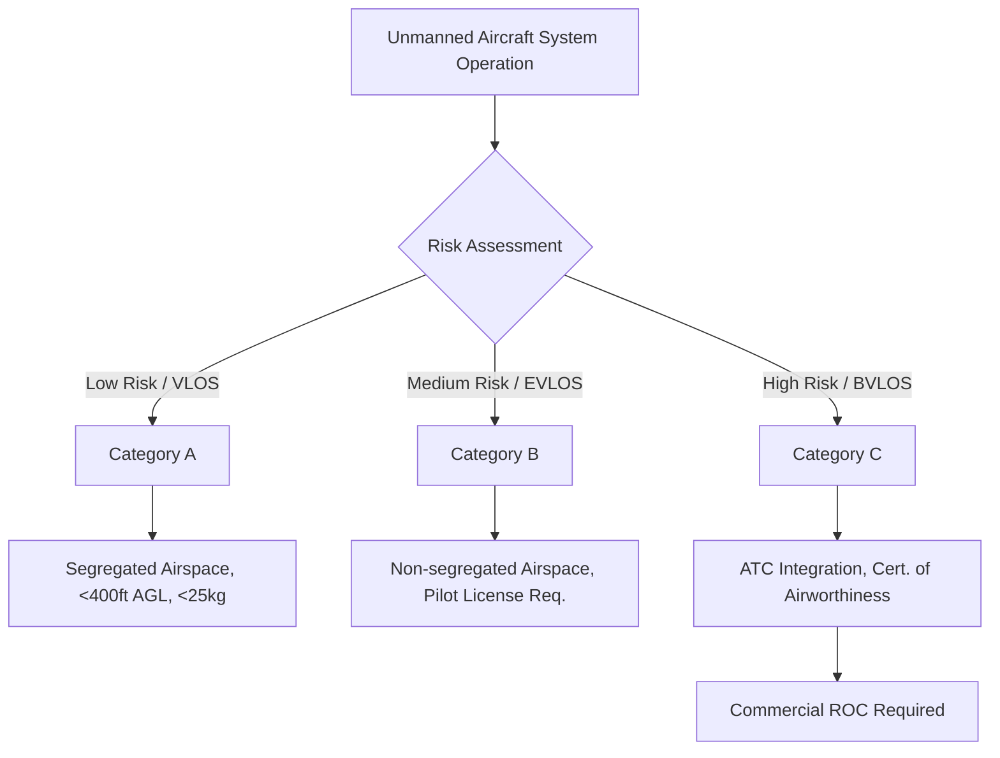

# 6.0 Module Overview

> [!abstract] Learning Objectives
> The regulatory frameworks governing drone operations across the globe.

# Module 6: Drone Regulations, UTM, Geofencing, and Security Protocols

*(Note: The provided sources focus strictly on the Kenya Civil Aviation (Unmanned Aircraft Systems) Regulations 2020. Broad global regulatory frameworks, the software architecture of Unmanned Aircraft System Traffic Management (UTM), and the digital implementation of geofencing are not explicitly detailed in the provided text. You may want to independently verify those specific external concepts. The following overview leverages the Kenyan framework as a proxy for understanding the first principles of international aviation compliance).*

## 1. First Principles of Airspace Governance
The fundamental principle of aviation regulation is the mitigation of risk associated with shared airspace and kinetic energy over populated areas. Regulatory frameworks shift the focus from the aircraft's hardware to the operational risk profile . This ensures that public safety, national security, and manned aviation are protected from spatial and physical interference .

## 2. Local and Global Regulatory Frameworks
Using the Kenyan regulatory environment as a foundational model, drone operations are typically structured around a tiered risk assessment system . 

### 2.1 Categorization of Operations
To manage operational risk, flights are classified into three distinct categories based on their threat to safety and manned aviation:
*   **Category A (Low Risk):** Restricted to Visual Line-of-Sight (VLOS), under 400 feet Above Ground Level (AGL), and maintaining a 50-meter lateral distance from unaffiliated persons or structures . These drones must weigh under 25kg (including payload) and operate within segregated airspace .
*   **Category B (Medium Risk):** Includes Extended Visual Line of Sight (EVLOS) operations in non-segregated airspace . Operators must hold a valid remote pilot license issued by the Authority .
*   **Category C (High Risk / Manned Aviation Approach):** Encompasses Beyond Visual Line-of-Sight (BVLOS) operations, integrating directly into airspace shared with manned aviation . These aircraft require a Certificate of Airworthiness based on a recognized type certificate and are subject to strict Air Traffic Control (ATC) instructions .

### 2.2 Commercial Operator Authorizations
To operate commercially, entities must secure a Remote Aircraft Operators Certificate (ROC) . Obtaining an ROC requires demonstrating an adequate organizational structure, robust flight operation controls, a formal training program, and a comprehensive Safety Management System (SMS) that identifies and mitigates systemic hazards [10-13].

## 3. Airspace Integration and Traffic Management (UTM)
While the source material does not explicitly define the digital architecture of UTM, it establishes the operational prerequisites for drone integration into controlled air traffic ecosystems. 
*   **ATC Communication and Flight Plans:** Flights entering controlled airspace must file formal flight plans and establish communication with Air Traffic Control . 
*   **ANSP Integration:** The Air Navigation Service Provider (ANSP) is mandated to establish procedures for the safe integration of UAS, focusing on secure communication and surveillance detection . 
*   **Command and Control (C2):** Operators must maintain uninterrupted C2 links . If the C2 link fails or communication with ATC drops, the operator must execute predefined emergency and contingency procedures . Aircraft are also evaluated on their integrated "detect and avoid" capabilities .

## 4. Spatial Restrictions (Geofencing Fundamentals)
Geofencing represents the programmatic enforcement of legal spatial boundaries. Regulations dictate strict geographical operating limitations to protect critical infrastructure and aerial corridors :
*   **Aerodrome Proximity:** Operations are strictly prohibited within 10 kilometers of Code C, D, E, and F aerodromes, and within 7 kilometers of Code A and B aerodromes . Furthermore, drones cannot operate in terminal traffic holding patterns or on approach/take-off paths without explicit written authorization .
*   **Strategic Installations:** Flights are prohibited around high-tension cables, communication masts, prisons, courts, and scenes of crime .
*   **Public Infrastructure:** Landing on or flying within 50 meters of public roads requires explicit closure of the road and specific safety authorizations .

## 5. Drone Security Protocols
Drones represent potential vectors for unlawful interference, requiring rigorous physical and personnel security protocols .
*   **Personnel Security:** Organizations must conduct comprehensive background checks upon recruitment and mandatory criminal record checks every 24 months for any personnel involved in the deployment, handling, or storage of UAS .
*   **Operational Security Programs:** Commercial ROC holders must implement a formalized security program overseen by a designated security coordinator . 
*   **Asset Protection:** Drones must be securely stored to prevent tampering or unauthorized access . Critical information technology, flight documents, and C2 communication systems must be protected against cyber and physical interference that could jeopardize civil aviation . Hardware no longer in use must be demonstrably destroyed or disabled .

---

## Lessons in this Module
- [[6.1 Global Regulatory Landscape]]
- [[6.2 Kenya UAS Regulations]]
- [[6.3 UTM and Airspace Management]]
- [[6.4 Geofencing and Airspace Control]]
- [[6.5 Cybersecurity and Drone Security]]
- [[6.6 Remote ID and Compliance]]

---
⬅️ **Back to Course:** [[Overview]]
