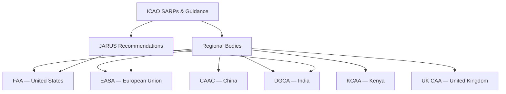
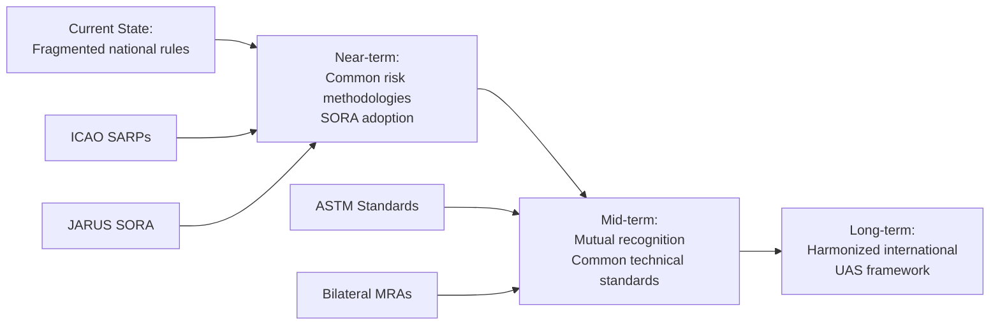

# 6.1 Global Regulatory Landscape

> [!abstract] Learning Objectives
> Compare FAA, EASA, ICAO, and emerging national UAS regulatory frameworks.

## Why Drone Regulation Exists

At the most fundamental level, drone regulation exists because unmanned aircraft share airspace with manned aviation and operate above populated areas. The core regulatory challenge reduces to two physical realities:

1. **Kinetic Energy Risk:** A drone falling from altitude carries kinetic energy proportional to ½mv². A 25 kg drone at 120 m altitude impacts with energy comparable to a vehicle collision — regulators must ensure this risk is managed to an acceptable probability of fatality.
2. **Airspace Deconfliction:** Without deterministic separation mechanisms, a drone operating at 400 ft AGL occupies the same airspace as helicopters, general aviation, and emergency services. Regulatory frameworks exist to prevent mid-air collisions through procedural and technological controls.

Every national regulatory framework is ultimately an engineering solution to these two physics problems, balanced against the economic imperative to enable commercial innovation.

---

## 1. ICAO — The International Foundation

The **International Civil Aviation Organization (ICAO)**, a United Nations specialized agency established by the 1944 Chicago Convention, provides the foundational framework upon which all national drone regulations are built.

### Key ICAO Contributions

- **Annex 2 (Rules of the Air):** Establishes that all aircraft — manned or unmanned — operating in international airspace must comply with ICAO rules. This creates the legal basis for UAS regulation.
- **Doc 10019 (Manual on RPAS):** The primary guidance document for Remotely Piloted Aircraft Systems, covering airworthiness, licensing, operations, and air traffic management.
- **Doc 10250 (UAS Toolkit):** A modular framework helping member states develop national UAS regulations proportional to their aviation maturity.
- **CONOPS for UAS-UTM Integration:** ICAO's concept of operations for integrating UAS Traffic Management (UTM) with traditional Air Traffic Management (ATM) systems.

### ICAO's Risk-Based Approach

ICAO does not prescribe specific rules. Instead, it establishes **Standards and Recommended Practices (SARPs)** that member states transpose into national law. This creates a tiered global system:

---

## 2. FAA — United States

The **Federal Aviation Administration (FAA)** regulates the world's largest drone market through a layered system of rules and waivers.

### Part 107 — Small UAS Rule (2016)

The foundational rule for commercial drone operations under 55 lbs (25 kg):

| Requirement | Specification |
|---|---|
| **Pilot Certification** | Remote Pilot Certificate (Part 107 exam) |
| **Maximum Altitude** | 400 ft AGL (or within 400 ft of a structure) |
| **Maximum Speed** | 100 mph (87 knots) |
| **Visual Line of Sight** | Required at all times |
| **Operations Over People** | Prohibited without Category 1–4 waiver |
| **Night Operations** | Permitted with anti-collision lighting (since 2021) |
| **Airspace Authorization** | Required for Class B/C/D/E via LAANC or DroneZone |

### Part 89 — Remote ID (2023)

All drones operating in US airspace must broadcast identification and location data via:
- **Standard Remote ID:** Built into the aircraft firmware, broadcasting over Wi-Fi/BLE
- **Remote ID Broadcast Module:** External add-on for legacy aircraft
- **FRIA (FAA-Recognized Identification Areas):** Designated areas where Remote ID is not required

### BVLOS Pathway

The FAA has historically been conservative on Beyond Visual Line of Sight (BVLOS) operations, requiring individual waivers under Part 107.31. Key developments:
- **Part 108 (Proposed):** A dedicated rule for BVLOS operations expected to establish performance-based standards rather than prescriptive waivers.
- **Type Certificates:** Companies like Zipline, Wing (Alphabet), and Joby Aviation have pursued type certification for BVLOS-capable aircraft.
- **ASTM F3442 (DAA):** The Detect-And-Avoid standard that will underpin routine BVLOS approval.

---

## 3. EASA — European Union

The **European Union Aviation Safety Agency (EASA)** adopted a fundamentally different philosophy: a **risk-based, operation-centric** framework that regulates the operation rather than just the aircraft.

### Three-Category System (EU 2019/947)

- **Open Category:** Low-risk operations requiring no authorization.
  - **A1:** Fly over people (< 250g drones), A1 competency certificate
  - **A2:** Fly close to people (< 4 kg), additional theory exam
  - **A3:** Fly far from people (< 25 kg), basic online training
- **Specific Category:** Medium-risk operations requiring operational authorization based on a **Specific Operations Risk Assessment (SORA)**.
  - Operators submit a SORA following the **JARUS methodology** that quantifies ground risk (population density) and air risk (airspace class) to determine required mitigations.
  - **Standard Scenarios (STS-01, STS-02):** Pre-approved operational envelopes for common use cases like VLOS over populated areas or BVLOS over sparsely populated areas.
- **Certified Category:** High-risk operations (passenger transport, cargo over dense urban areas) requiring full aircraft type certification, operator certification, and pilot licensing analogous to manned aviation.

### JARUS SORA Methodology

The **Joint Authorities for Rulemaking on Unmanned Systems (JARUS)** — a consortium of 65 national aviation authorities — developed the SORA as a universal risk assessment framework:

1. **Step 1:** Define the Concept of Operations (ConOps)
2. **Step 2:** Determine intrinsic Ground Risk Class (GRC) based on drone dimensions and operational scenario
3. **Step 3:** Apply ground risk mitigations (parachute, geofencing) to reduce GRC to final GRC
4. **Step 4:** Determine initial Air Risk Class (ARC) based on airspace type
5. **Step 5:** Apply strategic mitigations (operational restrictions, airspace segregation) to reduce ARC
6. **Step 6:** Determine tactical mitigations (DAA systems, transponders)
7. **Step 7:** Map residual risk to a **Specific Assurance and Integrity Level (SAIL)** from I to VI
8. **Step 8:** Identify **Operational Safety Objectives (OSOs)** required for the determined SAIL

### U-Space — Europe's UTM

EASA's **U-Space** regulation (EU 2021/664) defines four service tiers for UAS Traffic Management:

| Service Level | Capabilities |
|---|---|
| **U1 — Foundation** | E-registration, e-identification, geofencing |
| **U2 — Initial** | Flight planning, flight approval, tracking, airspace management |
| **U3 — Advanced** | Conflict detection, dynamic capacity management, interface with ATC |
| **U4 — Full** | Integrated operations with manned aviation, fully automated deconfliction |

---

## 4. China — CAAC

The **Civil Aviation Administration of China (CAAC)** regulates the world's largest drone manufacturing base (DJI commands ~70% global consumer market share).

### Key Framework Elements

- **Real-Name Registration:** All drones above 250g must be registered on the UOM (Unmanned Aircraft Real-Name Registration System) with operator identity linked to national ID.
- **Flight Plan Approval:** Operations in controlled airspace require pre-filed flight plans through the UTMISS (UAS Traffic Management Information Service System).
- **Weight-Based Categories:**
  - **Micro (< 250g):** Minimal restrictions, visual line of sight
  - **Light (250g – 4 kg):** Registration, geofencing compliance
  - **Small (4 – 25 kg):** Pilot certification, operational authorization
  - **Medium/Large (> 25 kg):** Full airworthiness certification
- **Geofencing Enforcement:** Hardware-level geofencing is mandatory. DJI's GEO system is effectively a regulatory compliance tool, restricting flight near airports, military installations, and government buildings.
- **BVLOS Trials:** China has been aggressive with BVLOS approvals, particularly for logistics (SF Express, Meituan) and agricultural applications, establishing designated low-altitude corridors.

---

## 5. United Kingdom — UK CAA

Post-Brexit, the **UK Civil Aviation Authority (CAA)** has diverged from EASA while maintaining a broadly compatible structure.

### UK Framework

- **Open Category:** Mirrors EASA's A1/A2/A3 subcategories with the **Flyer ID** (online test for all operators) and **Operator ID** (registration for drones > 250g or with cameras).
- **Specific Category:** Uses an Operational Authorization process with risk assessment.
- **Certified Category:** Reserved for advanced operations pending development.
- **Innovation Sandbox:** The UK CAA's **Innovation Hub** enables experimental BVLOS trials, and the **Skyway Project** is building a 165-mile BVLOS corridor network.
- **Electronic Conspicuity:** The CAA is trialing electronic conspicuity solutions (ADS-B In, FLARM) to enable drone-manned aviation coexistence.

---

## 6. India — DGCA

The **Directorate General of Civil Aviation (DGCA)** has rapidly evolved India's drone framework through the **Drone Rules, 2021** and subsequent **Liberalised Drone Rules**.

- **Digital Sky Platform:** India's centralized UTM system handles registration, flight permissions, and real-time tracking through an automated "No Permission, No Takeoff" (NPNT) system embedded in drone firmware.
- **PLI Scheme:** The Production-Linked Incentive scheme promotes domestic drone manufacturing to reduce dependence on Chinese imports.
- **Green/Yellow/Red Zones:** India divides its airspace into color-coded zones with automated permissions — green zones allow automatic approval up to 400 ft AGL.
- **Type Certification:** The Quality Council of India (QCI) manages drone type certification, covering structural integrity, flight performance, and communication systems.

---

## 7. African Regulatory Pioneers

Africa has emerged as a surprising leader in progressive drone regulation, driven by humanitarian logistics needs and limited legacy infrastructure.

### Rwanda — RCAA
- **First African drone delivery corridor** established with Zipline in 2016 for medical blood delivery.
- Progressive BVLOS approval framework built around specific corridor operations.
- Serves as a model for the African Union's continental UAS strategy.

### Ghana — GCAA
- Partnered with Zipline to build the world's largest drone delivery network (covering 12 million people).
- Developed a performance-based approvals framework that evaluates operational safety records rather than prescriptive hardware requirements.

### Kenya — KCAA
- **UAS Regulations of 2020** establish a three-tier risk categorization system (A/B/C).
- Detailed in [[6.2 Kenya UAS Regulations]].

### South Africa — SACAA
- **Part 101 regulations** were among the first comprehensive drone rules in Africa (2015).
- Requires a Remote Pilot Licence (RPL) for all commercial operations.
- Mandates letters of approval for specific operational areas.

---

## 8. Comparative Analysis: BVLOS Approaches

The most commercially significant regulatory benchmark is BVLOS (Beyond Visual Line of Sight) approval, which unlocks long-range delivery, infrastructure inspection, and large-area mapping.

| Jurisdiction | BVLOS Status | Approach |
|---|---|---|
| **USA (FAA)** | Waiver-based, Part 108 pending | Conservative — individual waivers, moving to performance-based rules |
| **EU (EASA)** | SORA-based via Specific Category | Systematic — SAIL-based risk assessment with standard scenarios |
| **China (CAAC)** | Corridor-based approvals | Aggressive — designated corridors for logistics operators |
| **UK (CAA)** | Innovation sandbox + Skyway | Progressive — corridor trials, sandbox experiments |
| **India (DGCA)** | Green zone automatic | Digital-first — NPNT firmware integration |
| **Rwanda (RCAA)** | Corridor-operational | Pioneer — Zipline operations since 2016 |
| **Kenya (KCAA)** | Category C authorization | Developing — framework exists, limited commercial BVLOS |

---

## 9. The Path Toward Regulatory Harmonization

The fundamental challenge for the global drone industry is **regulatory fragmentation** — a drone certified for BVLOS in the EU cannot automatically operate in the US or Kenya without separate approvals.

### Key Harmonization Initiatives

- **ICAO UTM Framework (CONOPS v3):** Establishing common principles for UAS traffic management interoperability.
- **JARUS SORA v2.5:** Providing a universal risk assessment methodology adopted by 65+ countries.
- **Mutual Recognition Agreements (MRAs):** Bilateral agreements between aviation authorities to accept each other's pilot certifications and type approvals.
- **ASTM International Standards:** F3411 (Remote ID), F3442 (DAA), and F3548 (UTM) are becoming the de facto technical standards referenced by regulators worldwide.

### The Convergence Trajectory

---

## 📊 Slide Deck
> [!info] Presentation Available
> 📎 [[6.1 Global Regulatory Landscape.pdf]]

### 🧭 Navigation
⬅️ **Previous:** [[6.0 Module Overview]]
⬆️ **Module:** [[6.0 Module Overview]]
➡️ **Next:** [[6.2 Kenya UAS Regulations]]
