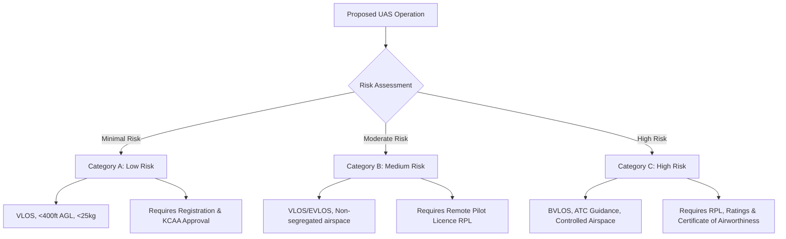

# 6.2 Kenya UAS Regulations

> [!abstract] Learning Objectives
> Navigate KCAA drone registration, licensing, and operational requirements.

### The Foundational Axioms of KCAA UAS Regulations

The fundamental principle governing the Kenya Civil Aviation Authority (KCAA) Unmanned Aircraft Systems (UAS) Regulations of 2020 is the systematic mitigation of risk . Rather than regulating merely the physical hardware, the KCAA employs a risk-based stratification approach, evaluating the potential kinetic energy transfer during an impact and the probability of mid-air collisions with manned aviation [1-4]. Every regulatory mandate—from licensing to hardware certification—is derived from the necessity to safely integrate unmanned systems into the national airspace while protecting non-participants on the ground [1-4].

### Risk Categorization of UAS Operations

The KCAA classifies all UAS operations into three distinct risk tiers, dictating the operational parameters, equipment standards, and personnel qualifications required [1-4].

*   **Category A (Low Risk):** This category poses minimal risk to the public and manned aviation . Operations are strictly bound to Visual Line-of-Sight (VLOS) and cannot exceed an altitude of 400 feet Above Ground Level (AGL) [5-7]. The UAS must maintain a lateral separation of at least 50 meters from any person, building, or object not associated with the operation [5-7]. The Maximum Take-Off Mass (MTOM) of the UAS, including payloads, must not exceed 25kg [5-7]. Operations are confined to segregated airspaces away from prohibited or restricted zones . Unlike some jurisdictions, Kenya does not exempt "micro-drones" under 250 grams; all fall under Category A and require registration .
*   **Category B (Medium Risk / Regulated Lower Risk):** These operations introduce moderate risk and allow for more flexibility . Flights remain within VLOS or Extended Visual Line of Sight (EVLOS) but may occur in non-segregated airspaces, provided they steer clear of controlled airspaces . Category B operations mandate that the remote pilot possesses a valid Remote Pilot Licence (RPL) issued by the Authority . 
*   **Category C (High Risk / Manned Aviation Approach):** This tier involves high-risk operations subject to rigorous Air Traffic Control (ATC) instructions and guidance, akin to manned aviation [3, 4, 11-14]. Operations may occur Beyond Visual Line of Sight (BVLOS) . The UAS must possess a Certificate of Airworthiness issued by the Authority based on a State of design/manufacture type certificate . The pilot must hold a valid RPL with specific ratings corresponding to the UAS type .

### The Remote Pilot Licence (RPL)

To act as a Remote Pilot in Command (RPIC) or co-pilot for Category B and C operations, an individual must hold a Remote Pilot Licence (RPL) [17-20]. This ensures the human-in-the-loop possesses the necessary aeronautical knowledge, decision-making capabilities, and physiological fitness to manage complex airspace variables [21-25].

**Eligibility & Issuance Requirements:**
1.  **Demographics & Fitness:** The applicant must be at least 18 years of age and hold a valid Class 3 Medical Certificate issued under the Civil Aviation (Personnel Licensing) Regulations [21-25].
2.  **Proficiency:** Demonstrated ability to read, speak, write, and understand the English language [21-25].
3.  **Aeronautical Knowledge:** Applicants must undergo training at an approved Unmanned Aircraft Systems Training Organization (UTO) and pass theoretical knowledge tests [21, 26-29].
4.  **Practical Skills:** To obtain a VLOS or BVLOS rating, the pilot must complete a minimum of 5 hours of flight time covering familiarization, take-offs, landings, speed changes, and emergency procedures (such as engine failure recovery), followed by a practical skill test [30-32].
5.  **Licence Validity:** The RPL is valid for 24 months for holders under 40 years of age, and 12 months for holders aged 40 or older, running concurrently with the validity of their medical certificate [33-39].

**Ratings and Endorsements:** 
The KCAA issues specific ratings to be attached to the RPL, including Beyond Visual Line of Sight (B-VLOS), Extended Visual Line of Sight (E-VLOS), and Instructor Ratings .

### Remote Aircraft Operators Certificate (ROC)

To derive commercial value from a UAS (operations for reward or hire), the underlying corporate entity must possess a Remote Aircraft Operators Certificate (ROC) [40-43]. The ROC proves that the organization has the systemic infrastructure to supervise flight operations safely .

**ROC Authorization Framework:**
*   **Organizational Architecture:** The applicant must prove they have an adequate organization, properly qualified staff, a rigorous training program, and robust ground handling and maintenance arrangements [44-48]. 
*   **Safety Management System (SMS):** The operator must establish an SMS commensurate with the size and complexity of their operations to identify hazards, assess risks, and implement remedial actions .
*   **Security Clearance:** Because drones map to physical security vectors, obtaining an ROC requires a security clearance issued by the Ministry of Defense [48, 51-54]. Operators must also deploy an approved aircraft operator security program .
*   **Validity:** The ROC is valid for 12 months from the date of issue or renewal, subject to continuous compliance and KCAA audits [52, 54-56].

### Enforcement and Penalties

The KCAA enforces these regulations stringently to deter reckless operations that compromise national security or public safety [57-62]. KCAA categorizes offenses to distinguish between administrative/safety failures and severe kinetic/security threats .

*   **General Penalty:** Contravening a directive given under the regulations, or operating a UAS in a manner that unlawfully interferes with authorized operations, constitutes an offense liable to a fine not exceeding Ksh 2,000,000, imprisonment for up to 3 years, or both [57-60, 62, 65, 66].
*   **"A" Provisions (Ksh 1,000,000 fine / 1-year imprisonment):** Violations related to Airworthiness (Reg 12), Licensing (Reg 20), Training (Reg 21), Accident Reporting (Reg 25), Operations in congested areas (Reg 28), Flight plan filing (Reg 33), Command and Control (Reg 35), Record keeping (Reg 39), and Insurance (Reg 40) .
*   **"B" Provisions (Ksh 2,000,000 fine / 3-years imprisonment):** High-severity violations including operating without Authorization (Reg 13), violating UAS operating limitations (Reg 24), Prohibited operations (Reg 26), Carriage of dangerous goods (Reg 27), Collision avoidance failures (Reg 31), International operations without clearance (Reg 32), Operations near aerodromes (Reg 37), dropping goods (Reg 42), and breaching privacy/nuisance laws (Reg 41) [63, 64, 67-69]. 
*   **Seizure and Interception:** If a UAS poses an imminent risk or prejudices national security, the KCAA and national security agencies possess the legal authority to intercept, force-land, assume control of, or confiscate the UAS and its components [70-75].

---

---

## 📜 Official Source Document
> [!important] Kenya Civil Aviation (UAS) Regulations, 2020
> The full legal text of the KCAA regulations referenced throughout this lesson.
> 📎 [[Regulations.pdf]]

## 📊 Slide Deck
> [!info] Presentation Available
> 📎 [[6.2 Kenya UAS Regulations.pdf]]

### 🧭 Navigation
⬅️ **Previous:** [[6.1 Global Regulatory Landscape]]
⬆️ **Module:** [[6.0 Module Overview]]
➡️ **Next:** [[6.3 UTM and Airspace Management]]

