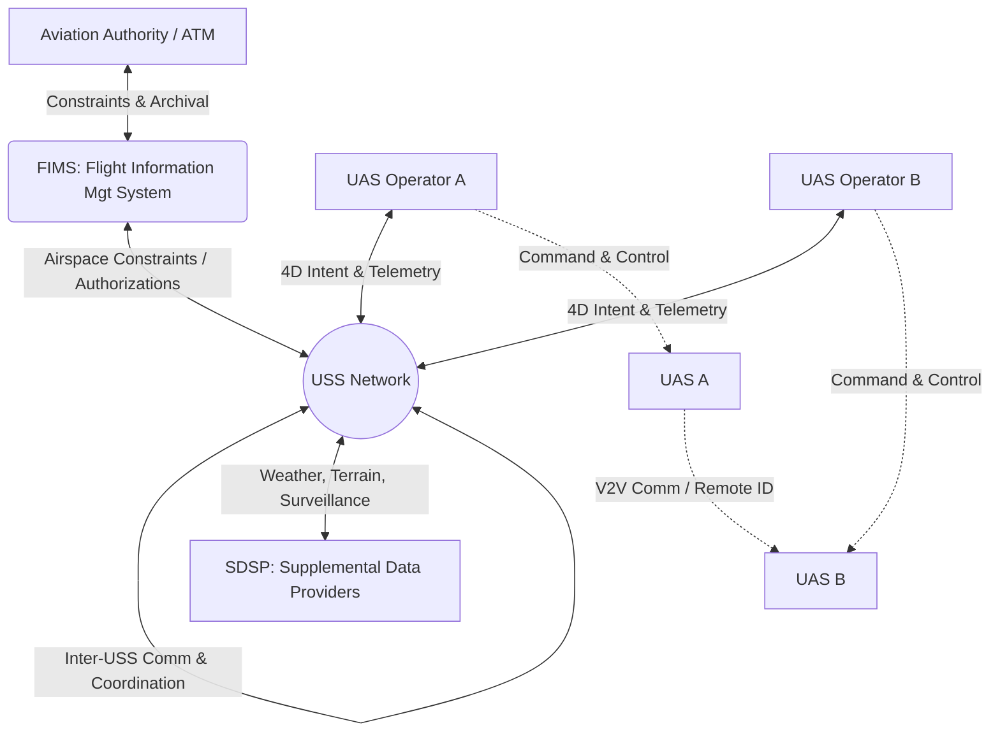

# 6.3 UTM and Airspace Management

> [!abstract] Learning Objectives
> Understand UTM systems, ASTM standards, and low-altitude airspace integration.

# Unmanned Aircraft System Traffic Management (UTM): A First-Principles Analysis

## 1. First Principles of UTM and Low-Altitude Airspace Integration

From a first-principles perspective, traditional Air Traffic Management (ATM) relies on centralized human control, voice communications, and radar surveillance to manage a relatively small number of high-altitude, high-speed aircraft . Unmanned Aircraft System Traffic Management (UTM) solves a fundamentally different problem: safely routing millions of highly heterogeneous, autonomous vehicles through complex, obstacle-dense environments at low altitudes (typically below 400 feet Above Ground Level) . 

To achieve this, UTM abandons the centralized control paradigm in favor of a **federated, cooperative, and highly automated digital ecosystem** . Safety is achieved not through tactical human intervention, but through shared operational intent, automated strategic deconfliction, and digital constraints . 

### 1.1 Core Architectural Entities
The integration of UAS into low-altitude airspace relies on a distributed architecture of specialized entities:
*   **Flight Information Management System (FIMS):** The central gateway managed by the aviation authority (e.g., the FAA). It acts as the data exchange interface between regulatory systems and the UTM ecosystem, providing real-time airspace constraints without giving external entities direct access to core ATM systems .
*   **UAS Service Suppliers (USS):** Third-party entities that act as a communications bridge between operators, FIMS, and other USSs . They provide the computational heavy lifting for flight planning, intent sharing, strategic deconfliction, and conformance monitoring . 
*   **Supplemental Data Service Providers (SDSP):** Specialized entities providing essential telemetry and environmental data, including terrain, obstacle databases, micro-weather forecasting, and surveillance data .
*   **Operators and UAS:** The end-users executing flights, responsible for submitting 4D operation volumes and adhering to assigned trajectories and performance authorizations .

## 2. UTM Federated Architecture Diagram

## 3. Spatial-Temporal Deconfliction and Geofencing

A foundational requirement of low-altitude airspace integration is preventing physical intersection of aircraft trajectories. UTM manages this through **Operation Volumes**, which are four-dimensional (4D) blocks of airspace defined by lateral/vertical boundaries and specific entry/exit times . 

To optimize airspace utilization, UTM systems are transitioning from static to dynamic geofencing constraints:
*   **Static Geofencing:** Reserves a fixed volume of airspace for the entire duration of a mission . While computationally simple, it is highly inefficient, blocking other UAS from using any part of that volume even when the aircraft is far away .
*   **Dynamic Geofencing:** Creates a moving 3D spatial envelope that strictly encapsulates the UAS at discrete time points . The leading front of this envelope is determined by the vehicle's maximum speed, while the trailing end is dictated by the latest required arrival time . By representing trajectories as dynamic convex hulls in 4D space, the system drastically increases airspace capacity—saving up to 80% of airspace time-volume compared to static methods—while allowing high-efficiency conflict detection algorithms to mathematically prove path safety [23-25].

## 4. ASTM F3548: Standardizing USS Interoperability

Because UTM is a federated network of multiple USSs operating in the same geographical area, interoperability is a critical safety requirement . The **ASTM F3548-21** standard is the global specification defining the performance and interoperability requirements for USSs to execute Uncrewed Traffic Management .

It strictly focuses on the strategic aspects of UAS operations in a connected environment, heavily relying on Application Programming Interfaces (APIs) . The standard categorizes USS functions into four primary roles :
1.  **Strategic Coordination:** Comprises Strategic Conflict Detection and Aggregate Operational Intent Conformance Monitoring. This is the mathematical backbone of UTM, ensuring that submitted 4D operational intents do not overlap and that vehicles conform to these digital constraints .
2.  **Conformance Monitoring for Situational Awareness (CMSA):** Requires a USS to monitor active flights and alert the network if a UAS deviates from its operational intent, providing critical situational awareness for off-nominal or contingent operations .
3.  **Constraint Management:** Allows authorized providers to input and manage temporary flight restrictions or localized geofences .
4.  **Constraint Processing:** Ensures that USSs can process airspace constraints and accurately relay these limitations to operators to prevent incursions .

By adhering to ASTM F3548, the UTM network can achieve strategic deconfliction that reduces the probability of mid-air collisions by two to three orders of magnitude . Crucially, the standard provides business-case flexibility; a USS is not required to implement all roles, allowing lightweight USSs to exist purely for constraint processing or situational awareness .

## 5. U-space: The European Regulatory Framework

While ASTM provides the technical standards, **U-space** is the European Union's regulatory implementation of the UTM concept. Formally established under Commission Implementing Regulation (EU) 2021/664, U-space is defined as a specific airspace zone where UAS operations are strictly managed through a mandatory set of digital services .

U-space relies on a high degree of digitalisation and automation to support safe, efficient, and secure access for a large volume of drones . Key elements of the U-space framework include:
*   **Mandatory Services:** Within designated U-space airspace, operators are legally bound to utilize specific digital services (such as Network Remote Identification and flight authorization) provided by certified U-space Service Providers (USSPs) .
*   **Cybersecurity Integration:** The framework mandates rigorous information security risk management to prevent unauthorized access, spoofing, or denial-of-service attacks that could compromise aviation safety (addressed further in Regulation (EU) 2023/203) .
*   **Civil-Military Coordination:** U-space seeks to adapt civil UAS standards to ensure safe cross-border operations and interoperability with military applications .

---

---

## 📊 Slide Deck
> [!info] Presentation Available
> 📎 [[6.3 UTM and Airspace Management.pdf]]

### 🧭 Navigation
⬅️ **Previous:** [[6.2 Kenya UAS Regulations]]
⬆️ **Module:** [[6.0 Module Overview]]
➡️ **Next:** [[6.4 Geofencing and Airspace Control]]

