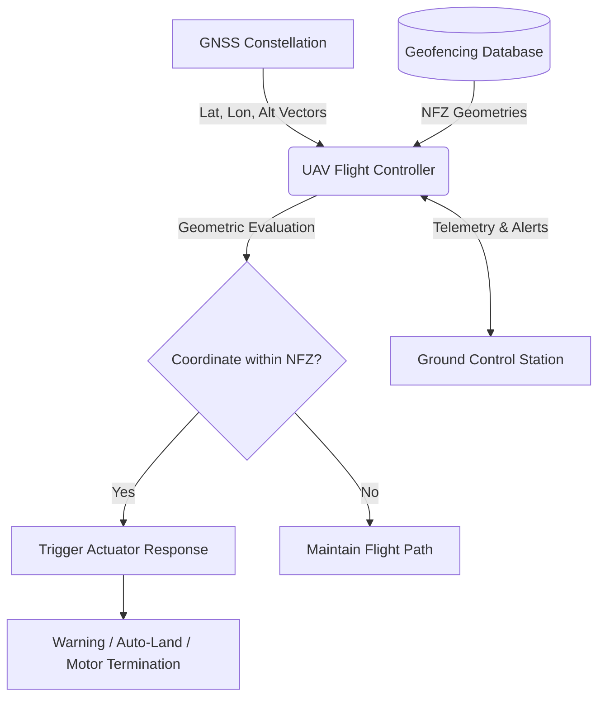

# 6.4 Geofencing and Airspace Control

> [!abstract] Learning Objectives
> Implement digital boundaries and automated airspace restriction compliance.

# Fundamentals of UAV Geofencing Technology

Unmanned Aerial Vehicle (UAV) geofencing relies on the first principles of spatial computation and real-time telemetry to restrict physical drone movements within predefined virtual boundaries. By comparing the UAV's continuous geospatial coordinates against a database of restricted geometries, flight controllers can dynamically enforce airspace compliance. 

## Core Principles and System Architecture

At its foundation, a geofencing system requires the continuous acquisition and processing of location data through a closed-loop architecture. The fundamental components enabling this process include:

*   **Global Navigation Satellite System (GNSS):** Provides real-time latitude, longitude, and altitude vectors (utilizing GPS, GLONASS, Galileo, or BDS) to the UAV . 
*   **Flight Controller:** The central hardware-firmware nexus (such as PX4 or ArduPilot) that processes GNSS inputs and synchronously controls the UAV's actuators .
*   **Geofencing Database:** A local or cloud-referenced repository containing the precise geometric bounds of No-Fly Zones (NFZs) and other restricted domains (e.g., airports, power plants), often mapped using WGS-84 coordinate systems .
*   **Ground Control Station (GCS) and Telemetry Modules:** Facilitate RF communication between the operator and the drone, transmitting alerts and real-time positioning .

## Geometric Algorithms and Spatial Computation

To ascertain whether a UAV has breached a digital boundary, the flight controller's algorithms continuously evaluate the UAV's GNSS coordinates in $R^2$ or $R^3$ Euclidean space . 

*   **Polygonal Geofencing (Ray-Casting):** For a given point of interest $p$ (the UAV's location), the system projects an infinite ray $\gamma$ through $p$. The algorithm determines that $p$ is inside the restricted polygon if the number of edges $\gamma$ intersects is odd .
*   **Spherical and Cylindrical Geofencing:** These methods compute the absolute distance $d$ between the center of a restricted sphere/cylinder (radius $r$) and the UAV. If $d < r$, an incursion has occurred . While computationally lightweight, these struggle to tightly enclose complex geometries .
*   **Advanced Topologies ($\alpha$-shapes and Voronoi Diagrams):** To address the inaccuracies of standard polygons—which can inadvertently restrict legitimate airspace or fail to prevent collisions in dense urban environments—advanced algorithms utilize $\alpha$-shapes to create tightly fitted boundaries around discrete sets of points. When combined with Voronoi diagrams, these algorithms also generate internal edges that aid in dynamic obstacle circumnavigation and automated path planning .

# Operational Mechanisms: Preventing Airspace Incursions

Geofencing systems act as a "digital leash," translating mathematical coordinate intersections into physical kinetic restrictions . Depending on the operational framework, these boundaries function in three primary modes:

1.  **Keep-Out Geofences:** Form virtual barriers around sensitive infrastructure. If a drone approaches, the system prevents entry .
2.  **Keep-In Geofences:** Contain the UAV within a predefined operational volume, ensuring it does not fly beyond a permitted perimeter (e.g., used heavily in NASA's UAS Traffic Management testing) . 
3.  **Dual Geofences:** Combine keep-in containment with keep-out exclusion zones, heavily utilized in complex urban operations to maximize safety .

### Automated Kinetic Responses

When a UAV approaches or breaches a digital boundary, the firmware initiates pre-programmed failsafes . The system typically enforces a graduated response protocol:
*   **Enhanced Warning Zones:** The Ground Control Station UI displays alerts to the remote pilot, requiring acknowledgement before proceeding .
*   **Flight Path Alteration:** The flight controller autonomously alters the drone's heading to bounce off the invisible boundary .
*   **Emergency Overrides:** If an incursion is imminent or the drone powers up within an NFZ, the firmware can automatically trigger a safe landing procedure or entirely terminate rotor actuation .

# Regulatory Frameworks and Guidelines: EASA and FAA

Regulatory bodies face the complex challenge of balancing unhindered airspace integration with the safety of manned commercial aircraft. Both the European Aviation Safety Agency (EASA) and the Federal Aviation Administration (FAA) have developed rigorous, though differing, frameworks.

## EASA Guidelines: Stratified Limits and Built-in Protections

EASA’s approach emphasizes "safety-by-default" and advocates for built-in, automatic geo-limitation functions for small UAS operating in the "Open" category . EASA differentiates system implementations to balance safety with professional utility:

*   **Hard-Locked Limitations:** Strict, immutable boundaries surrounding highly sensitive Prohibited Zones (e.g., nuclear facilities, prisons). The automated geo-limitation function cannot be disabled by a standard user . 
*   **Soft-Locked Limitations:** Boundaries around Restricted Zones that can be unlocked by verified, authorized operators . Unlocking typically requires the operator to provide identification (via credit card or phone SMS) and positively acknowledge their authorization to fly, thereby creating an auditable record of the event .
*   **Performance Limitations:** EASA heavily favors embedding hardcoded maximum height and distance limitations independent of geographic location. Recommendations include "hard-locked" height limitations of 120m (400ft) or 150m (500ft), and "soft-locked" limits of 50m (165ft) or 70m (230ft) to proactively separate drones from manned commercial glideslopes .

## FAA Directives: Airspace Preemption and Operator Accountability

In the United States, the FAA relies on statutory authority asserting exclusive jurisdiction over all navigable airspace and aviation safety .

*   **Federal Preemption over Local Mandates:** The FAA explicitly preempts state and local jurisdictions from independently regulating airspace efficiency or mandating safety-related equipment . Consequently, local laws attempting to unilaterally force UAS operators to use geo-fencing or establish local "no-fly" altitudes are generally preempted because they interfere with the FAA's comprehensive integration plans .
*   **Cost-Benefit and Operator Accountability:** The FAA has previously resisted mandating universal geofencing for all small UAS, citing a lack of uniform design standards, the prohibitive costs of maintaining perfectly updated terrain/obstacle databases, and the necessity for pilots to easily override systems during emergencies [29-31]. 
*   **Shift toward Remote ID and Official Data:** The FAA's modern framework prioritizes Remote Identification (acting as a digital license plate) and pilot accountability . In alignment with this, manufacturers like DJI have updated their systems to display official FAA data (reclassifying many rigid "No-Fly Zones" into "Enhanced Warning Zones"), effectively removing absolute firmware blocks and returning ultimate operational responsibility—and legal liability—to the pilot in command .

---

---

## 📊 Slide Deck
> [!info] Presentation Available
> 📎 [[6.4 Geofencing and Airspace Control.pdf]]

### 🧭 Navigation
⬅️ **Previous:** [[6.3 UTM and Airspace Management]]
⬆️ **Module:** [[6.0 Module Overview]]
➡️ **Next:** [[6.5 Cybersecurity and Drone Security]]

