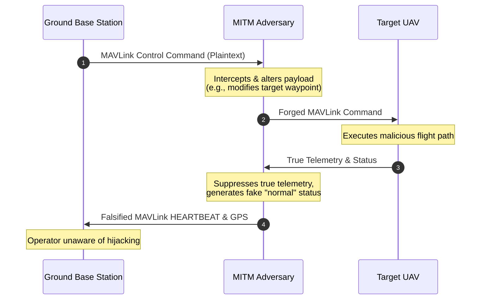

# 6.5 Cybersecurity and Drone Security

> [!abstract] Learning Objectives
> Identify cyber threats to UAV systems and implement countermeasures.

### Fundamental Vulnerabilities in UAV Communication Architectures

From a first-principles perspective, unmanned aerial vehicles (UAVs) and Flying Ad Hoc Networks (FANETs) rely on the propagation of electromagnetic waves through an unshielded, shared medium. This foundational reality dictates that any receiver is inherently exposed to all energy in its tuned frequency band, making the physical layer intrinsically susceptible to interception and interference . Furthermore, FANETs are characterized by highly dynamic 3D topologies, rapid node mobility, intermittent connectivity, and strict constraints on onboard computational power and battery life [2-4]. 

Because legacy communication protocols like MAVLink v1.0 were engineered primarily for lightweight telemetry rather than security, they transmit commands and payload data in plain text without native encryption or authentication mechanisms . This architectural deficit expands the attack surface across the physical, network, and application layers, enabling adversaries to compromise the confidentiality, integrity, and availability of the network .

### Deep Dive: Jamming Attacks

Jamming is an availability attack that exploits the physics of wireless communication. By injecting artificial radio frequency (RF) energy into the operating band, an attacker intentionally degrades the target's Signal-to-Interference-plus-Noise Ratio (SINR) below the threshold required for successful demodulation and decoding .

**Categorization of Jamming Modalities:**
*   **Noise and Tone Jamming:** The simplest forms involve broadcasting continuous disruptive noise or focusing on a singular frequency tone to drown out legitimate pulses .
*   **Swept Jamming:** This technique sweeps a jamming signal across a wide spectrum, disrupting all hop frequencies utilized by the data signal .
*   **Follower Jamming:** Used specifically against Frequency Hopping Spread Spectrum (FHSS) systems, follower jammers utilize rapid spectrum analysis to detect energy fluctuations, dynamically identifying and jamming the specific frequency hops the UAV is currently using .
*   **Smart and Protocol-Aware Jamming:** Utilizing Software Defined Radios (SDR), smart jammers do not merely emit brute-force noise. Instead, they analyze transmitted data to identify critical synchronization points and emit spoofed signals that mimic the target's modulation (such as DSSS pseudorandom noise codes). This achieves devastating bit error rates with high energy efficiency .

### Deep Dive: Man-in-the-Middle (MITM) Attacks

A Man-in-the-Middle (MITM) attack compromises data integrity and confidentiality by covertly positioning an adversary between two communicating nodes—such as a UAV and a Ground Base Station (GBS), or between two UAVs in a FANET . 

Because protocols like standard MAVLink utilize unencrypted headers containing predictable System IDs and Component IDs, an attacker can seamlessly intercept wireless frames . 

**Mechanism of a UAV MITM Attack:**
1.  **Interception:** The attacker captures plain-text control data sent by the GBS .
2.  **Alteration:** The attacker modifies the payload (e.g., altering GPS waypoints in a `COMMAND_LONG` or `MISSION_ITEM` message) .
3.  **Relay & Spoofing:** The malicious commands are injected into the UAV's flight controller. Simultaneously, the attacker fabricates normalized telemetry data (forging `HEARTBEAT` and `GLOBAL_POSITION_INT` messages) and relays it back to the GBS. 
4.  **Hostile Takeover (Hijacking):** The GBS operator remains entirely unaware of the deviation, believing they still possess control, while the attacker physically redirects the drone .

### Countermeasures for FANETs

To secure FANETs, defenses must be implemented in a multi-layered approach, balancing robust security with the severe energy and latency constraints of UAV hardware .

#### 1. Prevention Strategies

*   **Physical-Layer Security (PLS) and Cooperative Jamming:** Because traditional cryptographic overhead can drain UAV batteries, PLS leverages the physical properties of the wireless channel. **Cooperative Jamming** involves a friendly UAV transmitting artificial noise to purposefully degrade the channel of an unauthorized eavesdropper. The legitimate receiver, possessing prior knowledge of the noise signature, uses self-interference cancellation to filter it out .
*   **Intelligent Reflecting Surfaces (IRS):** Advanced 5G/6G deployments utilize IRS—surfaces with controllable electromagnetic elements—to dynamically adjust phase shifts. Controlled by reinforcement learning, IRS can suppress interference from smart jammers and redirect enhanced signals toward legitimate UAVs [22-24].
*   **Cryptographic Protocol Upgrades:** Upgrading from legacy systems to **MAVLink 2.0** introduces a 13-byte cryptographic signature at the tail of each packet. This utilizes a SHA-256 hash of the message combined with a secret symmetric key and a timestamp, explicitly neutralizing packet spoofing, tampering, and replay attacks . 
*   **Secure Routing Protocols:** To defend the network layer against topology attacks (like Blackhole and Sinkhole attacks), secure ad-hoc routing protocols such as SUAP and SEEDRP integrate asymmetric cryptography, hash chains, and optimized cluster-head assignments to validate route integrity before forwarding packets .

#### 2. Detection Strategies (Intrusion Detection Systems)

When preventative perimeters fail, network resilience relies on distributed Intrusion Detection Systems (IDS) customized for 3D aerial mobility.

*   **Anomaly-Based Machine Learning:** Traditional rule-based IDSs struggle with the highly dynamic topology of FANETs. Modern approaches deploy Deep Neural Networks (DNN) or Gradient Boosting (like LightGBM) to evaluate continuous sensor and telemetry streams. By establishing a statistical baseline of "normal" flight physics and RF behavior, these models flag the minute deviations indicative of GPS spoofing or DoS flooding [29-31].
*   **Federated Learning (FL):** Centralized ML models require raw data to be transmitted to the GBS, consuming massive bandwidth. FL allows each UAV to train a local anomaly-detection model onboard using its own sensor data. The UAVs then transmit only the updated mathematical weights to a central server or cluster-head. The server aggregates these weights into a global defense model and distributes it back to the swarm. This ensures collective immunity against jamming and routing attacks while preserving bandwidth and communication privacy 

---

---

## 📊 Slide Deck
> [!info] Presentation Available
> 📎 [[6.5 Cybersecurity and Drone Security.pdf]]

### 🧭 Navigation
⬅️ **Previous:** [[6.4 Geofencing and Airspace Control]]
⬆️ **Module:** [[6.0 Module Overview]]
➡️ **Next:** [[6.6 Remote ID and Compliance]]

