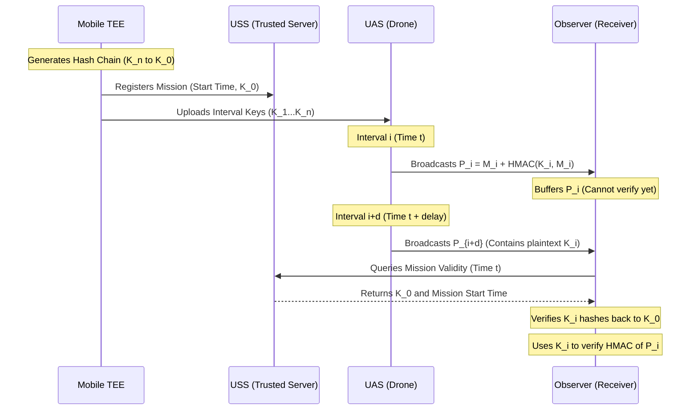

# 6.6 Remote ID and Compliance

> [!abstract] Learning Objectives
> Master FAA Part 89, ASTM F3411, and broadcast Remote ID implementation.

### First Principles of Airspace Accountability: The Remote ID Framework

At a fundamental level, integrating Uncrewed Aircraft Systems (UAS) into a shared airspace requires deterministic mechanisms to ensure state observability, accountability, and deconfliction. To address this, regulatory bodies like the FAA (codified in 14 CFR Part 89) and EASA have mandated **Remote Identification (Remote ID)**, which acts as a digital license plate for drones . 

Remote ID requires aircraft to broadcast telemetry—including their unique serial number, 3D position, velocity, and the operator’s ground location—in real-time [2-4]. Under the ASTM F3411-22a standard (implemented by open-source libraries like OpenDroneID), these broadcasts are transmitted over standardized consumer protocols: 2.4 GHz/5 GHz Wi-Fi (via Beacon frames or Neighbor Awareness Networking) and Bluetooth Low Energy (BLE) advertisements .

However, from an information security perspective, the baseline Remote ID standard is critically flawed: **the broadcasts lack intrinsic authentication** . Because the data is transmitted in plaintext without cryptographic verification, the system is highly vulnerable to spoofing, relay, and replay attacks by bad actors utilizing off-the-shelf Software Defined Radios (SDRs) . 

### The Cryptographic Dilemma in Resource-Constrained Environments

Securing these broadcasts requires generating asymmetric cryptographic proofs so that observers can verify a message’s origin without sharing a secret key with the sender. Traditionally, this is achieved via Public Key Infrastructure (PKI) and digital signatures like Elliptic Curve Cryptography (ECC). 

However, applying first principles of computation and information theory reveals two severe bottlenecks for UAS platforms:
1. **Computational Overhead:** Microcontrollers typical of drone Remote ID modules (e.g., ESP32-S3) require roughly 1.2 seconds and 216 mW of power to compute a 512-bit ECC signature, making it impossible to meet the 1 Hz minimum broadcast rate mandated by the ASTM standard .
2. **Bandwidth Limitations:** An ECC signature produces 139 bytes of overhead . The ASTM standard limits total authentication data to 255 bytes, making bulky PKI signatures highly inefficient over lossy, low-bandwidth RF links .

### TESLA: Asymmetry Through Time

To resolve the computational and bandwidth bottlenecks, we look to the **Timed-Efficient Stream Loss-Tolerant Authentication (TESLA)** protocol . Rather than relying on computationally heavy asymmetric math, TESLA achieves asymmetric security properties using lightweight symmetric cryptography (hash functions) combined with **delayed key disclosure** . 

**The TESLA First-Principles Workflow:**
1. **Hash Chain Generation:** A random seed key $K_n$ is selected. A one-way hash function is applied iteratively to generate a chain of keys: $K_i = H(K_{i+1})$. Because hashing is a one-way mathematical function, possessing $K_i$ provides zero knowledge of the subsequent key $K_{i+1}$ .
2. **Reverse Usage:** The keys are generated in reverse order ($K_n$ to $K_0$) but consumed in forward time-intervals ($K_1, K_2, \dots$) .
3. **Delayed Disclosure:** In a given time interval $j$, the drone broadcasts the plaintext message $M_j$ appended with a Message Authentication Code (MAC) generated using a key derived from $K_i$. Critically, the message also includes a *previously* used key, $K_{i-d}$, where $d$ is the disclosure delay .
4. **Verification:** Observers buffer the message $M_j$. Upon receiving $K_i$ in a subsequent interval, they hash it backward to prove it belongs to the chain (verifying against a known root $K_0$), and then use it to locally calculate and verify the MAC of $M_j$ .

Using a SHA-256 HMAC, this operation takes a mere **10 milliseconds** and 129 mW of power on an ESP32, introducing only 68 bytes of communication overhead .

### TBRD: Secure Compliance Architecture 

**TBRD (TESLA Authenticated UAS Broadcast Remote ID)** is a practical implementation of this concept designed for standard UAS ecosystems. It operates using a triad of trust: the Mobile Trusted Execution Environment (TEE), the UAS, and the UAS Service Supplier (USS) .

1. **Pre-flight (Key Management):** A mobile device's hardware-isolated TEE securely generates the one-way hash chain for the anticipated flight duration . The final hashed value ($K_0$) acts as the mission's "key commitment" and is uploaded to the USS over a secure TLS connection . The private interval keys ($K_1 \dots K_{n-1}$) are pushed to the drone .
2. **In-flight (Execution):** The drone broadcasts ASTM-compliant frames containing the telemetry, the MAC, and the delayed key . To avoid breaking TESLA's security guarantees due to 802.11 CSMA/CA channel contention (which could delay a transmission into the wrong time interval), TBRD enforces strict transmission windows within the interval .
3. **Verification:** Observers query the USS to retrieve $K_0$. They then authenticate the drone's delayed keys against $K_0$ and verify the buffered messages .

### Criticality for Scaled Autonomous Operations

As the industry advances toward Urban Air Mobility (UAM) Maturity Level 6 (ubiquitous, high-density, highly-integrated automated networks), decentralized autonomy becomes the primary operational paradigm . In this state, unauthenticated broadcasts represent a catastrophic attack vector.

*   **Integrity of Unmanned Traffic Management (UTM):** UTM systems will rely on aggregated data from ADS-B, radar, and Remote ID to orchestrate low-altitude airspace . An attacker injecting spoofed Remote ID packets could create "phantom drones," forcing UTM algorithms to unnecessarily reroute legitimate traffic, causing gridlock or triggering false regulatory enforcement actions .
*   **Decentralized Swarm Collision Avoidance:** High-density operations will require drones to execute decentralized collision avoidance algorithms—such as Optimal Reciprocal Collision Avoidance (ORCA) or GLAS—relying strictly on vehicle-to-vehicle (V2V) communications . Without TBRD, an adversary can broadcast spoofed drone coordinates directly in the path of an autonomous swarm. Because algorithms like ORCA treat all incoming positional data as ground-truth, the swarm will violently alter its velocity vectors to avoid the non-existent threats, disrupting mission execution and potentially inducing secondary physical collisions .
*   **Resilience Against Edge Compromise:** If a drone is physically captured, TBRD ensures that only the keys for the *current* mission interval are compromised. Because keys are mathematically forward-secure, past flight logs cannot be manipulated, nor can the adversary forge future missions without the Mobile TEE and USS authorization . 

By applying the lightweight, mathematically robust principles of TESLA through TBRD, the drone industry can shift from a highly vulnerable, unauthenticated RF environment to a zero-trust, cryptographically verified airspace capable of safely sustaining autonomous UAM and swarm logistics .

---

---

## 📊 Slide Deck
> [!info] Presentation Available
> 📎 [[6.6 Remote ID and Compliance.pdf]]

### 🧭 Navigation
⬅️ **Previous:** [[6.5 Cybersecurity and Drone Security]]
⬆️ **Module:** [[6.0 Module Overview]]
➡️ **Next:** [[Overview|Back to Main Menu]]

