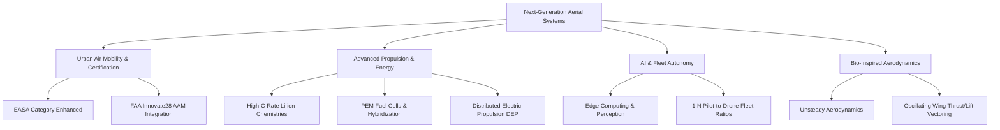

# 7.0 Module Overview

> [!abstract] Learning Objectives
> Emerging technologies shaping the future of autonomous aerial systems.

# Module 7: The Frontier of Aerial Robotics - UAM, Bio-Inspiration, Propulsion, and Autonomy at Scale

This module explores the bleeding edge of unmanned and autonomous aviation, focusing on the first-principle constraints and technological breakthroughs shaping the next decade of airspace utilization. We will dissect the systems engineering required to move from localized drone operations to continent-wide, high-density fleet logistics and passenger-carrying air taxis.

## 1. Urban Air Mobility (UAM) and Advanced Air Mobility (AAM)
The integration of powered-lift aircraft into the National Airspace System (NAS) represents the first entirely new category of civil aircraft in nearly a century . These aircraft combine the vertical takeoff and landing (VTOL) agility of a helicopter with the wing-borne aerodynamic lift of a traditional airplane .

*   **Regulatory First Principles:** Because Urban Air Mobility requires high-density flight over populated areas, regulators have shifted from component-level reliability to system-level fault tolerance. Under EASA's SC-VTOL-01 framework, aircraft intended for Commercial Air Transport (CAT) of passengers or operations over congested cities must be certified under **Category Enhanced** . 
*   **Quantitative Safety Objectives:** For Category Enhanced, the aircraft must be capable of "continued safe flight and landing" following a critical malfunction, requiring catastrophic failure conditions to meet a probability of $\le 10^{-9}$ per flight hour . 
*   **Infrastructure and Scaling:** The FAA's "Innovate28" implementation plan lays the groundwork for AAM operations to reach scale at multiple sites by 2028, leveraging existing helipads initially before transitioning to dedicated vertiports and defined AAM corridors .

## 2. Advanced Propulsion and Electrochemical Demands
The core limiting factor of VTOL and UAM platforms is the energy density of the power source. Achieving vertical flight with electric motors dictates a minimum power loading of 300 W/kg . Furthermore, Distributed Electric Propulsion (DEP) relies on multiple rotors to bathe the wings in accelerated slipstream, artificially increasing dynamic pressure to improve low-speed aerodynamic efficiency .

*   **Asymmetric Battery Loads:** Unlike ground-based electric vehicles that experience relatively steady current drains, eVTOL batteries are subjected to massive, rapid spikes in current draw during the hover, climb, and descent phases of flight . These intense bursts of high power fundamentally alter the thermodynamics of the battery, degrading longevity and thermal stability, and requiring highly customized lithium-ion chemistries and active thermal management systems .
*   **Hybrid-Electric and Fuel Cell Architectures:** To bridge the physical limits of current nickel-rich lithium cell energy densities, the industry is adopting hybrid-electric and Proton Exchange Membrane (PEM) fuel-cell systems . PEM fuel-cell stacks provide vastly superior specific energy for missions exceeding two hours, while hybrid systems dynamically optimize energy swaps between a combustion engine and a battery pack to extend hovering capabilities .

## 3. AI at Scale and Fleet Automation
The economics of drone delivery and AAM depend entirely on removing the 1:1 pilot-to-aircraft ratio constraint. The shift from remotely piloted systems to full autonomy relies on high-fidelity edge computing, onboard perception, and fail-safe algorithms .

*   **Beyond Visual Line-of-Sight (BVLOS):** Regulatory waivers and new unmanned traffic management (UTM) systems are enabling autonomous flight corridors . 
*   **Fleet Scalability:** Advanced AI control laws allow a single human operator to supervise vast fleets. For example, platforms like Wing Aviation’s Hummingbird have secured special class criteria allowing a single pilot to actively supervise up to 20 drones simultaneously . This 1:20 ratio validates the labor-efficient fleet economics required for autonomous logistics to scale globally .

## 4. Bio-Inspired Flapping-Wing Micro Air Vehicles (FWMAVs)
At the micro-scale of aerial robotics, engineers look to biological first principles—mimicking the flight of birds and insects—to solve complex aerodynamic challenges. 

*   **Unsteady Aerodynamics:** Unlike fixed-wing or rotary platforms that rely on steady-state airflow over an airfoil, FWMAVs utilize oscillating wings. This allows the vehicle to simultaneously vector both lift and thrust through complex, unsteady flow mechanisms (such as leading-edge vortices), granting them the ability to hover and maneuver with extreme agility . 
*   **Physical Limitations:** While bio-inspired designs offer exceptional maneuverability, they currently face severe mechanical and thermodynamic constraints. The mechanical complexity of the actuation mechanisms and the extremely high power required to maintain continuous wing oscillation severely restrict their payload capacity, operational range, and flight endurance .

---

## Lessons in this Module
- [[7.1 Urban Air Mobility and Vertiports]]
- [[7.2 Bio-Inspired and Next-Gen Drones]]
- [[7.3 Hydrogen and Advanced Propulsion]]
- [[7.4 Autonomous Swarms at Scale]]
- [[7.5 The Road Ahead]]

---
⬅️ **Back to Course:** [[Overview]]
