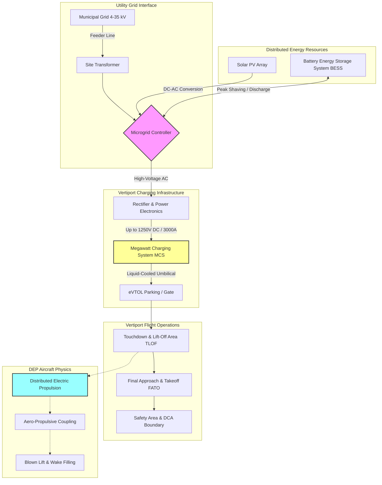

# 7.1 Urban Air Mobility and Vertiports

> [!abstract] Learning Objectives
> Design vertiport infrastructure and eVTOL urban transit networks.

### Urban Air Mobility (UAM) and the Cyber-Physical Airspace

Urban Air Mobility (UAM) represents the integration of high-density, automated air transportation systems into metropolitan environments, primarily leveraging Electric Vertical Take-Off and Landing (eVTOL) aircraft . Scaling UAM from isolated conceptual models to a mature transit layer requires a rigorous, first-principles approach to three interdependent pillars: the aerodynamic innovations of Distributed Electric Propulsion (DEP), the civil engineering of Vertiport infrastructure, and the electrical engineering of megawatt-scale charging networks .

---

### First Principles of Distributed Electric Propulsion (DEP)

Classical momentum theory dictates that the thrust ($T$) generated by a rotor is a function of air density ($\rho$), the rotor disc area ($A = \pi R^2$), and the induced velocity ($v$) of the fluid mass accelerated through the propeller, expressed as $T = 2 \rho A \nu^2$ . In a DEP system, thrust generation is decentralized across an array of electrically driven propulsors distributed along the airframe . 

This distribution unlocks phenomena known as **aero-propulsive coupling**, where aerodynamic and propulsive forces interact synergistically .
*   **Blown Lift:** By placing propulsors along the leading edge of a wing, the accelerated slipstream increases the local fluid velocity over the airfoil. This drastically increases the effective lift coefficient at low speeds, enabling Short Take-Off and Landing (STOL) operations and reducing runway infrastructure footprints .
*   **Boundary Layer Ingestion (BLI):** Propulsors mounted near the aft or fuselage ingest the low-momentum boundary layer air. By re-energizing this sluggish airflow, BLI effectively reduces the aircraft's wake drag and improves overall propulsive efficiency, though it requires robust fan blades to withstand the highly distorted ingested air .
*   **Differential Thrust Steering:** Because electric motors can adjust RPM instantaneously, DEP allows for propulsion-controlled maneuvering. Varying thrust across the wingspan induces pitch, roll, and yaw moments, enabling the reduction or elimination of traditional control surfaces, thereby reducing overall vehicle mass and drag .

---

### Vertiport Infrastructure and Geometric Design

The physical ground infrastructure necessary to support eVTOL aircraft—the **Vertiport**—must be engineered to handle the unique physics of DEP systems. The Federal Aviation Administration (FAA) dictates vertiport topology via highly specific sizing constraints tied to the Design VTOL aircraft's **Controlling Dimension ($D$)** (the largest overall span) and its **Rotor Diameter ($RD$)** .

#### Core Operational Zones
1.  **Touchdown and Liftoff Area (TLOF):** The central, load-bearing paved area where the aircraft makes ground contact. The FAA specifies a minimum TLOF width of $1 RD$ . 
    *   *Load Bearing Constraints:* The TLOF must support a dynamic load equal to **150% of the Maximum Takeoff Weight (MTOW)** applied to the landing gear's specific contact points (skids or wheels) to account for hard landings .
2.  **Final Approach and Takeoff Area (FATO):** Surrounding the TLOF, the FATO provides a buffer for hover maneuvers. Its minimum width and length are sized at $2 RD$ . To prevent ground resonance and pooling, the FATO requires a negative gradient of 1.5% to 5% for positive drainage .
3.  **Safety Area:** A non-operational buffer sized to extend $0.5 D$ beyond the FATO to protect against accidental divergences .
4.  **Downwash/Outwash Caution Area (DCA):** As DEP rotors force high-velocity air downward (downwash), it strikes the TLOF and translates horizontally (outwash). Because outwash velocities exceeding 34.5 mph (55.5 kph) present severe foreign object debris (FOD) and personnel hazards, a DCA must be designated and mathematically modeled to prevent wake recirculation and venturi effects in adjacent urban canyons [19-21].

*Approach paths* must maintain an 8:1 slope (horizontal to vertical units), with transitional surfaces extending outward at a 2:1 slope to guarantee clearance during the critical Effective Transitional Lift (ETL) phase .

---

### Megawatt-Scale Charging Networks & Grid Integration

The operational tempo of UAM relies entirely on rapid energy replenishment. eVTOL battery capacities (ranging from 150 kWh to 1 MWh) necessitate extreme fast charging to meet turnaround times . 

#### Megawatt Charging Systems (MCS)
To circumvent the limitations of conventional EV chargers, the aviation sector is adopting the **SAE AIR7357** standard and the **Megawatt Charging System (MCS)**. These systems deliver charging capacities exceeding 1 MW (operating up to 1,250 VDC and 3,000 Amps) . Because high-current DC fast charging generates immense thermal loads, next-generation connectors are integrating off-board liquid cooling systems (circulating deionized ethylene-glycol) directly into the charging umbilical to maintain battery cell stability .

#### Distribution Grid Impacts
Charging multiple eVTOLs simultaneously drastically alters the power profile of the hosting electrical grid. Power flow simulations demonstrate that adding unmitigated 1 MW+ eVTOL charging loads to standard airport distribution feeders increases peak demand by up to 71% . 
*   **Voltage Drops:** Megawatt charging can cause severe localized undervoltage, dropping grid voltage to 0.837 per-unit (p.u.), which violently violates the ANSI standard minimum threshold of 0.95 p.u. .
*   **Thermal Overloading:** Such loads can push existing site transformers to operate at over 200% of their rated thermal capacity, leading to rapid insulation degradation and catastrophic failure .

#### Microgrids and Distributed Energy Resources (DER)
To prevent grid collapse and avoid exorbitant utility demand charges, vertiports must be architected as independent **Microgrids** incorporating Distributed Energy Resources (DERs). 
By integrating **Solar Photovoltaics (PV)** and **Battery Energy Storage Systems (BESS)**, vertiports can perform peak shaving and energy arbitrage . In predictive models, adding an appropriately sized BESS (e.g., 771 kW / 264 kWh) allows the vertiport to discharge stored power during aircraft docking, effectively decoupling the extreme high-amperage DC charging spikes from the municipal AC feeder lines. This completely mitigates thermal overloading and keeps the utility voltage safely within the 0.95–1.05 p.u. ANSI limits .

---

### System Architecture Diagram

---

---

## 📊 Slide Deck
> [!info] Presentation Available
> 📎 [[7.1 Urban Air Mobility and Vertiports.pdf]]

### 🧭 Navigation
⬅️ **Previous:** [[7.0 Module Overview]]
⬆️ **Module:** [[7.0 Module Overview]]
➡️ **Next:** [[7.2 Bio-Inspired and Next-Gen Drones]]

