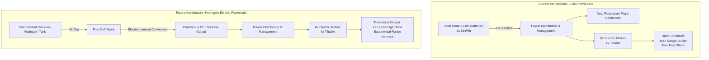

# 7.3 Hydrogen and Advanced Propulsion

> [!abstract] Learning Objectives
> Evaluate hydrogen fuel cells, solar, and hybrid propulsion for extended endurance.

# The Future of Drone Propulsion: Overcoming the Energy Density Bottleneck

## 1. A First Principles Analysis of Aerial Energy Storage

The fundamental physical constraint of electric vertical take-off and landing (eVTOL) flight lies in the specific energy—the energy-to-weight ratio—of the aircraft's storage medium. To achieve lift and forward propulsion, an aircraft must expend energy to overcome gravity and aerodynamic drag; if the energy source itself is too heavy, the aircraft suffers from diminishing returns, where additional energy storage merely lifts its own weight.

Currently, platforms like the Wingcopter 198 utilize dual smart Lithium-Ion (Li-Ion) batteries, providing 814Wh each . While this all-electric architecture enables critical redundancies and zero-emission flight, Li-Ion chemistry has a hard theoretical limit on specific energy. Consequently, the Wingcopter 198 is bounded by a maximum flight time of 90 minutes in fixed-wing cruise mode, and just 15 minutes during energy-intensive multicopter hovering . In terms of operational reach, this caps the drone at a 110-kilometer range under optimal conditions with zero payload . To scale beyond-visual-line-of-sight (BVLOS) operations, the industry must engineer solutions that bypass the Li-Ion specific energy barrier.

## 2. Hydrogen Fuel Cell Integration: The Next Paradigm

To exponentially increase flight endurance without adopting environmentally detrimental combustion engines, Wingcopter has initiated a shift toward green hydrogen propulsion . 

From a first-principles standpoint, compressed gaseous hydrogen possesses a specific energy significantly higher than any commercially available Li-Ion battery. By converting chemical energy directly into electrical energy via an electrochemical reaction, fuel cells provide continuous power to electric motors as long as fuel is supplied, decoupling the drone's energy capacity from the severe weight penalties of solid-state batteries.

### 2.1. The ZAL Partnership and Technical Implementation
Wingcopter has partnered with the Hamburg-based ZAL Center of Applied Aeronautical Research GmbH to retrofit the Wingcopter 198 with a sustainable, hydrogen-based propulsion system . 
*   **Fuel Cell Architecture:** The modification, taking place at ZAL's Fuel Cell Lab, will replace the heavy Li-Ion battery packs with a system utilizing compressed gaseous hydrogen paired with a lightweight fuel cell .
*   **Proven Endurance:** ZAL engineers have previously validated this technology, achieving flight durations exceeding two hours using compressed gaseous hydrogen on their proprietary ZALbatros drone . 
*   **Aerodynamic Synergy:** Because the Wingcopter already possesses an aerodynamic fixed-wing design that generates substantial lift, integrating a high-specific-energy hydrogen system will yield compounding increases in both flight speed and maximum delivery range . 

## 3. Hybrid Networks and Ground-Level Infrastructure 

Until hydrogen-powered fleets achieve commercial scalability, operators must solve the battery limitation problem through physical infrastructure and rapid ground-level logistics. 

### 3.1. Rapid-Swap and Relay Operations
Rather than forcing a single battery to endure a massive journey, operational networks rely on modularity. The Wingcopter 198 is engineered with smart batteries that can be hot-swapped within seconds . This allows the aircraft to maximize its time in the air; an operator can land the drone, instantly replace the depleted 814Wh batteries with fully charged units, and relaunch the aircraft.

### 3.2. Distributed Energy Nodes
For massive deployments—such as Wingcopter's initiative to roll out 12,000 drones across 49 Sub-Saharan African countries—the physical range limit of 110 kilometers  must be countered by a distributed network of energy nodes. Industry observers and operators suggest that long-range drone logistics will ultimately rely on a network of charging locations, potentially utilizing localized solar recharging stations situated at designated waypoints or villages . By combining quick-swap battery mechanics with distributed solar infrastructure, operators can effectively chain together multiple short-range flights to traverse continental distances. 

## 4. Propulsion Architecture Comparison

---

---

## 📊 Slide Deck
> [!info] Presentation Available
> 📎 [[7.3 Hydrogen and Advanced Propulsion.pdf]]

### 🧭 Navigation
⬅️ **Previous:** [[7.2 Bio-Inspired and Next-Gen Drones]]
⬆️ **Module:** [[7.0 Module Overview]]
➡️ **Next:** [[7.4 Autonomous Swarms at Scale]]

