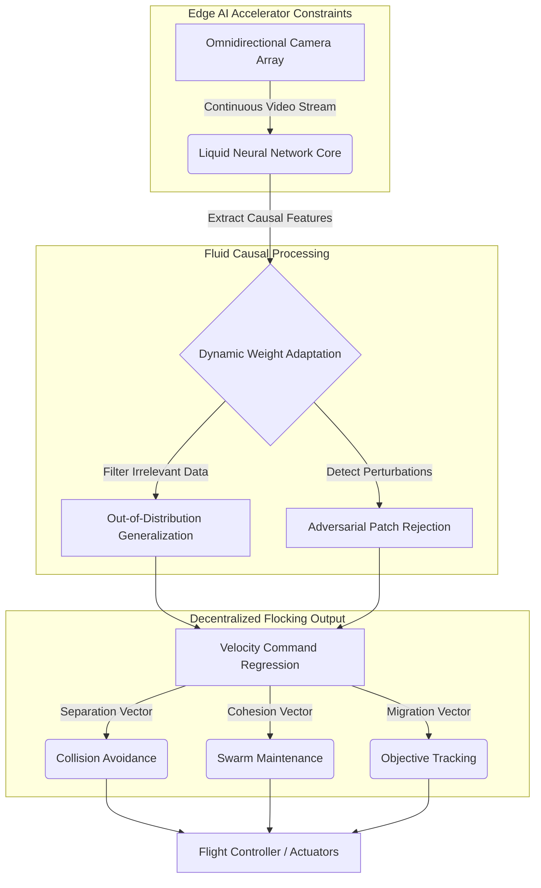

# 7.4 Autonomous Swarms at Scale

> [!abstract] Learning Objectives
> Scale swarm coordination from laboratory demonstrations to operational deployments.

# First Principles of Decentralized Swarm Intelligence

To scale autonomous drone swarms to hundreds or thousands of agents, engineers must eliminate reliance on centralized control architectures, wireless state-sharing, and Global Navigation Satellite Systems (GNSS) . These traditional methods introduce catastrophic single points of failure, latency bottlenecks, and vulnerability to signal degradation in dense urban environments . The fundamental mathematical principle of scalable swarm intelligence is **fully decentralized, vision-based cohesive flight**, where high-frequency control decisions are derived purely from local, onboard sensory information . 

Instead of broadcasting GPS coordinates, next-generation swarm agents formulate multi-agent interaction as a nonlinear regression problem . By utilizing omnidirectional camera arrays, deep convolutional neural networks directly map raw pixel inputs to 3D velocity commands [5-7]. This architecture inherently learns the foundational vectors of Reynolds flocking:
*   **Separation:** A repulsive velocity vector inversely proportional to the distance of neighboring agents, ensuring strict collision avoidance .
*   **Cohesion:** An attractive velocity vector driving the agent toward the spatial centroid of its neighbors, maintaining the structural integrity of the swarm .
*   **Migration:** A uniform directional vector guiding the collective toward a global objective .

By learning these behaviors end-to-end, the network implicitly generates dynamic saliency maps that spatially localize neighboring drones within the visual field, allowing the swarm to navigate cohesively without visual markers or communication payloads .

# Liquid Neural Networks and Navigating Unseen Environments

A critical limitation of traditional deep reinforcement learning and convolutional architectures is their inability to transfer policies across the "reality gap" or adapt to severe out-of-distribution shifts . Standard neural networks struggle to capture causality, frequently overfitting to specific environmental textures or lighting conditions . 

**Liquid Neural Networks (LNNs)** overcome this limitation by applying the first principle of continuous, dynamic adaptation . Inspired by biological brains, the mathematical weights of an LNN are probabilistic and fluid, constantly altering their parameters in real-time based on the incoming data streams [15-17]. 

*   **Causal Extraction:** LNNs are uniquely capable of isolating the causal structure of a task from high-dimensional, unstructured pixel data, effectively learning to ignore irrelevant environmental features .
*   **Zero-Shot Generalization:** Because they extract task causality rather than memorizing environments, LNN-equipped drones trained to track a target in a dense summer forest can instantly deploy to vastly different terrains—such as a snow-covered winter landscape or a complex urban setting—without requiring retraining .
*   **Resilience to Noise:** The fluid parameter state of LNNs makes them inherently more interpretable and significantly more resilient to unexpected occlusions, target rotations, and atmospheric noise compared to static deep learning models .

# Overcoming Adversarial Attacks in Low-Power Edge AI

As swarms scale and rely entirely on local AI policies for navigation, they become susceptible to physical adversarial attacks . Unlike digital cyberattacks, these vulnerabilities exploit the mathematical gradient optimizations of the neural networks themselves . 

Because autonomous swarms must operate under strict Size, Weight, and Power (SWaP) constraints, they heavily utilize highly quantized, ultra-low-power neural networks running on edge accelerators like the Google Coral TPU . The simplified nature of these models opens specific attack vectors:
*   **Physical Adversarial Patches:** Attackers can perform white-box attacks (where network parameters are known) by optimizing specific pixel arrays printed onto physical patches . 
*   **Hijacking Spatial Control:** By attaching a fully optimized adversarial patch to an attacker drone and maneuvering it into the victim's field of view, the attacker manipulates the victim's input data . 
*   **Gradient Manipulation:** The attack simultaneously optimizes the pixel values of the patch and the relative physical pose of the attacker drone . This artificially minimizes the $L_2$ loss between the victim's network prediction and a predefined adversarial target label, granting the attacker full control over the victim drone's $x, y$, and $z$ axes .

Securing future swarms requires developing robust training paradigms—such as domain randomization and adversarial training—that explicitly harden these lightweight networks against spatially optimized physical perturbations .

# Architecture of a Next-Generation Autonomous Swarm Agent

---

---

## 📊 Slide Deck
> [!info] Presentation Available
> 📎 [[7.4 Autonomous Swarms at Scale.pdf]]

### 🧭 Navigation
⬅️ **Previous:** [[7.3 Hydrogen and Advanced Propulsion]]
⬆️ **Module:** [[7.0 Module Overview]]
➡️ **Next:** [[7.5 The Road Ahead]]

