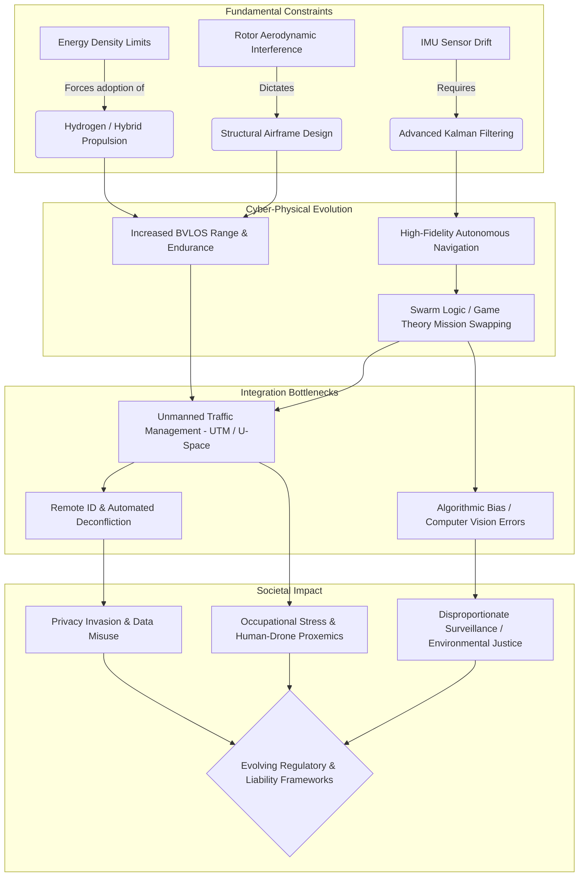

# 7.5 The Road Ahead

> [!abstract] Learning Objectives
> Synthesize emerging trends, challenges, and the trajectory of drone technology.

# The Overarching Trajectory of Drone Technology (2024–2034)

Over the next decade, unmanned aerial systems (UAS) will transition from isolated, human-supervised tools into a ubiquitous, highly autonomous layer of global infrastructure. The global military unmanned aerial systems market alone is projected to nearly double to $20 billion by 2034 , while civilian applications expand into high-density urban air mobility (air taxis) and autonomous logistics . Fundamentally, drones will evolve from simple mechanical tools into "co-workers" and "social entities" that interact directly with humans in shared 3D workspaces . 

Realizing this trajectory requires overcoming severe physical, algorithmic, regulatory, and societal bottlenecks, all of which are governed by first principles of physics, control theory, and human psychology.

## 1. Hardware Challenges: The Physics of Endurance and Propulsion

From a first principles perspective, rotary-wing flight is incredibly energy-intensive. The thrust ($F_T$) and drag torque ($Q$) generated by a propeller are proportional to the square of its rotational speed ($\omega^2$) . Because the resistant torque of a propeller is quadratic, attempting to lift a heavier payload (such as a larger battery to increase range) requires an exponential increase in motor torque, which in turn causes a massive increase in electrical current consumption . 

This physical limitation dictates the hardware challenges of the next decade:
*   **Energy Density Limitations:** Lithium-Polymer (Li-Po) batteries are reaching their theoretical limits for energy density . To achieve extended Beyond Visual Line of Sight (BVLOS) operations, the industry must pivot. Hydrogen fuel cells (utilizing proton-exchange membranes) offer a higher energy density and longer flight durations than Li-Po batteries, with the added tactical advantage of a minimal thermal signature . Solar-electric hybrid systems are also being developed for High Altitude Long Endurance (HALE) atmospheric satellites .
*   **Aerodynamic Interference in Multirotors:** As payload requirements drive the need for multi-rotor architectures (hexacopters, octocopters), designers face tandem vortex interference. If rotors are placed closer than 1.25 times their diameter ($d < 1.25D$), their aerodynamic vortices interact, drastically degrading lift efficiency and introducing high-frequency vibrations into the airframe . 
*   **Hardware Reliability:** To integrate into civilian airspace, the Mean Time Between Failures (MTBF) of critical components (power plants, ESCs) must dramatically improve . Hardware failsafes, such as autonomously deployed ballistic parachutes, will become mandatory mass-market integrations .

## 2. Software and Avionics Challenges: Closed-Loop Autonomy and Swarm Logic

The stabilization of an aerodynamically unstable quadcopter relies entirely on the continuous numerical integration of data from Micro-Electromechanical Systems (MEMS). Because gyroscopes suffer from integration drift over time and accelerometers are highly sensitive to motor vibration, modern flight controllers must rely on complex predictive algorithms (Extended Kalman Filters, Direction Cosine Matrices) to fuse this noisy data into an accurate attitude estimation . 

Scaling this individual cyber-physical autonomy into macro-level systems presents significant software hurdles:
*   **Autonomous Swarm Coordination:** Moving beyond single-pilot operations, future systems will rely on decentralized swarm logic. UAVs will need to utilize inter-UAV communication languages to self-organize, potentially relying on market negotiation principles and game theory to autonomously swap missions (e.g., an exhausted drone dynamically passing its payload/surveillance task to a fully charged node) .
*   **Algorithmic Bias in Perception:** As drones increasingly rely on onboard AI and computer vision for facial recognition and anomaly detection, there is a severe risk of algorithmic bias. AI models trained on non-diverse datasets have been shown to misidentify people of color at higher rates, creating environmental justice crises where marginalized communities face disproportionate automated targeting .
*   **Cybersecurity and C-UAS:** Unencrypted telemetry and Wi-Fi data links make civilian UAVs highly vulnerable to hacking, signal jamming, and video-stream hijacking (spoofing) . Consequently, Counter-Unmanned Air Systems (C-UAS)—which utilize radar, electro-optical sensors, RF jamming, and kinetic interceptors—will undergo parallel evolutionary arms races .

## 3. Regulatory and Infrastructural Challenges: U-Space and UTM

Current aviation regulations, rooted in early 20th-century manned flight, are fundamentally ill-equipped for millions of low-altitude autonomous vehicles. 
*   **Unmanned Traffic Management (UTM):** Scaling up drone operations in urban spaces requires the deployment of automated UTM systems. Human air traffic controllers cannot manage the dense, high-frequency 3D flight paths of urban delivery drones or air taxis .
*   **Remote Identification:** Regulators (such as the FAA and EASA) are mandating Remote ID systems, which act as digital license plates broadcasting a drone's location and operator data to ensure accountability and enable collision-free navigation .
*   **Civil Liability Frameworks:** The legal system currently lacks precise definitions for liability in autonomous drone accidents. If an AI-driven drone crashes due to a faulty sensor fusion algorithm, determining whether liability falls on the hardware manufacturer, the software developer, or the human mission planner remains an unresolved legal bottleneck .

## 4. Public Perception and Ethical Challenges

The transition of drones from novelties to ubiquitous infrastructure creates profound psychological and ethical friction.
*   **Invisible Surveillance and Consent:** Unlike fixed CCTV cameras, drones possess 3D mobility that allows them to bypass physical privacy barriers (walls, fences) silently . Because drones operate without visual or audible markers of their data-collection activities, individuals are subjected to surveillance without informed consent, fundamentally eroding the expectation of anonymity in public spaces .
*   **Occupational Safety and Health (OSH):** In industrial environments, sharing a workspace with high-velocity, high-mass drones induces significant cognitive load and psychological stress on human workers . A key trajectory is endowing drones with "social proxemics"—programming them to respect human spatial rules and clearly communicate their navigational intentions so workers do not constantly fear collision .

### Systems Trajectory Diagram (2024–2034)

---

---

## 📊 Slide Deck
> [!info] Presentation Available
> 📎 [[7.5 The Road Ahead.pdf]]

### 🧭 Navigation
⬅️ **Previous:** [[7.4 Autonomous Swarms at Scale]]
⬆️ **Module:** [[7.0 Module Overview]]
➡️ **Next:** [[Overview|Back to Main Menu]]

